# **Keyestudio 48 in 1 Sensor Kit**

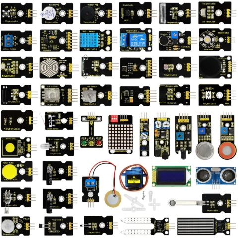


# 1.Description

This sensor kit which is compatible with various microcontrollers and Raspberry Pi contains 48 commonly used sensors and modules including an active buzzer module, a 5V relay module, a temperature and humidity module and others.

At the same time, some detailed projects for each sensor based on development board are also provided, such as wiring methods and test code. With the help of this kit, you could not only obtain interesting knowledge about them but also make substantial interactive projects.

Note that in the following projects, the main board and other wires are not included in this kit.

**Tutorial and code download：[KS0522 Tutorial](https://fs.keyestudio.com/KS0522)**


# 2.Component List

| **No.** |                   **Components**                    | **Quantity** |                         **Picture**                          |
| :-----: | :-------------------------------------------------: | :----------: | :----------------------------------------------------------: |
|    1    |                  White LED Module                   |      1       |       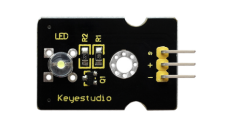        |
|    2    |                   RGB LED Module                    |      1       |       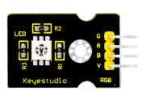        |
|    3    |                    3W LED Module                    |      1       |       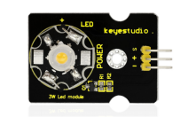        |
|    4    |                Traffic Light Module                 |      1       |               |
|    5    |                Active Buzzer Module                 |      1       |       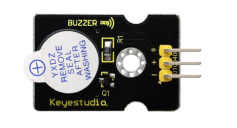        |
|    6    |                Passive Buzzer Module                |      1       |       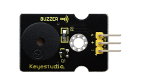        |
|    7    |             Digital Push Button Module              |      1       |       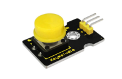        |
|    8    |                  Collision Sensor                   |      1       |       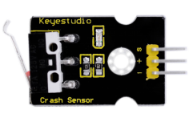        |
|    9    |                Line Tracking Sensor                 |      1       |       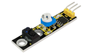        |
|   10    |         Infrared Obstacle Avoidance Sensor          |      1       |       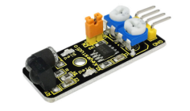        |
|   11    |              Photo Interrupter Module               |      1       |       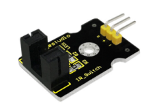        |
|   12    |                Hall Magnetic Sensor                 |      1       |       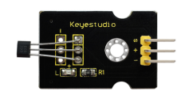        |
|   13    |                 Knock Sensor Module                 |      1       |       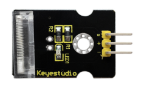        |
|   14    |                 Digital Tilt Sensor                 |      1       |       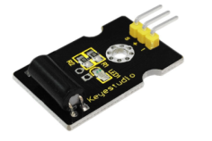        |
|   15    |               Capacitive Touch Sensor               |      1       |               |
|   16    |                    Flame Sensor                     |      1       |       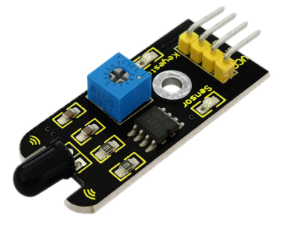        |
|   17    |                 Reed Switch Module                  |      1       |       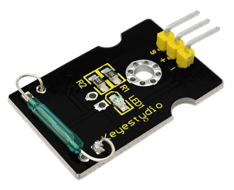        |
|   18    |                  PIR Motion Sensor                  |      1       |       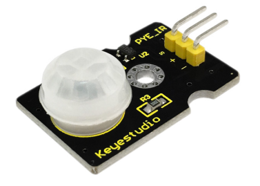        |
|   19    |              Analog Temperature Sensor              |      1       |       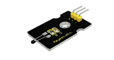        |
|   20    |               Analog Rotation Sensor                |      1       |       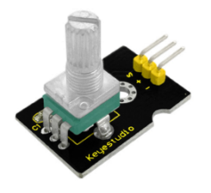        |
|   21    |                  Photocell Sensor                   |      1       |       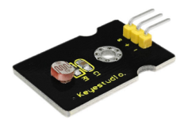        |
|   22    |                 Analog Sound Sensor                 |      1       |       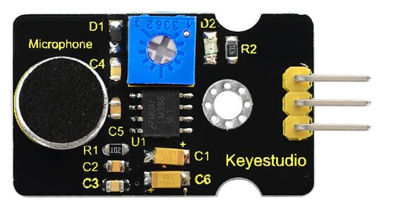       |
|   23    |                    Water Sensor                     |      1       |       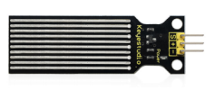        |
|   24    |                Soil Humidity Sensor                 |      1       |       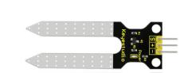       |
|   25    |                  Analog Gas Sensor                  |      1       |       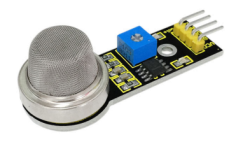        |
|   26    |                Analog Alcohol Sensor                |      1       |       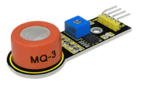        |
|   27    |                    Steam Sensor                     |      1       |       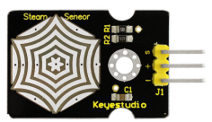        |
|   28    |    Analog Piezoelectric Ceramic Vibration Sensor    |      1       |       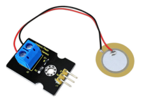        |
|   29    |                   Voltage Sensor                    |      1       |       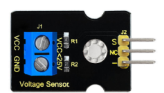        |
|   30    |              Thin-film Pressure Sensor              |      1       |       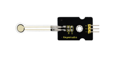        |
|   31    |            TEMT6000 Ambient Light Sensor            |      1       |       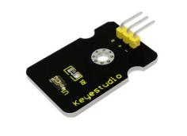       |
|   32    |         GUVA-S12SD 3528 Ultraviolet Sensor          |      1       |       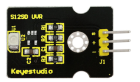        |
|   33    |             Digital IR Receiver Module              |      1       |       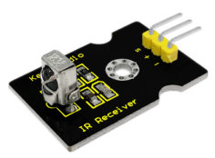        |
|   34    |            Digital IR Transmitter Module            |      1       |       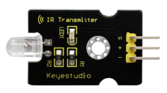        |
|   35    |              Pulse Rate Monitor Module              |      1       |       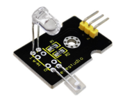        |
|   36    |                   Joystick Module                   |      1       |       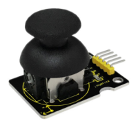        |
|   37    |                Rotary Encoder Module                |      1       |       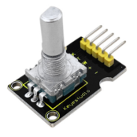        |
|   38    |              5V 1 Channel Relay Module              |      1       |       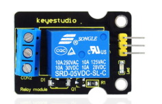        |
|   39    |           LM35 Linear Temperature Sensor            |      1       |       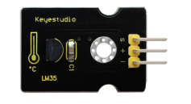        |
|   40    |        DHT11 Temperature and Humidity Sensor        |      1       |       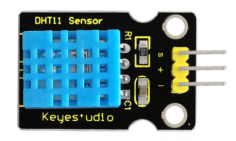        |
|   41    |              Magical Light Cup Module               |      2       |       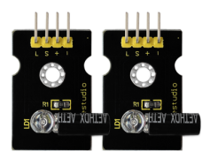        |
|   42    |          APDS-9930 Attitude Sensor Module           |      1       |       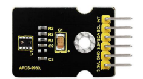        |
|   43    | ALS Infrared LED Optical Proximity Detection Module |      1       |       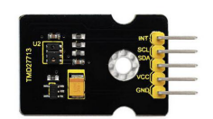        |
|   44    | MMA8452Q Triaxial Digital Acceleration Tilt Sensor  |      1       |       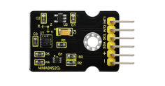        |
|   45    |                   9G Servo Motor                    |      1       |       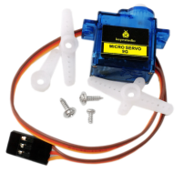        |
|   46    |           HC-SR04 Blue Ultrasonic Sensor            |      1       |       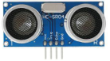        |
|   47    |  0802 LCD module 5V blue screen（with backlight）   |      1       |       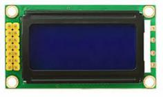       |
|   48    |        8x8 LED Matrix Module Address Select         |      1       |       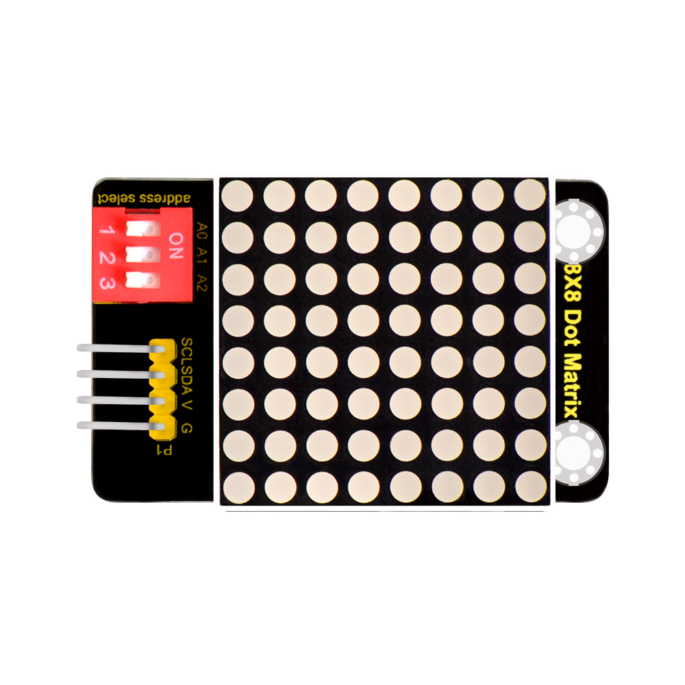       |


# 3.keyestudio V4.0 Development Board

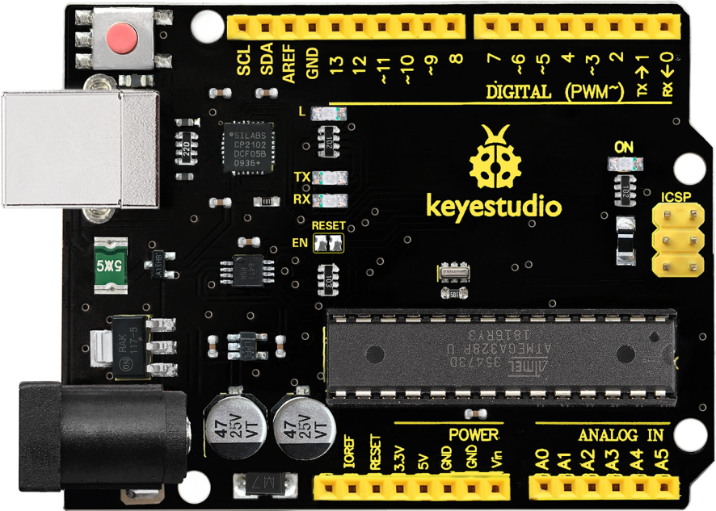

Keyestudio V4.0 development board is an Arduino uno-compatible board, which is based on ATmega328P MCU, and with a cp2102 Chip as a UART-to-USB converter.

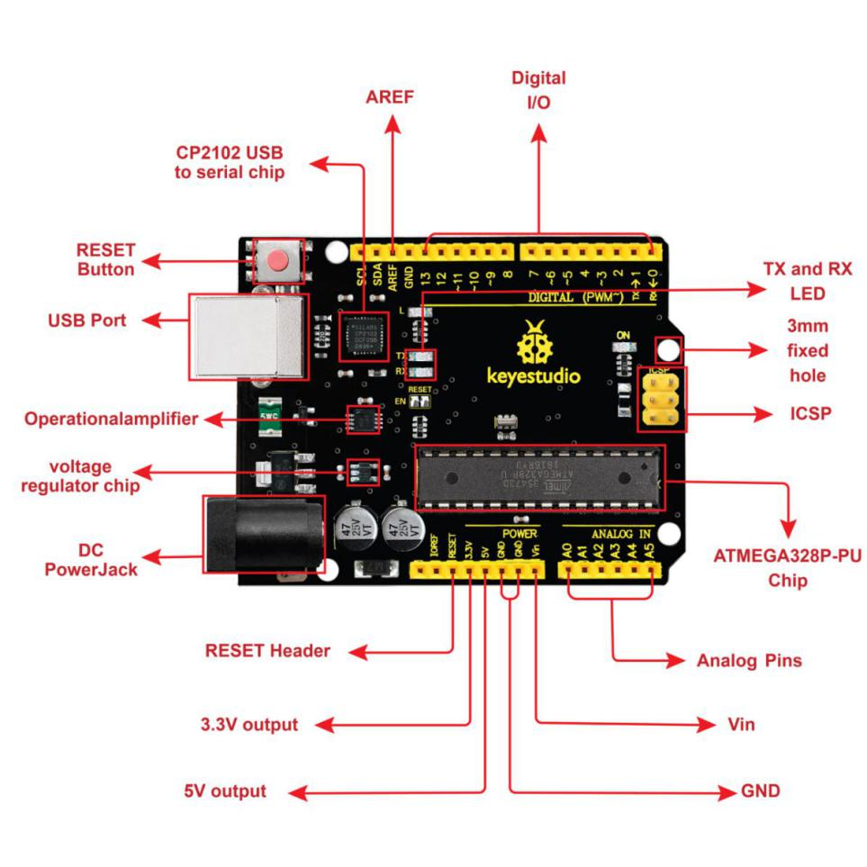  
It has 14 digital input/output pins (of which 6 can be used as PWM outputs), 6 analog inputs, a 16 MHz quartz crystal, a USB connection, a power jack, 2 ICSP headers and a reset button.

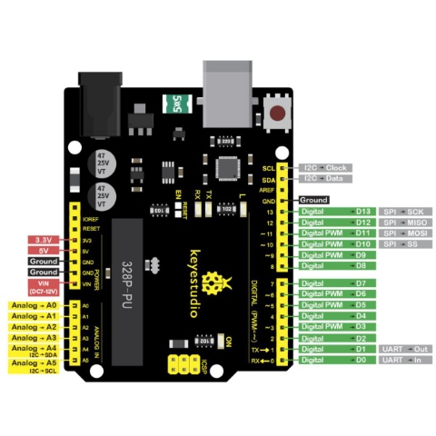
It contains everything needed to support the micro controller; simply connect it to a computer with a USB cable or power it via an external DC power jack (DC 7-12V) or via female headers Vin/ GND(DC 7-12V) to get started.

| Microcontroller             | ATmega328P-PU                                            |
|-----------------------------|----------------------------------------------------------|
| Operating Voltage           | 5V                                                       |
| Input Voltage (recommended) | DC7-12V                                                  |
| Digital I/O Pins            | 14 (D0-D13)  (of which 6 provide PWM output)             |
| PWM Digital I/O Pins        | 6 (D3, D5, D6, D9, D10, D11)                             |
| Analog Input Pins           | 6 (A0-A5)                                                |
| DC Current per I/O Pin      | 20 mA                                                    |
| DC Current for 3.3V Pin     | 50 mA                                                    |
| Flash Memory                | 32 KB (ATmega328P-PU) of which 0.5 KB used by bootloader |
| SRAM                        | 2 KB (ATmega328P-PU)                                     |
| EEPROM                      | 1 KB (ATmega328P-PU)                                     |
| Clock Speed                 | 16 MHz                                                   |
| LED_BUILTIN                 | D13                                                      |

# 4.Install Arduino IDE and Driver


**Click the link to start learning how to download software, install drivers, upload code, and install library files.**

**[https://getting-started-with-arduino.readthedocs.io](https://getting-started-with-arduino.readthedocs.io/en/latest/Arduino%20IDE%20Tutorial.html)**

# 5.Projects

## Project 1: White LED

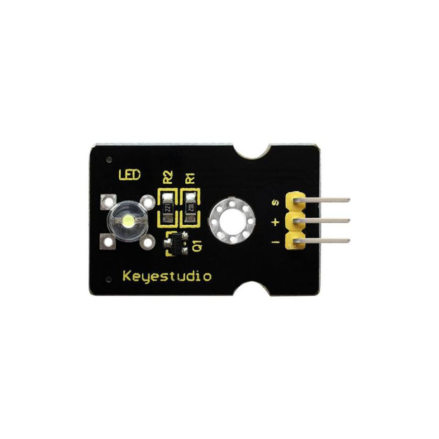

**Description**

This white LED light module is ideal for Arduino starters. It can be easily connected to IO/Sensor shield. It enables interaction with light-related works.

Note: You can choose other LED modules to emit different color like yellow, red, green and blue.

**Specification**

-   White LED module

-   Type: Digital

-   PH2.54 socket

-   Size: 30\*20mm

-   Weight: 3g

**Connection Diagram**

First, you need to prepare the following parts before connection:

-   V4.0 board\*1

-   White LED module \*1

-   USB Cable\*1

-   Jumper wire\*3

Connect the S pin of module to Digital 3 of V4.0 board, connect the negative pin to GND port, positive pin to 5V port.

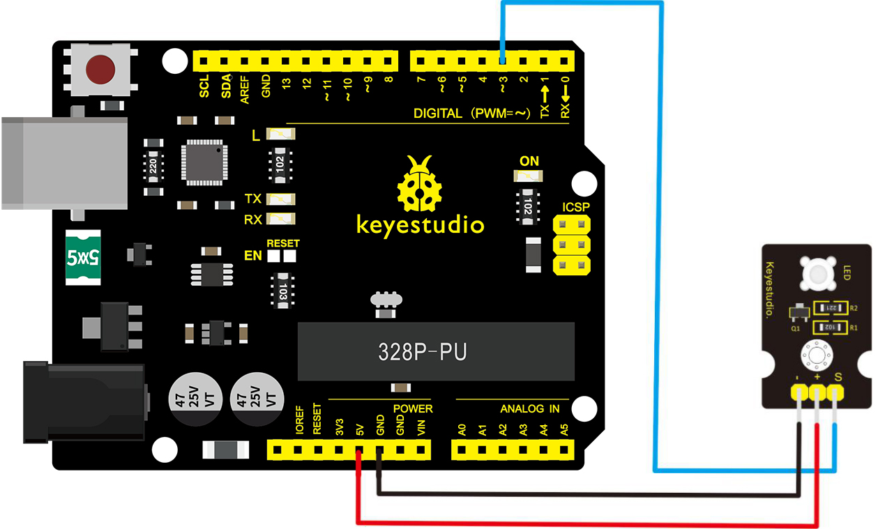

**Sample Code**

Copy and paste the below code to Arduino software.

```c
int buzzPin =3;    //Connect Buzzer on Digital Pin3
 void setup()  
 {        
  pinMode(buzzPin, OUTPUT);     
}
 void loop()                     
{
  digitalWrite(buzzPin, HIGH);
  delay(1);
  digitalWrite(buzzPin, LOW); 
  delay(1);        
}
```


**Example Result**

Done wiring and powered up, upload well the code, you will see the LED module emit the white light.

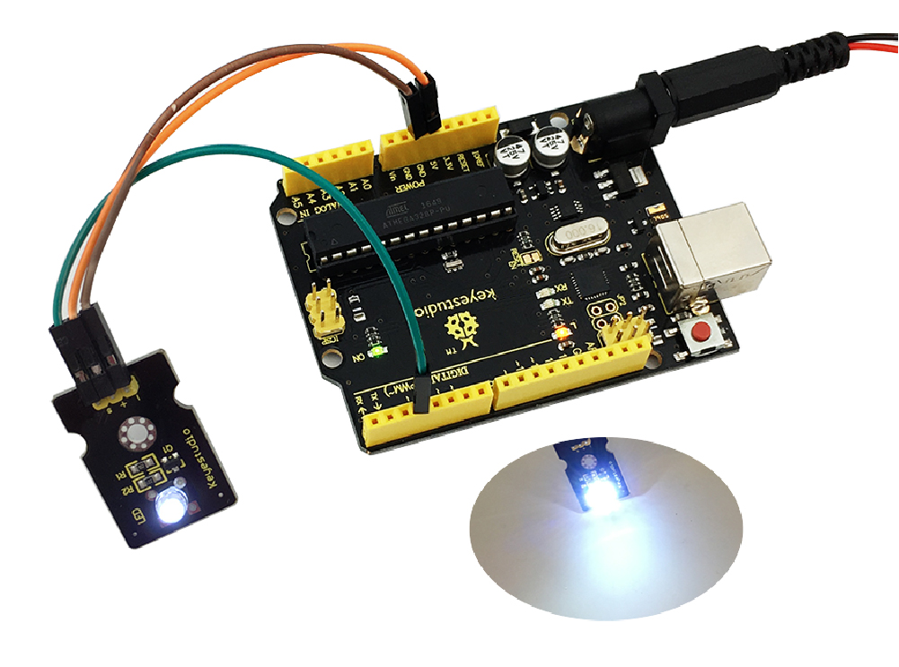

## Project 2: RGB LED

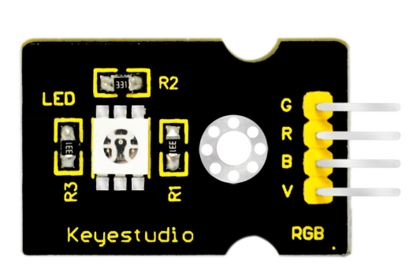

**Description**

This is a full-color LED module, which contains 3 basic colors－red, green and blue. They can be seen as separate LED lights.

After programming, you can turn them on and off by sequence or can also use PWM analog output to mix three colors to generate different colors.

**Specification**

-   Color: red, green and blue

-   Brightness: High

-   Voltage: 5V

-   Input: digital level

-   Size: 30 \*20mm

-   Weight: 3g

**Connection Diagram**

First, you need to prepare the following parts before connection:

-   V4.0 Board\*1

-   RGB LED module \*1

-   USB Cable\*1

-   Jumper Wire\*4

Connect the V pin of module to 5V port of V4.0 board, connect the B pin to Digital 11, R pin to Digital 10, G pin to Digital 9.

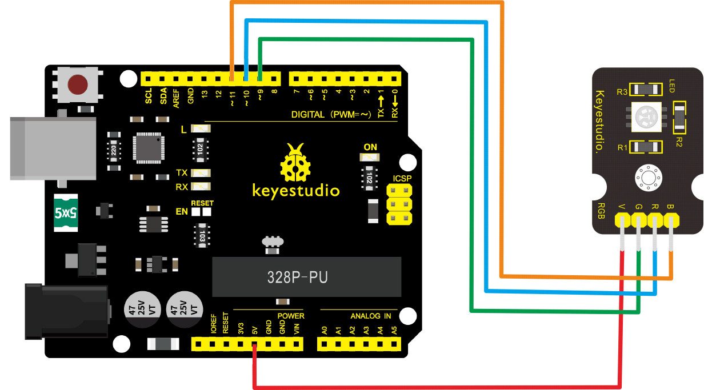

**Sample Code**

Copy and paste the below code to Arduino software.

```c
///////////////////////////////////////////////////////////
int redpin = 11; //select the pin for the red LED
int bluepin =10; // select the pin for the blue LED
int greenpin =9;// select the pin for the green LED
int val;
void setup() {
  pinMode(redpin, OUTPUT);
  pinMode(bluepin, OUTPUT);
  pinMode(greenpin, OUTPUT);
  }
void loop() 
{for(val=255; val>0; val--)
  {analogWrite(11, val);
   analogWrite(10, 255-val);
   analogWrite(9, 128-val);
   delay(1); 
  }
for(val=0; val<255; val++)
  {analogWrite(11, val);
   analogWrite(10, 255-val);
   analogWrite(9, 128-val);
   delay(1);  
  }
}
///////////////////////////////////////////////////////////
```


**Example Result**

Done wiring and powered up, upload well the code, you will see the RGB LED module emit shiny colors.

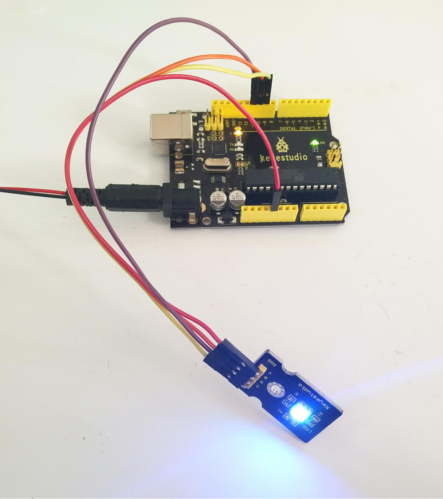

## Project 3: 3W LED

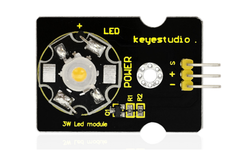

**Description**

This LED module is of high brightness because the lamp beads it carries is 3w.
You can apply this module to Arduino projects, ideal for Robot or search and
rescue platform application.

For example, intelligent robots can use this module for illumination purpose. 
Please note that the LED light can't be exposed directly to human eyes for
safety concerns.

**Specification**

- Color temperature: 6000\~7000K

- Luminous flux: 180\~210lm

- Current: 700\~750mA

- Power: 3W

- Light angle: 140 degree

- Working temperature: -50\~80℃

- Storage temperature: -50\~100℃

- High power LED module, controlled by IO port microcontroller

- IO Type: Digital

- Supply Voltage: 3.3V to 5V

- Size: 40x28mm

- Weight: 6g

**Connection Diagram**

First, you need to prepare the following parts before connection:

-   V4.0 Board\*1

-   3W LED module \*1

-   USB Cable\*1

-   Jumper Wire\*3

Connect the S pin of module to Digital 13 of V4.0 board, connect the negative pin to GND port, positive pin to 5V port.

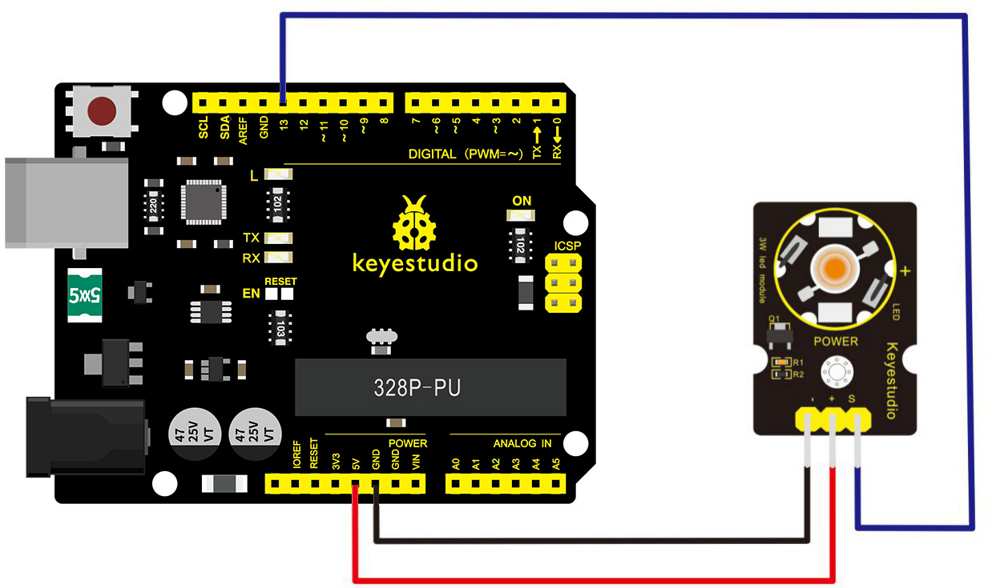

**Sample Code**

Copy and paste the below code to Arduino software.

```c
///////////////////////////////////////////////////////////
// the setup function runs once when you press reset or power the board
void setup() {
  // initialize digital pin 13 as an output.
  pinMode(13, OUTPUT);
}

// the loop function runs over and over again forever
void loop() {
  digitalWrite(13, HIGH);   // turn the LED on (HIGH is the voltage level)
  delay(1000);              // wait for a second
  digitalWrite(13, LOW);    // turn the LED off by making the voltage LOW
  delay(1000);              // wait for a second
}
///////////////////////////////////////////////////////////
```


**Example Result**

Done wiring and powered up, upload well the code, both D13 led and the led on the module blink for one second then off, circularly.

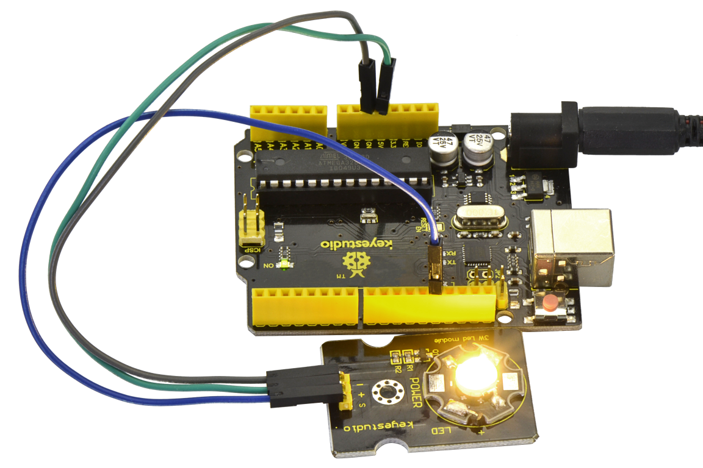

## Project 4: Traffic Light

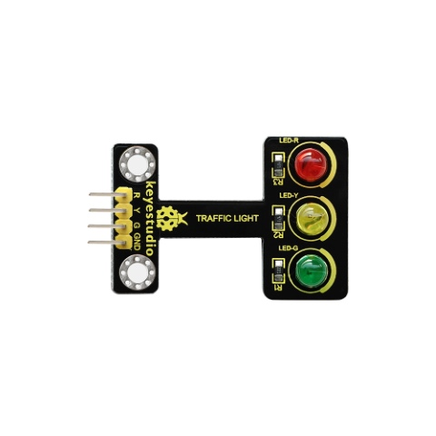

**Description**

When learning the microcontroller, you may usually use three LEDs, namely red, green and yellow lights to simulate the traffic light blinking via external connection.

This time we specially design this module which is very convenient for wiring, and on the module you can see the red, yellow and green LED.

This module is fully compatible with Arduino microcontroller and Raspberry Pi system.

**Specification**

-   Working Voltage: 3.3-5v

-   Interface Type: digital

-   PH2.54 Socket

**Connection Diagram**

First, you need to prepare the following parts before connection:

-   V4.0 Board\*1

-   Traffic light module \*1

-   USB Cable\*1

-   Jumper Wire\*4

Connect the R pin of module to Digital 5 of V4.0 board, connect the Y pin to Digital 4, G pin to Digital 3, GND pin to ground port.

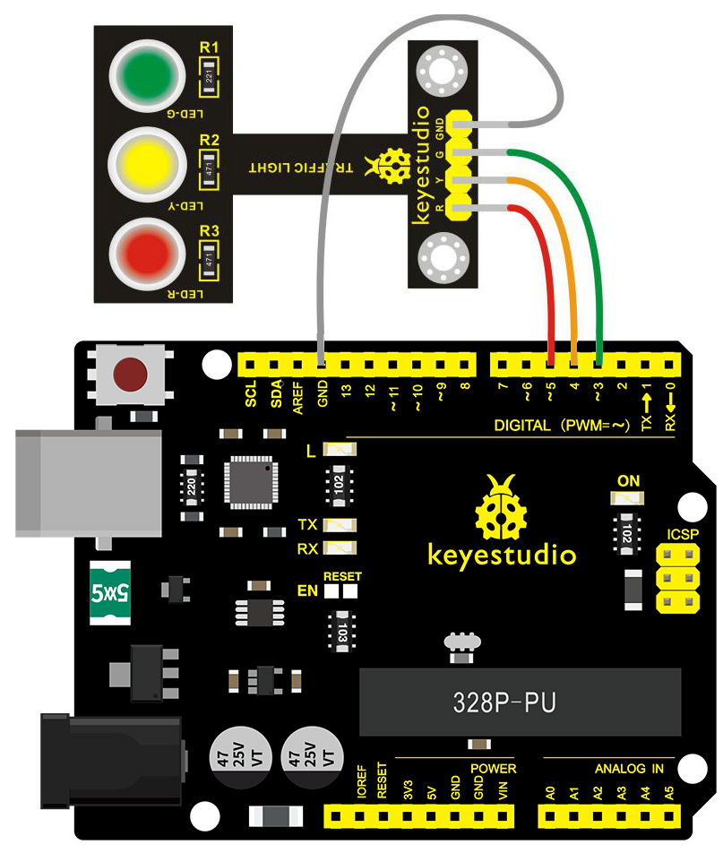

**Sample Code**

Copy and paste the below code to Arduino software.

```c
////////////////////////////////////////////////////////////////////
int redled =5; // initialize digital pin 5.
int yellowled =4; // initialize digital pin 4.
int greenled =3; // initialize digital pin 3.
void setup()
{
pinMode(redled, OUTPUT);// set the pin with red LED as “output”
pinMode(yellowled, OUTPUT); // set the pin with yellow LED as “output”
pinMode(greenled, OUTPUT); // set the pin with green LED as “output”
}
void loop()
{
digitalWrite(greenled, HIGH);//// turn on green LED
delay(5000);// wait 5 seconds
digitalWrite(greenled, LOW); // turn off green LED
for(int i=0;i<3;i++)// blinks for 3 times
{
delay(500);// wait 0.5 seconds
digitalWrite(yellowled, HIGH);// turn on yellow LED
delay(500);// wait 0.5 seconds
digitalWrite(yellowled, LOW);// turn off yellow LED
} 
delay(500);// wait 0.5 seconds
digitalWrite(redled, HIGH);// turn on red LED
delay(5000);// wait 5 seconds
digitalWrite(redled, LOW);// turn off red LED
}
////////////////////////////////////////////////////////////////////
```


**Example Result**

Done uploading the code, powered up, three LEDs on the module will automatically simulate the traffic light on and off, circularly.

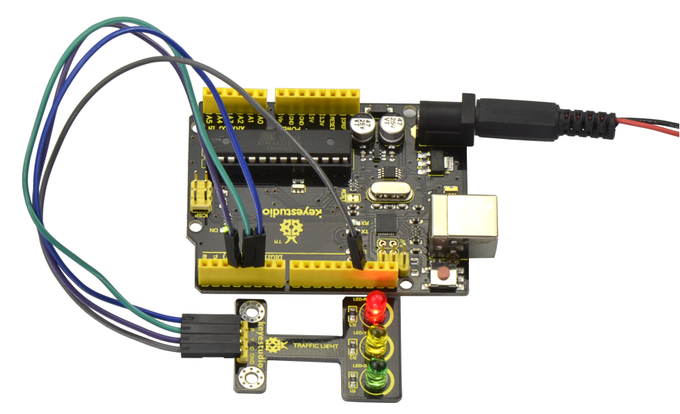

## Project 5: Buzzer Beeps

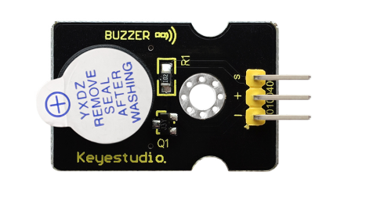

**Description**

Here is the simplest sound making module. You can use high/low level to drive it. Changing the frequency it buzzes can produce different sounds.

This module is widely used on our daily appliances like PC, refrigerator, phones, etc.

In addition, you can create many interesting interactive projects with this small but useful module. Just try it!! You will find the electronic sound it creates so fascinating.

**Specification**

-   Working voltage: 3.3-5v

-   Interface type: digital

-   Size: 30*20mm

-   Weight: 4g

**Connection Diagram**

Connect the S pin of module to Digital 3 of V4.0 board, connect the negative pin to GND port, positive pin to 5V port.

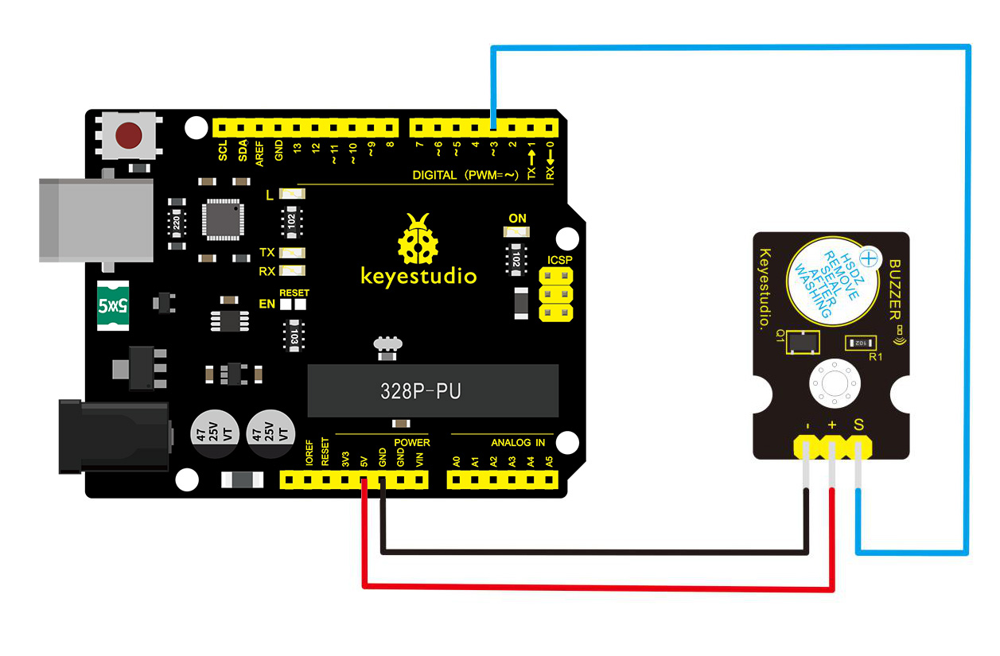

**Sample Code**

Copy and paste the below code to Arduino software.

```c
////////////////////////////////////////////////////////////////////
int buzzPin =3;    //Connect Buzzer on Digital Pin3
 void setup()  
 {        
  pinMode(buzzPin, OUTPUT);     
}
 void loop()                     
{
  digitalWrite(buzzPin, HIGH);
  delay(1);
  digitalWrite(buzzPin, LOW); 
  delay(1);        
}
////////////////////////////////////////////////////////////////////
```


**Example Result**

Done uploading the code to board, the buzzer will make a sound.

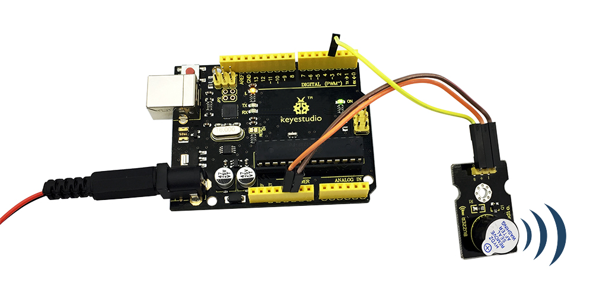

## Project 6: Passive Buzzer

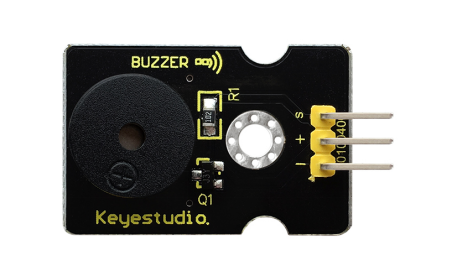

**Description**

We can use Arduino to make many interactive works of which the most commonly used is acoustic-optic display. The circuit in this experiment can produce sound.

Normally, the experiment can be done with a buzzer or a speaker, while buzzer is simpler and easier to use.

The buzzer we introduced here is a passive buzzer. It cannot be actuated by itself, but by external pulse frequencies. Different frequencies produce different sounds. You can use Arduino to code the melody of a song, quite fun and simple.

**Specification**

-   Working voltage: 3.3-5v

-   Interface type: digital

-   Size: 30\*20mm

-   Weight: 4g

**Connection Diagram**

First, you need to prepare the following parts before connection:

-   V4.0 Board*1

-   Passive buzzer module*1

-   USB Cable*1

-   Jumper Wire*3

Connect the S pin of module to Digital 3 of V4.0 board, connect the negative pin to GND port, positive pin to 5V port.

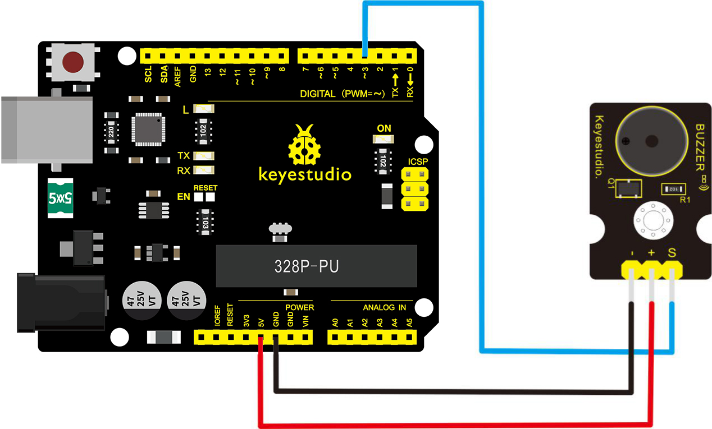

**Sample Code**

Copy and paste the below code to Arduino software.

```c
////////////////////////////////////////////////////////////////////
int buzzer=3;//set digital IO pin of the buzzer
void setup() 
{ 
pinMode(buzzer,OUTPUT);// set digital IO pin pattern, OUTPUT to be output 
} 
void loop() 
{ unsigned char i,j;//define variable
while(1) 
{ for(i=0;i<80;i++)// output a frequency sound
{ digitalWrite(buzzer,HIGH);// sound
delay(1);//delay1ms 
digitalWrite(buzzer,LOW);//not sound
delay(1);//ms delay 
} 
for(i=0;i<100;i++)// output a frequency sound
{ 
digitalWrite(buzzer,HIGH);// sound
digitalWrite(buzzer,LOW);//not sound
delay(2);//2ms delay 
}
} 
} 
////////////////////////////////////////////////////////////////////
```


**Example Result**

Done uploading the code to board, the buzzer will make a sound.

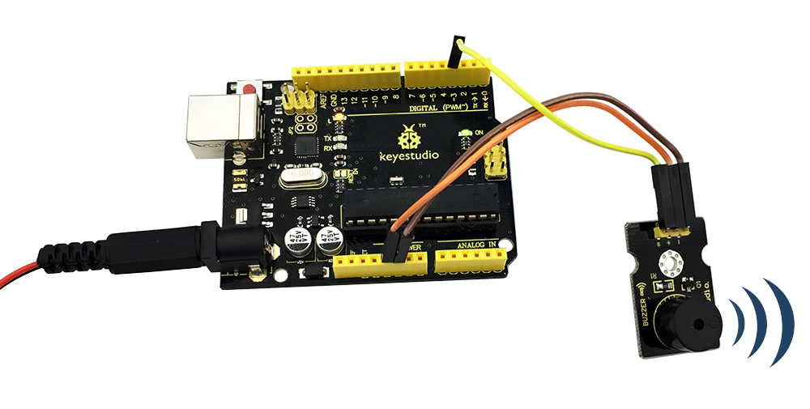

## Project 7: Digital Push Button

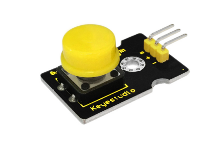

**Description**

This is a basic button module. You can simply plug it into an IO shield to have your first try of Arduino.

**Features**

- Wide voltage range from 3.3V to 5V

- Easily recognizable interfaces of sensors ("A" for Analog and "D" for Digital)

- Standard assembled hole

- Clear icons illustration

- High quality connector

- Easy to plug and operate

- Large button and high-quality cap

- To achieve interesting and interactive works

**Specification**

- Supply Voltage: 3.3V to 5V

- Interface: Digital

- Dimensions: 30*20mm

- Weight: 4g


**Connection Diagram**

First, you need to prepare the following parts before connection:

-   V4.0 Board*1

-   Push button module*1

-   USB Cable*1

-   Jumper Wire*3

Connect the S pin of module to Digital 3 of V4.0 board, connect the negative pin to GND port, positive pin to 5V port.

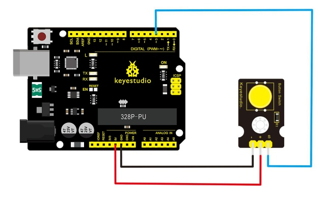

**Sample Code**

Copy and paste the below code to Arduino software.

```c
////////////////////////////////////////////////////////////////////
/* # When you push the digital button, the Led 13 on the board will be turned on. Otherwise,the led is turned off.
*/
int ledPin = 13;                // choose the pin for the LED
int inputPin = 3;               // Connect sensor to input pin 3 
void setup() {
  pinMode(ledPin, OUTPUT);      // set LED as output
  pinMode(inputPin, INPUT);     // set pushbutton as input
}
void loop(){
  int val = digitalRead(inputPin);  // read input value
  if (val == HIGH) {            // check if the input is HIGH
    digitalWrite(ledPin, LOW);  // turn LED OFF
  } else {
    digitalWrite(ledPin, HIGH); // turn LED ON
  }
}
////////////////////////////////////////////////////////////////////
```


**Example Result**

Wire it up well as the figure shown below, and then upload the code to the board.

When you push the digital button, the Led 13 on V4.0 board will be on. When release the button, the led is off. Shown as below.

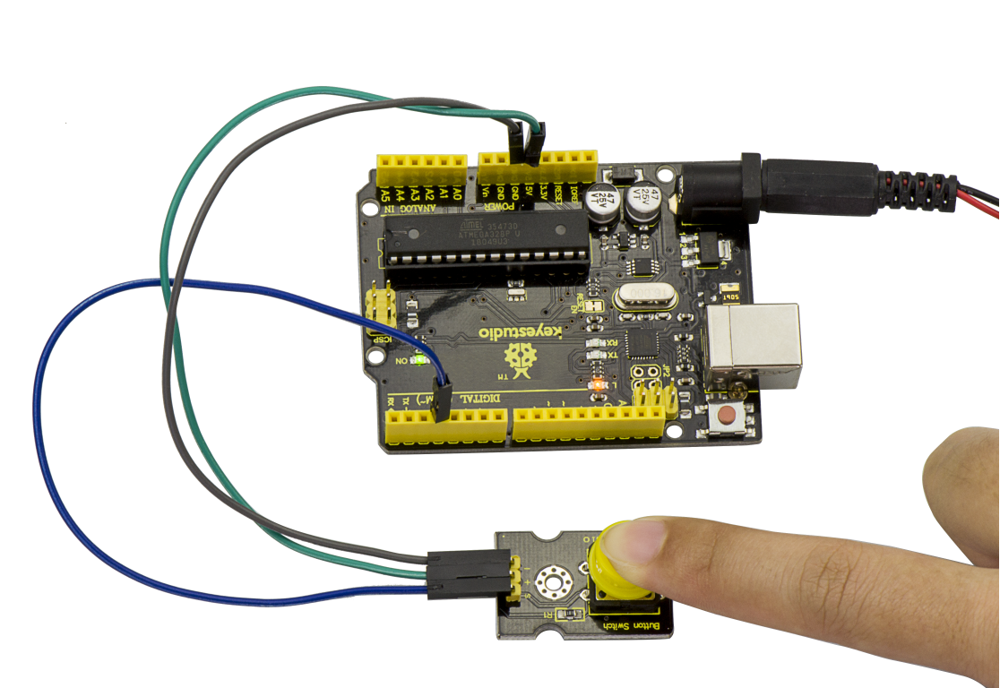

## Project 8: Collision Flash

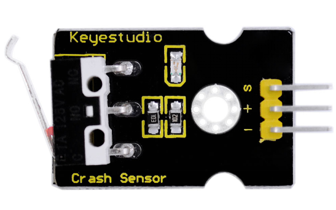

**Description**

Crash sensor, also known as electronic switch, is a digital on-off input module necessary for elementary electronic learning.

By programming, it can realize to control over light, sound device, key choice function of LCD display, etc.

Using 3P sensor cable to connect it to sensor shield, it can be installed to 4WD AL alloy mobile robot platform to realize collision detection function. It is both convenient and efficient.

You can make a collision flasher using collision module and built-in LED on interface 13. Connect the collision sensor to pin 3. When the collision sensor senses a collision signal, the LEDs on both main board and module will light up simultaneously.

**Parameters**

1. If collision happens upfront of where collision module is installed, module outputs low level signal; no collision, outputs high level signal.

2. Module reserves M3 mounting hole, convenient for fixation on a car.

3. With switch indicator light, if there is collision, light is on; no collision, light is off.

**Pin definition**

1.  Positive pin (+): connect to 3v-12v power supply

2.  Negative pin (-): connect to GND

3.  Signal pin (S): connect to High-low level output

**Connection Diagram**

First, you need to prepare the following parts before connection:

-   V4.0 Board\*1

-   Crash module \*1

-   USB Cable\*1

-   Jumper Wire\*3

Connect the S pin of module to Digital 3 of V4.0 board, connect the negative pin to GND port, positive pin to 5V port.

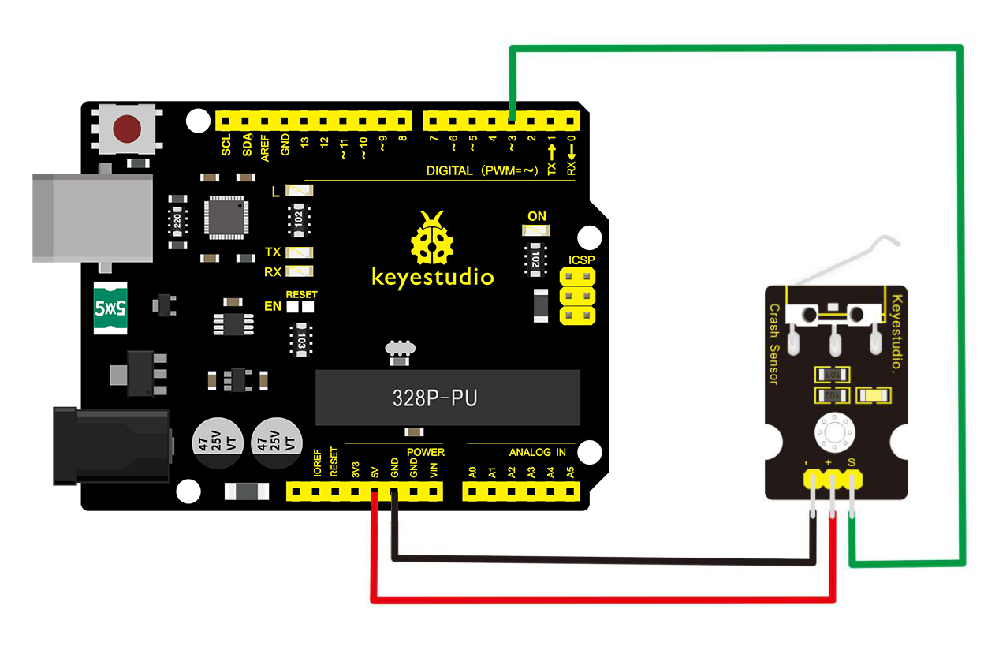

**Sample Code**

Copy and paste the below code to Arduino software.

```c
////////////////////////////////////////////////////////////////////
int Led=13;// set pin for LED 
int Shock=3// set pin for collision sensor
;int val;// set digital variable val
void setup()
{ 
pinMode(Led,OUTPUT);// set pin LED as output
pinMode(Shock,INPUT);// set collision sensor as input
}
void loop()
{
val=digitalRead(Shock);// read value on pin 3 and assign it to val
if(val==HIGH)// when collision sensor detects a signal, LED turns on.
{
digitalWrite(Led,LOW);
} else
{
digitalWrite(Led,HIGH);
}
}
////////////////////////////////////////////////////////////////////
```


**Example Result**

Wire it up well and then upload the code to the board.

When the object crashes the switch of sensor, both the led on the sensor and led 13 on the board are turned on.

## Project 9: Line -tracking Sensor

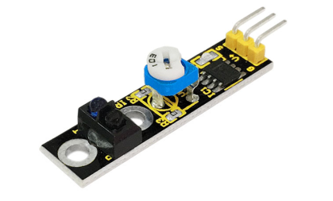

**Description**

This Line Tracking Sensor can detect white line in black or black line in white.

The single line-tracking signal provides a stable output signal TTL for a more accurate and more stable line. Multi-channel option can be easily achieved by installing required line-tracking robot sensors.

**Specification**

1.  Power supply: +5V

2.  Operating current: \<10mA

3.  Operating temperature range: 0°C \~ + 50°C

4.  Output interface: 3-wire interface (1 - signal, 2 - power, 3 - power supply negative)
    
5.  Output Level: TTL level

**Connection Diagram**

First, you need to prepare the following parts before connection:

-   V4.0 Board\*1

-   Line tracking module \*1

-   USB Cable\*1

-   Jumper Wire\*3

Connect the S pin of module to Digital 3 of V4.0 board, connect the GND pin to GND port, V+ pin to 5V port.

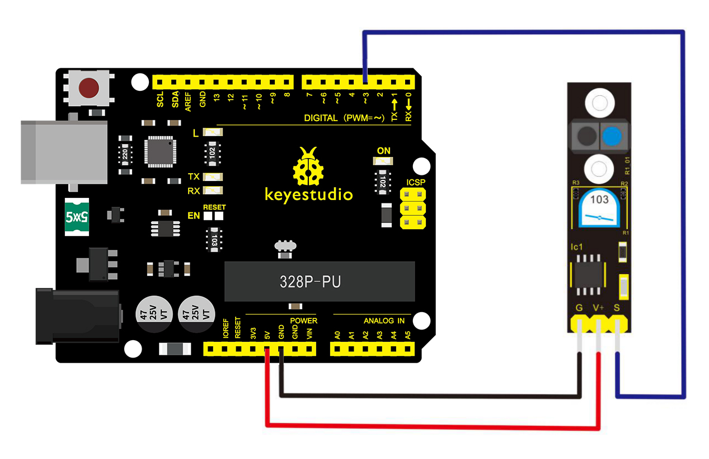

**Sample Code**

Copy and paste the below code to Arduino software.

```c
////////////////////////////////////////////////////////////////////
//Arduino Sample Code
void setup()
{
  Serial.begin(9600);
}
void loop()
{
  Serial.println(digitalRead(3)); // print the data from the sensor
  delay(500);
}
////////////////////////////////////////////////////////////////////
```


**Example Result**

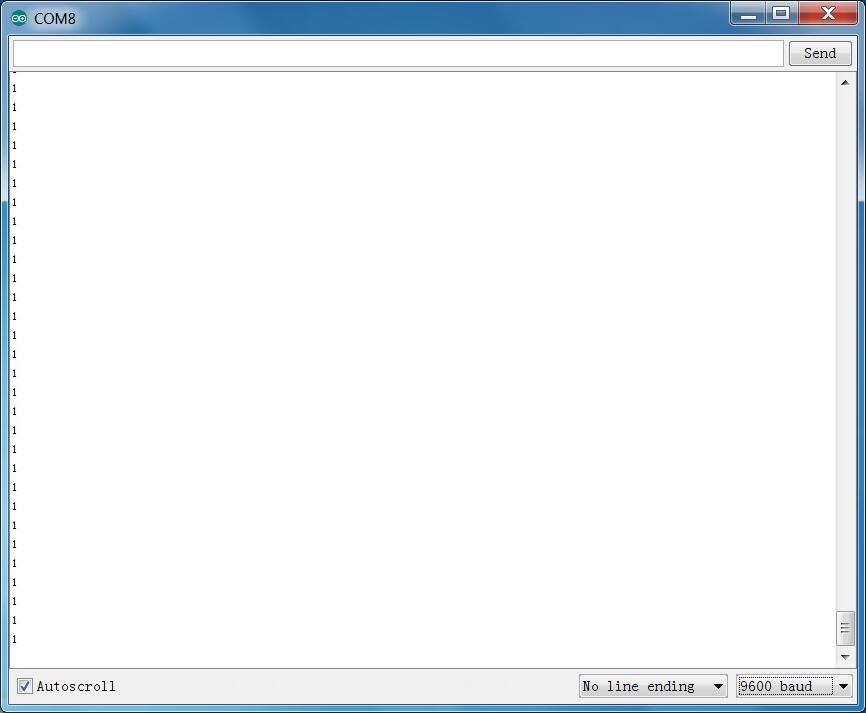

Done uploading the code to board, open the serial monitor and set the baud rate as 9600, then you can see the data from the sensor.

## Project 10: Infrared Obstacle Avoidance

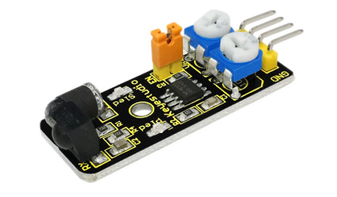

**Description**

Infrared obstacle detector sensor is equipped with distance adjustment function and is especially designed for wheeled robots.

This sensor has strong adaptability to ambient light and is of high precision.

It has a pair of infrared transmitting and receiving tube. When infrared ray launched by the transmitter tube encounters an obstacle (its reflector), the infrared ray will be reflected to the receiver tube, thus the indicator will light up, and signal output interface outputs digital signal.

In addition, you can rotate the potentiometer knob to adjust detection distance (effective distance: 2～40cm, working Voltage: 3.3V-5V ).

Thanks to a wide voltage range, this sensor can work steadily even under fluctuating power supply voltage, and is suitable for various micro-controllers, Arduino controllers and BS2 controllers.

A robot mounted with this sensor can sense obstacle in the environment.

**Specification**

- Working voltage: DC 3.3V-5V

- Working current: ≥20mA

- Working temperature: －10℃ to＋50℃

- Detection distance: 2-40cm

- IO Interface: 4 wire interfaces (-/+/S/EN)

- Output signal: TTL voltage

- Accommodation mode: Multi-circle resistance regulation

- Effective Angle: 35°

**Connection Diagram**

First, you need to prepare the following parts before connection:

-   V4.0 Board\*1

-   Obstacle detector module \*1

-   USB Cable\*1

-   Jumper Wire\*3

Connect the Out pin of module to Digital 2 of V4.0 board, connect the V+ pin to 5V port, GND pin to GND port.

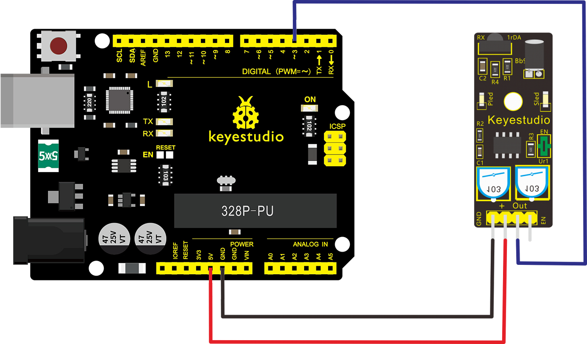

**Sample Code**

Copy and paste the below code to Arduino software.

```c
////////////////////////////////////////////////////////////////////
const int sensorPin = 3;     // the number of the sensor pin
const int ledPin =  13;      // the number of the LED pin
int sensorState = 0;         // variable for reading the sensor status
void setup() {
  pinMode(ledPin, OUTPUT);      
  pinMode(sensorPin, INPUT); }
void loop(){
  // read the state of the sensor value:
  sensorState = digitalRead(sensorPin);
  // if it is, the sensorState is HIGH:
  if (sensorState == HIGH) {     
     digitalWrite(ledPin, HIGH);  
  } 
  else {
       digitalWrite(ledPin, LOW); 
  }
}
////////////////////////////////////////////////////////////////////
```


**Example Result**

Done uploading the code to board, you can see the led on both V4.0 board and obstacle detector sensor is turned on.

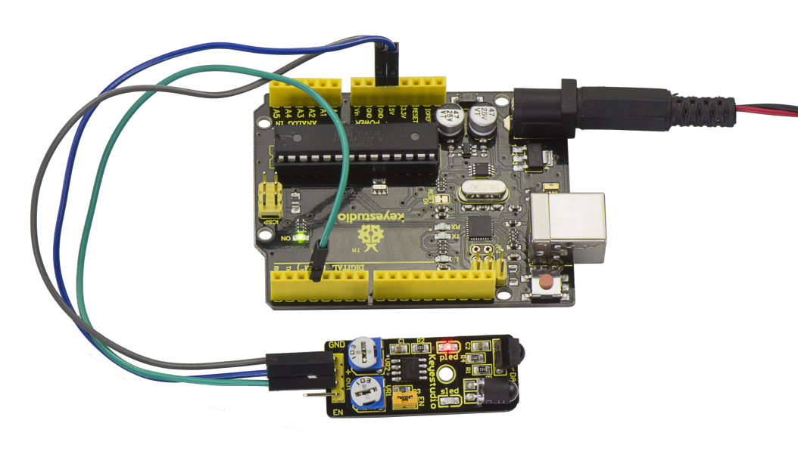

If we put a foam block in front of the sensor, this time when sensor detects the obstacle, sled on the sensor will be turned on.

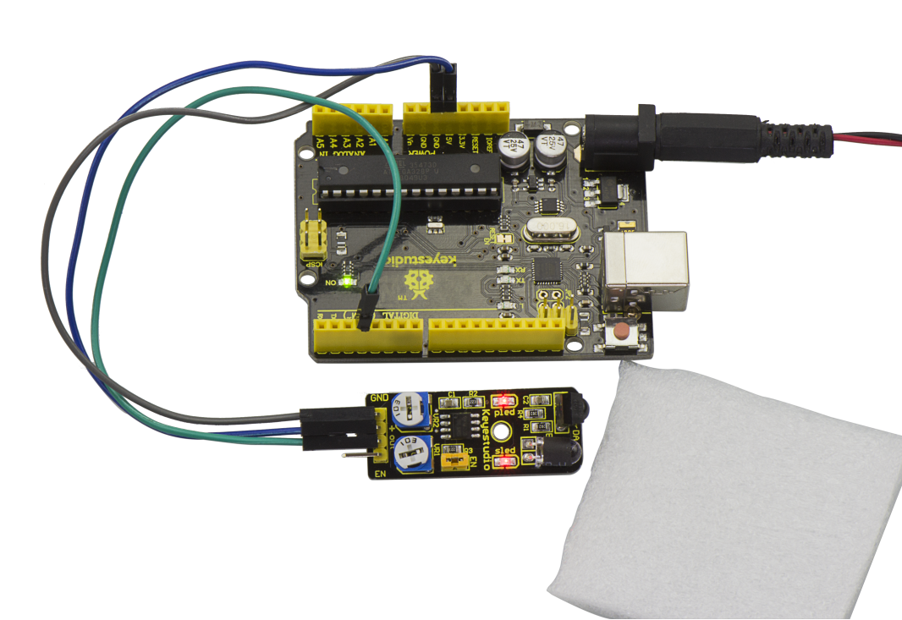

## Project 11: Photo Interrupter

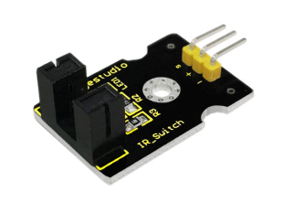

**Description**

Upright part of this sensor is an infrared emitter and on the other side, it’s a shielded infrared detector. By emitting a beam of infrared light from one end to other end, the sensor can detect an object when an object passes through the beam.

It is used for many applications including optical limit switches, pellet dispensing, general object detection, etc.

**Specification**

-   Supply Voltage: 3.3V to 5V

-   Interface: Digital

-   Size: 30*20mm

-   Weight: 3g

**Connection Diagram**

First, you need to prepare the following parts before connection:

-   V4.0 Board\*1

-   Photo interrupter module \*1

-   USB Cable\*1

-   Jumper Wire\*3

Connect the S pin of module to Digital 3 of V4.0 board, connect the negative pin to GND port, positive pin to 5V port.

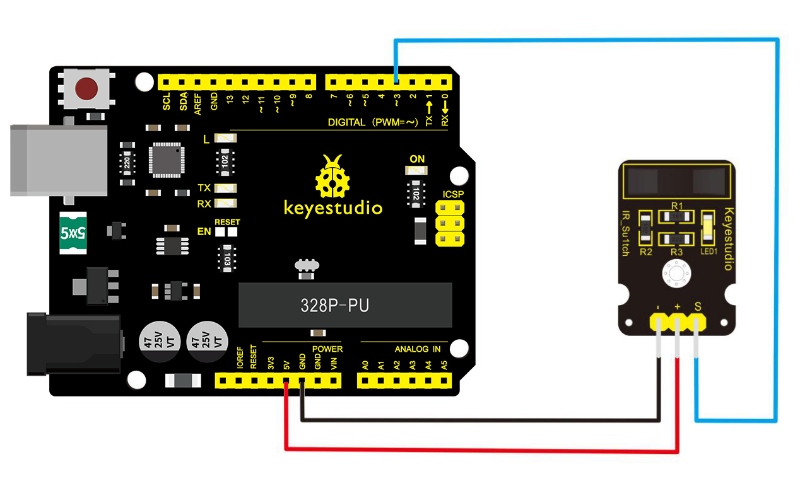

**Sample Code**

Copy and paste the below code to Arduino software.

```c
////////////////////////////////////////////////////////////////////
// photo interrupter module
int Led = 13 ;// define LED Interface
int buttonpin = 3; // define the photo interrupter sensor interface
int val ;// define numeric variables val
void setup ()
{
  pinMode (Led, OUTPUT) ;// define LED as output interface
  pinMode (buttonpin, INPUT) ;// define the photo interrupter sensor output interface   
}
void loop ()
{
  val = digitalRead (buttonpin) ;// digital interface will be assigned a value of 3 to read val
  if (val == HIGH) // When the light sensor detects a signal is interrupted, LED flashes
  {
    digitalWrite (Led, HIGH);
  }
  else
  {
    digitalWrite (Led, LOW);
  }
}
////////////////////////////////////////////////////////////////////
```


**Example Result**

Done uploading the code to board, you can see both led on V4.0 board and on module are turned on. Shown as below.

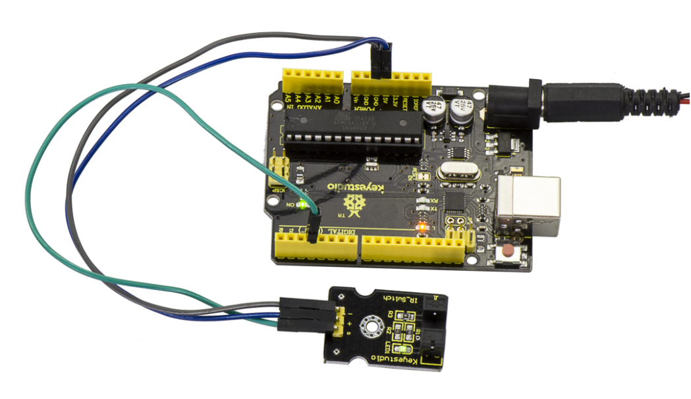

When pick up a paper on groove joint of module, the signal is interrupted, and led1 on the module will be turned off.

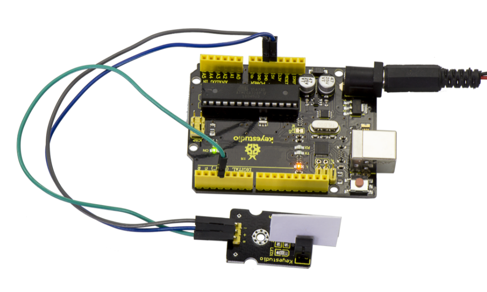

## Project 12: Hall Magnetic Sensor

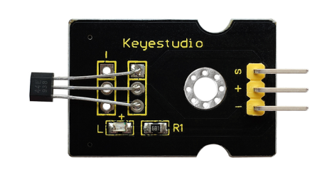

**Description**

This is a magnetic induction sensor. It can sense the magnetic materials within a detection range up to 3cm. The detection range and the strength of magnetic field are proportional. The output is digital on/off.

This sensor uses the SFE Reed Switch - Magnetic Field Sensor.

**Specification**

-   Sensing magnetic materials

-   Detection range: up to 3cm

-   Output: digital on/off

-   Size: 30*20mm

-   Weight: 3g

**Connection Diagram**

First, you need to prepare the following parts before connection:

-   V4.0 Board\*1

-   Hall sensor \*1

-   USB Cable\*1

-   Jumper Wire\*3

Connect the S pin of module to Digital 3 of V4.0 board, connect the negative pin to GND port, positive pin to 5V port.

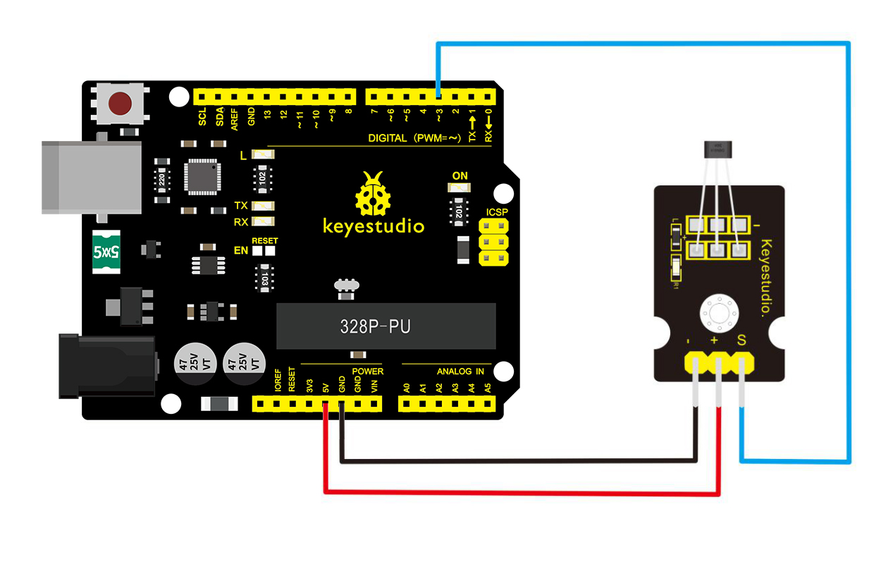

**Sample Code**

Copy and paste the below code to Arduino software.

```c
////////////////////////////////////////////////////////////////////
int ledPin = 13;                // choose the pin for the LED
int inputPin = 3;               // Connect sensor to input pin 3 
int val = 0;                    // variable for reading the pin status
 
void setup() {
  pinMode(ledPin, OUTPUT);      // declare LED as output
  pinMode(inputPin, INPUT);     // declare push button as input
}
 
void loop(){
  val = digitalRead(inputPin);  // read input value
  if (val == HIGH) {            // check if the input is HIGH
    digitalWrite(ledPin, LOW);  // turn LED OFF
  } else {
    digitalWrite(ledPin, HIGH); // turn LED ON
  }
}
////////////////////////////////////////////////////////////////////
```


**Example Result**

Wire it up and upload well the code to board, you will see that D13 indicator on V4.0 board is off, and led on the module is also off.

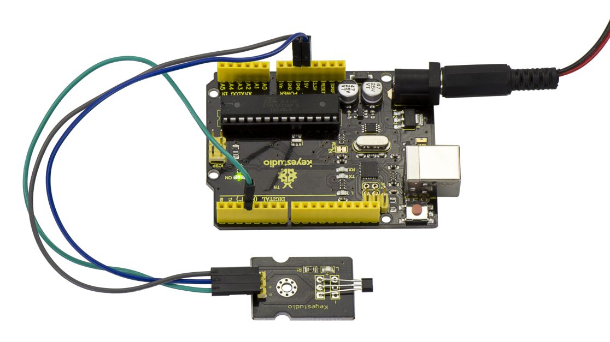

But if put a magnetic ball close to the hall module, you will see the D13 indicator on V4.0 board is turned on, and led on the module is also turned on.

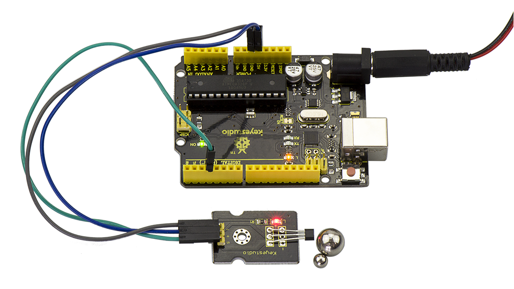

## Project 13: Knock Sensor

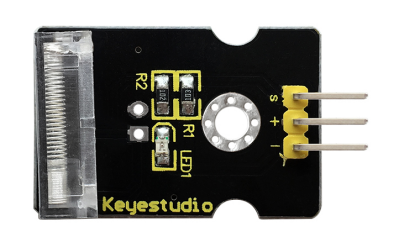

**Description**

This module is a knock sensor. When you knock it, it can send a momentary signal.

You can combine it with Arduino to make some interesting experiments, e.g. electronic drum

**Specification**

-   Working voltage: 5V

-   Size: 30\*20mm

-   Weight: 3g

**Connection Diagram**

First, you need to prepare the following parts before connection:

-   V4.0 Board\*1

-   Knock sensor \*1

-   USB Cable\*1

-   Jumper Wire\*3

Connect the S pin of module to Digital 3 of V4.0 board, connect the negative pin to GND port, positive pin to 5V port.

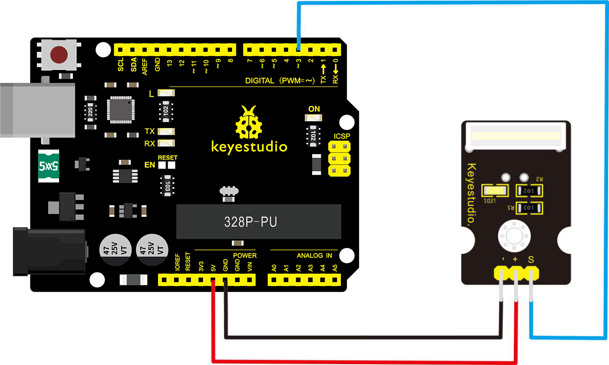

**Sample Code**

Copy and paste the below code to Arduino software.

```c
////////////////////////////////////////////////////////////////////
int Led=13;//define LED interface
int Shock=3;//define knock sensor interface
int val;//define digital variable val
void setup()
{
pinMode(Led,OUTPUT);//define LED to be output interface
pinMode(Shock,INPUT);//define knock sensor to be output interface
}
void loop()
{
val=digitalRead(Shock);//read the value of interface3 and evaluate it to val
if(val==HIGH)//when the knock sensor detect a signal, LED will be flashing
{
digitalWrite(Led,LOW);
}
else
{
digitalWrite(Led,HIGH);
}
}
////////////////////////////////////////////////////////////////////
```


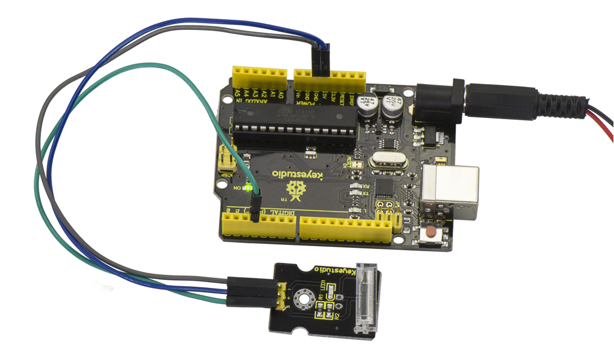

**Example Result**

Done wiring and powered up as above, upload well the code, then knock at the sensor, you will see both D13 led on the V4.0 board and D1 led on the sensor are turned on.

## Project 14: Digital Tilt Switch

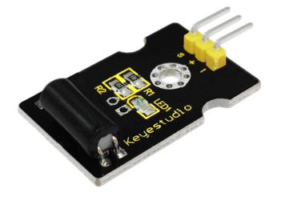

**Description**

Tilt Sensor is a digital tilt switch. It can be used as a simple tilt switch.

Simply plug it to our IO/Sensor shield, easy for wire connection. With dedicated sensor shield and Arduino, you can make lots of interesting and interactive works.

**Specification**

-   Supply Voltage: 3.3V to 5V

-   Interface: Digital

-   Size: 30*20mm

-   Weight: 3g

**Connection Diagram**

Connect the S pin of module to Digital 3 of V4.0 board, connect the negative pin to GND port, positive pin to 5V port.

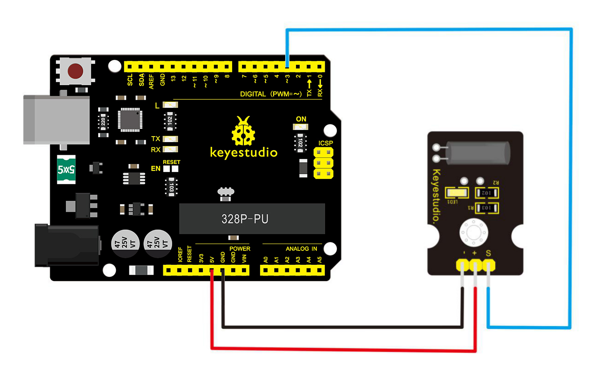

**Sample Code**

Copy and paste the below code to Arduino software.

```c
int Led=13;//define LED interface
int Shock=3;//define knock sensor interface
int val;//define digital variable val
void setup()
{
pinMode(Led,OUTPUT);//define LED to be output interface
pinMode(Shock,INPUT);//define knock sensor to be output interface
}
void loop()
{
val=digitalRead(Shock);//read the value of interface3 and evaluate it to val
if(val==HIGH)//when the knock sensor detect a signal, LED will be flashing
{
digitalWrite(Led,LOW);
}
else
{
digitalWrite(Led,HIGH);
}
}
```


**Example Result**

Done wiring and powered up, then upload well the code to V4.0 board.

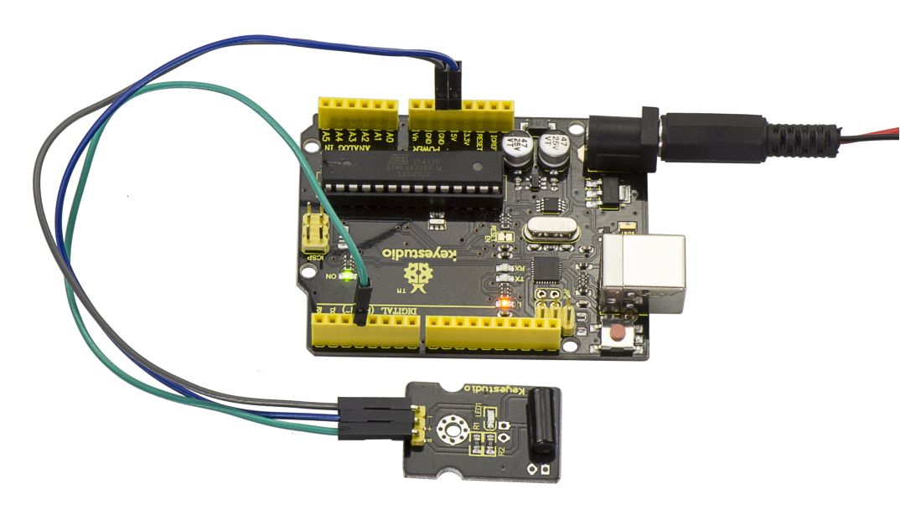

Then tilt the sensor, you will see the led on the sensor is turned on. Shown as below.

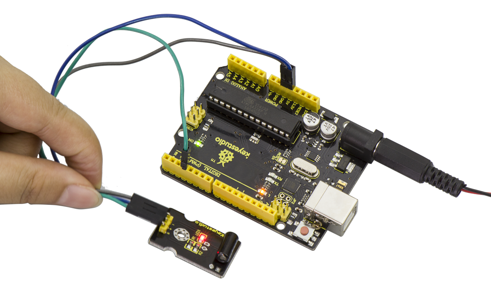

## Project 15: Capacitive Touch

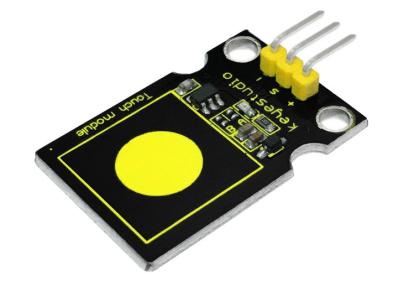

**Description**

Are you tired of clicking mechanic buttons? Well, try our capacitive touch sensor. You can find touch sensors mostly used on electronic device. So upgrade your Arduino project with this touch sensor to make it more cool.

This little sensor can sense the touch of body and metal with feedback of a high/low voltage level. Even isolated by some cloth and papers, it can still feel the touch. But its sensitivity will decrease as isolation layer gets thicker.

We will make further improvement on those sensor modules to give you better experience.

**Specification**

-   Supply Voltage: 3.3V to 5V

-   Interface: Digital

-   Size: 30*20mm

-   Weight: 3g

**Connection Diagram**

First, you need to prepare the following parts before connection:

-   V4.0 Board*1

-   Capacitive touch sensor*1

-   USB Cable*1

-   Jumper Wire*3

Connect the S pin of module to Digital 2 of V4.0 board, connect the negative pin to GND port, positive pin to 5V port.

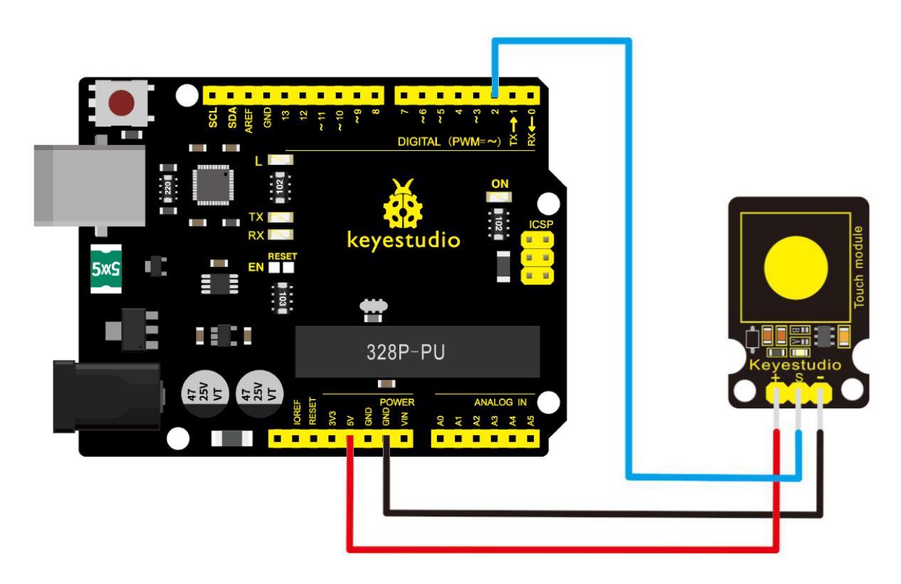

**Sample Code**

Copy and paste the below code to Arduino software.

```c
////////////////////////////////////////////////////////////////////
int ledPin = 13;
// Connect LED on pin 13, or use the
onboard one
int KEY = 2;
// Connect Touch sensor on Digital Pin 2
void setup(){
pinMode(ledPin, OUTPUT);
// Set ledPin to output mode
pinMode(KEY, INPUT);
//Set touch sensor pin to input mode
}
void loop(){
if(digitalRead(KEY)==HIGH) {
//Read Touch sensor signal
digitalWrite(ledPin, HIGH);
// if Touch sensor is HIGH, then
turn on
}
else{
digitalWrite(ledPin, LOW);
// if Touch sensor is LOW, then
turn off the led
}
}
////////////////////////////////////////////////////////////////////
```


**Example Result**

Done wiring and powered up, upload well the code, then touch the sensor with your finger, both D2 led on the sensor and D13 indicator on V4.0 board are on. Otherwise, those two indicators are turned off.

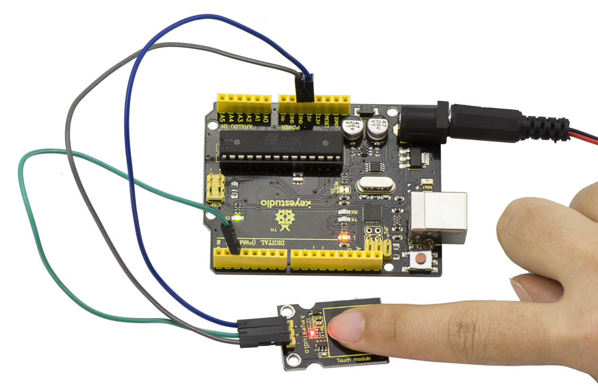

## Project 16: Flame Alarm


**Description**

This flame sensor can be used to detect fire or other lights with wavelength stands at 760nm \~ 1100nm.

In the fire-fighting robot game, the flame plays an important role in the probing, which can be used as the robot's eyes to find fire source.

**Specification**

1.  Supply Voltage: 3.3V to 5V

2.  Detection range: 20cm (4.8V) \~ 100cm (1V)

3.  Rang of Spectral Bandwidth: 760nm to 1100nm

4.  Operating temperature: -25℃to 85℃

5.  Interface: digital

6.  Size: 44*16.7mm

7.  Weight: 4g

**Connection Diagram**

First, you need to prepare the following parts before connection:

-   V4.0 Board*1

-   Flame sensor*1

-   USB Cable*1

-   Jumper Wire*3

Connect the D0 pin of module to Digital 2 of V4.0 board, connect the GND pin to GND port, VCC pin to 5V port.

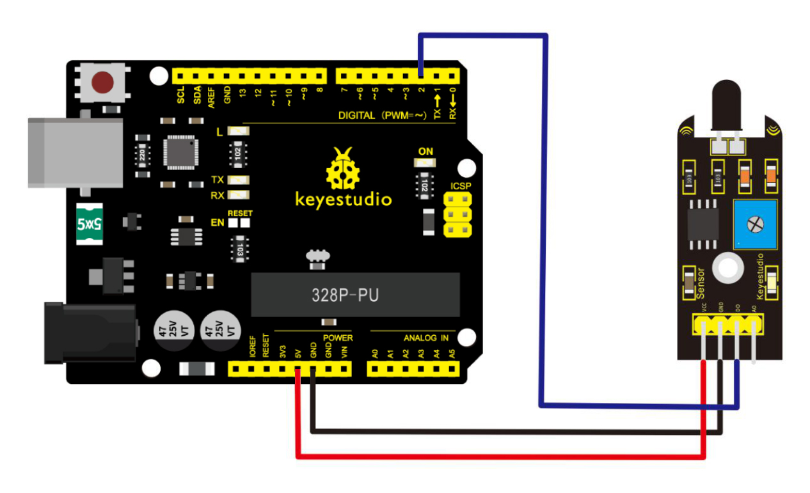

**Sample Code**

Copy and paste the below code to Arduino software.

```c
////////////////////////////////////////////////////////////////////
const int flamePin = 2;     // the number of the flame pin
const int ledPin =  13;      // the number of the LED pin
// variables will change:
int State = 0;         // variable for reading status
void setup() {
  // initialize the LED pin as an output:
  pinMode(ledPin, OUTPUT);      
  // initialize the pushbutton pin as an input:
  pinMode(flamePin, INPUT);     
}
void loop(){
  // read the state of the value:
State = digitalRead(flamePin);
  if (State == HIGH) {     
    // turn LED on:    
    digitalWrite(ledPin, HIGH);  
  } 
  else {
    // turn LED off:
    digitalWrite(ledPin, LOW); 
  }
}
////////////////////////////////////////////////////////////////////
```


**Example Result**

Done wiring and powered up, upload well the code to the board.

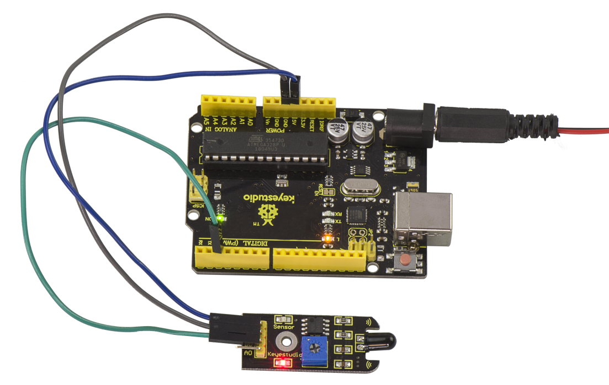

Then if you put a lighter close to the sensor, when the sensor detects the flame, another led on the sensor is turned on.

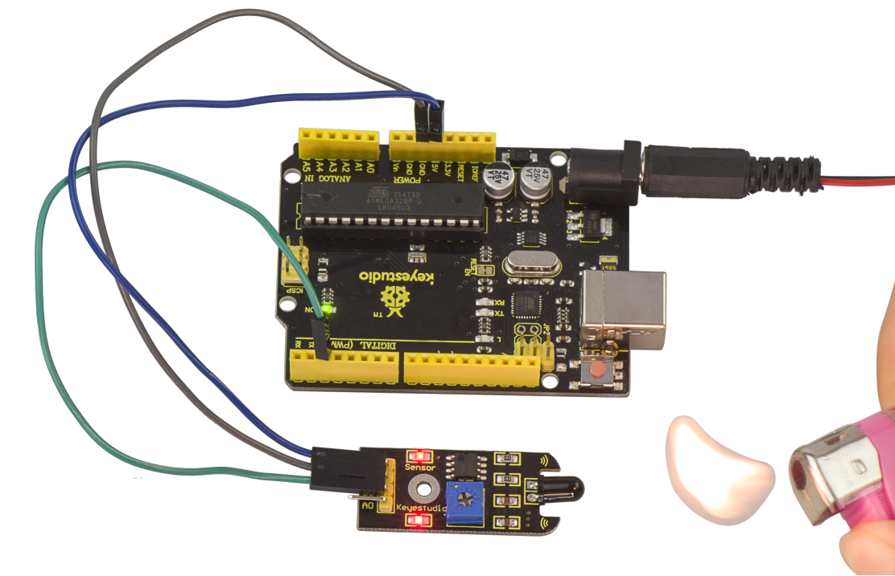

## Project 17: Reed Switch


**Description**

Reed Switch is a special switch and a main component for reed relay and proximity switch.

Reed switch is usually comprised of two soft magnetic materials and metal reed contacts which will disconnect itself when there is no magnetic.

In addition, some reed switches are also equipped with another reed acting as the third normally-closed contact. These reed contacts are encapsulated in a glass tube full of inert gases(such as nitrogen and helium) or in a vacuum glass tube.

The reeds encapsulated in the glass tube are placed in parallel with ends overlapped. Certain amount of space or mutual contact will be reserved to constitute the normally-open or normally-closed contacts of the switch.

Reed switch can be used as for count, limit or other purposes.

For instance, a kind of bike-kilometer is constituted by sticking magnetic to the tire and mounting reed switch aside.

You can also mount reed switch on the door for alarming purpose or as switches.

Reed switch has been widely applied in household appliances, cars, communication, industry, healthcare and security areas.

Furthermore, it can also be applied to other sensors and electric devices such as liquidometer, door magnet, reed relay, oil level sensor and proximity sensor(magnetic sensor). It can be used under high-risk environment.

**Specification**

1.  Working voltage: DC 3.3V-5V

2.  Working current: ≥20mA

3.  Working temperature: －10℃ to ＋50℃

4.  Detection distance: ≤10mm

5.  IO Interface: 3 wire interfaces (-/+/S)

6.  Size: 30\*20mm

7.  Weight: 3g

**Connection Diagram**

Connect the S pin of module to Digital 3 of V4.0 board, connect the negative pin to GND port, positive pin to 5V port.

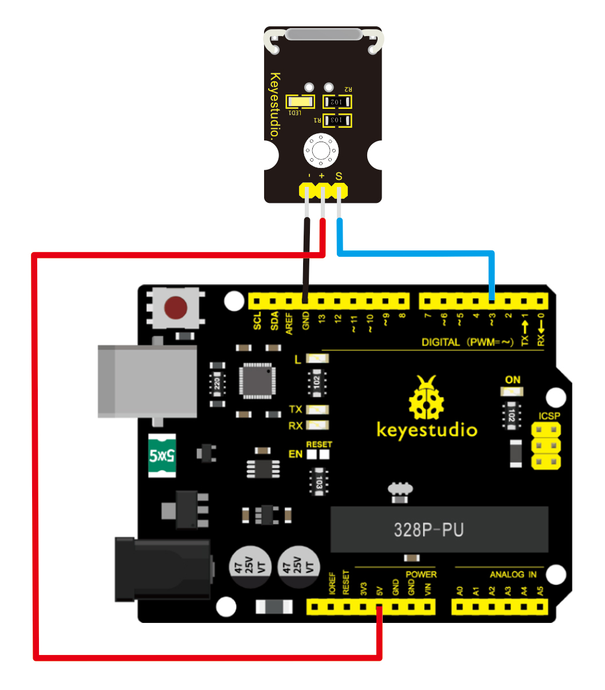

**Sample Code**

Copy and paste the below code to Arduino software.

```c
////////////////////////////////////////////////////////////////////
int Led=13;//define LED interface
int buttonpin=3; //define magnetic ring sensor interface
int val;//define digital variable val
void setup()
{
pinMode(Led,OUTPUT);//define LED as output interface
pinMode(buttonpin,INPUT);//define magnetic ring sensor as output interface
 }
void loop()
{

val=digitalRead(buttonpin);// read and assign the value of digital interface 3 to val 

if(val==HIGH)//When a signal is detected by magnetic ring sensor, LED will flash
{
digitalWrite(Led,HIGH);
}
else
{
digitalWrite(Led,LOW);
}
}
////////////////////////////////////////////////////////////////////
```


**Example Result**

Done wiring and powered up, upload well the code to the board. You can see the D13 led on V4.0 board is on.

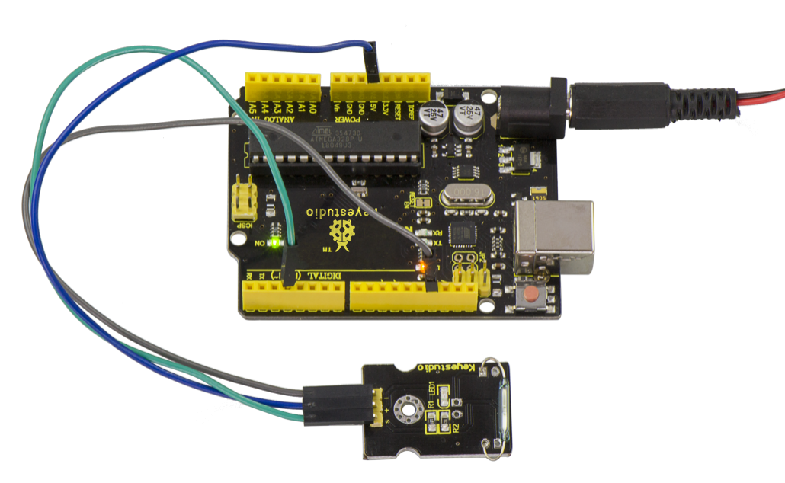

Then we put some magnetic balls close to the sensor. When the sensor detects the magnetic field signal, the led on the sensor will be turned on but D13 led will be turned off.

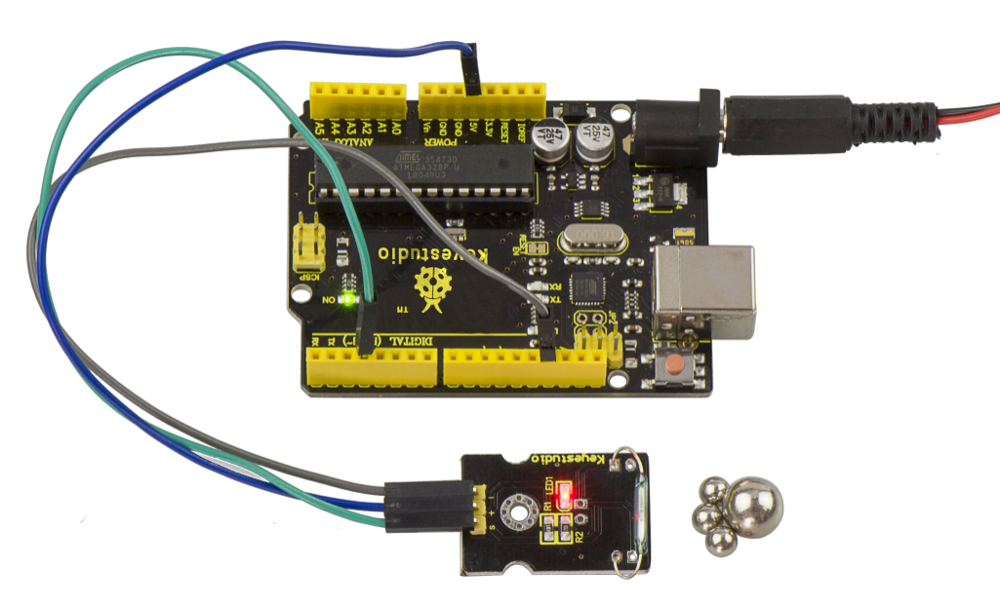

## Project 18: PIR Motion Sensor


**Description**

Pyroelectric infrared motion sensor can detect infrared signals from a moving person or moving animal, and output switching signals.

It can be applied to a variety of occasions to detect the movement of human body.

Conventional pyroelectric infrared sensors require body pyroelectric infrared detector, professional chip and complex peripheral circuit, so the size is much more bigger, with complex circuit and lower reliability.

Now we launch this new pyroelectric infrared motion sensor, specially designed for Arduino.

It uses an integrated digital body pyroelectric infrared sensor, with smaller size, higher reliability, lower power consumption and simpler peripheral circuit.

**Specification**

- Input Voltage: 3.3 \~ 5V, Maximum for 6V

- Working Current: 15uA

- Working Temperature: -20 \~ 85 ℃

- Output Voltage: High 3V, Low 0V

- Output Delay Time (High Level): About 2.3 to 3 Seconds

- Detection Angle: 100 °

- Detection Distance: 7 meters

- Output Indicator LED (if output HIGH, it will be ON)

- Limit Current for Pin: 100mA

- Size: 30*20mm

- Weight: 4g

**Connection Diagram**

First, you need to prepare the following parts before connection:

-   V4.0 Board*1

-   PIR motion sensor*1

-   USB Cable*1

-   Jumper Wire*3

Connect the S pin of module to Digital 3 of V4.0 board, connect the negative pin to GND port, positive pin to 5V port.

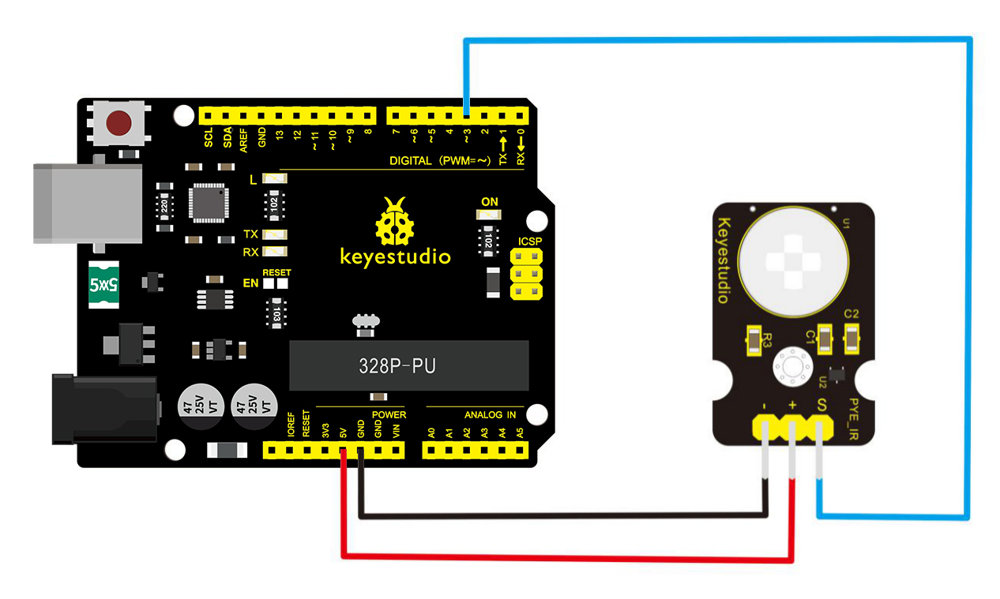

**Sample Code**

Copy and paste the below code to Arduino software.

```c
////////////////////////////////////////////////////////////////////
byte sensorPin = 3;
byte indicator = 13;
void setup()
{
  pinMode(sensorPin,INPUT);
  pinMode(indicator,OUTPUT);
  Serial.begin(9600);
}

void loop()
{
  byte state = digitalRead(sensorPin);
  digitalWrite(indicator,state);
  if(state == 1)Serial.println("Somebody is in this area!");
  else if(state == 0)Serial.println("No one!");
  delay(500);
}
////////////////////////////////////////////////////////////////////
```


**Example Result**

Done wiring and powered up, upload well the code, if the sensor detects someone moving nearby, D13 indicator on V4.0 board will light up, and "Somebody is in this area!" is displayed on the serial monitor of Arduino software.

If no detecting the movement, D13 indicator on V4.0 board will be off, and "No one!" is displayed on the serial monitor.

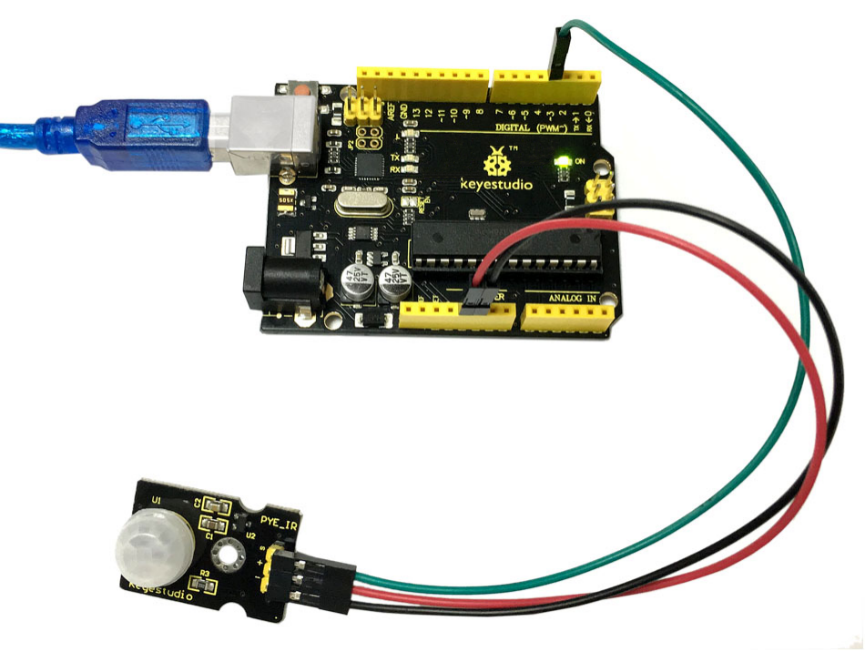

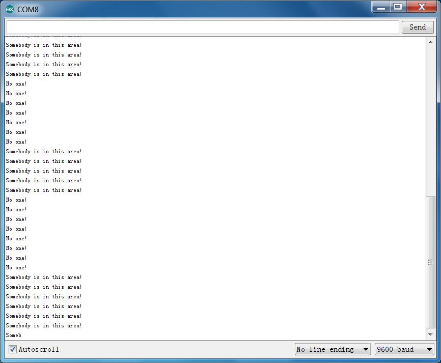

## Project 19: Analog Temperature

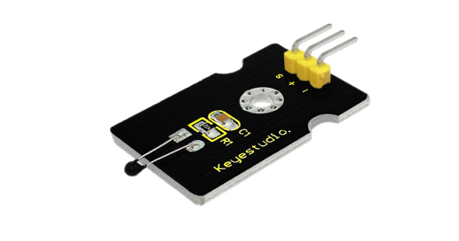

**Description**

This module is based on the working principle of a thermistor (resistance varies with temperature change in the environment).

It can sense temperature changes in the surrounding and send the data to the analog IO of Arduino board.

All we need to do is to convert the sensor’s output data into degrees Celsius temperature via simple programming, finally displaying it on the monitor.

It's both convenient and effective, thus it is widely applied to gardening, home alarm system and other devices.

**Specification**

-   Interface type: analog

-   Working voltage: 5V

-   Temperature range: -55℃～315℃

-   Size: 30\*20mm

-   Weight: 3g

**Connection Diagram**

First, you need to prepare the following parts before connection:

-   V4.0 Board\*1

-   Analog temperature sensor\*1

-   USB Cable\*1

-   Jumper Wire\*3

Connect the S pin of module to Analog A0 of V4.0 board, connect the negative pin to GND port, positive pin to 5V port.

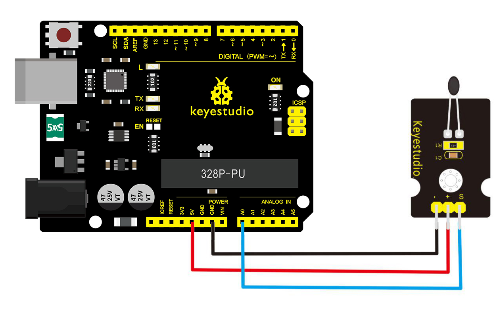

**Sample Code**

Copy and paste the below code to Arduino software.

```c
////////////////////////////////////////////////////////////////////
void setup() 
{Serial.begin(9600);
}
// the loop routine runs over and over again forever:
void loop() 
{int sensorValue = analogRead(A0);
Serial.println(sensorValue);
  delay(1); }
////////////////////////////////////////////////////////////////////
```


The above code is only for analog value.

You can see that the analog value is changing according to the temperature change in the environment. But it’s not very obvious.

Let’s solve this by using the following equation. Then upload the code below to the Arduino board. The value read from the serial port is similar to normal temperature. eg. The temperature right now is 30°C.

```c
////////////////////////////////////////////////////////////////////
#include <math.h>
void setup()
{
   Serial.begin(9600);
}
void loop()
{
  double val=analogRead(0);
  double fenya=(val/1023)*5;
  double r=(5-fenya)/fenya*4700;
  Serial.println( 1/(  log(r/10000) /3950 + 1/(25+273.15))-273.15);
  delay(1000);
}
////////////////////////////////////////////////////////////////////
```


**Example Result**

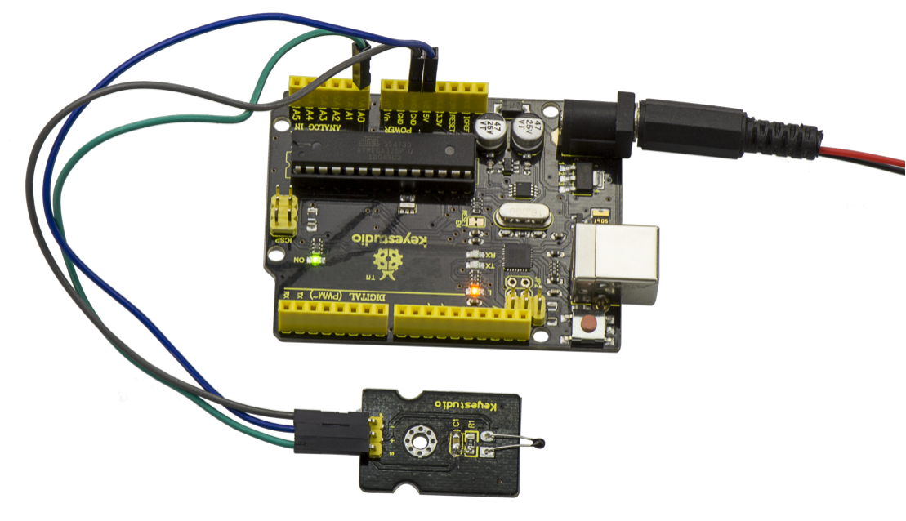

Done wiring and powered up as the above figure, upload well the code to the board, then open the serial monitor of Arduino IDE, you will see the current temperature value.

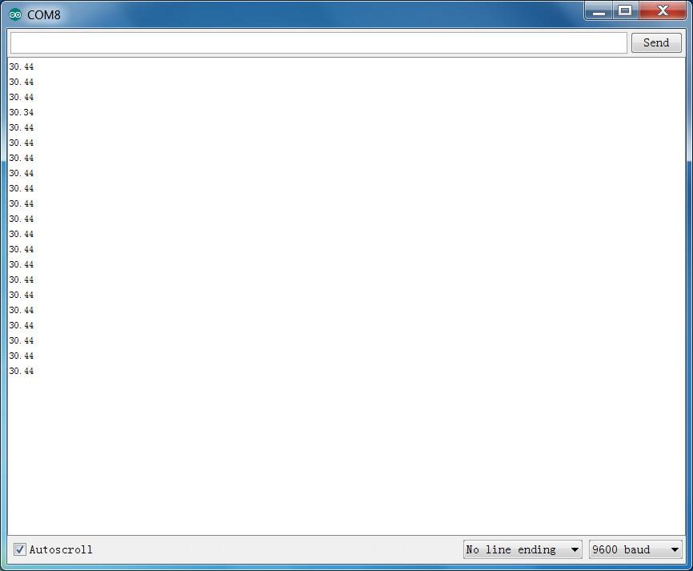

## Project 20: Analog Rotation

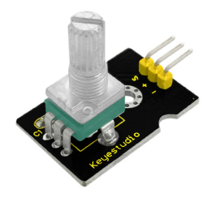

**Description**

This analog rotation sensor is Arduino compatible. It is based on a potentiometer. Its voltage can be subdivided into 1024, easy to be connected to Arduino with our sensor shield.

Combined with other sensors, you can use it to make interesting projects by reading the analog value from the IO port.

**Specification**

-   Supply Voltage: 3.3V to 5V

-   Interface: Analog

-   Size: 30*20mm

-   Weight: 8g

**Connection Diagram**

Connect the S pin of module to Analog A0 of V4.0 board, connect the negative pin to GND port, positive pin to 5V port.

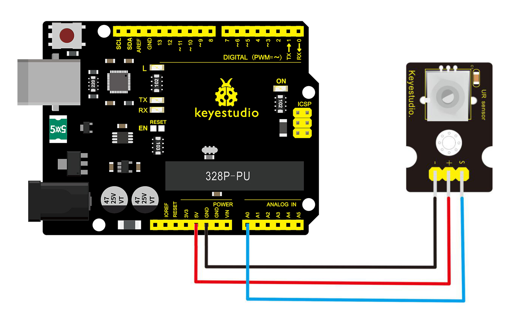

**Sample Code**

Copy and paste the below code to Arduino software.

```c
////////////////////////////////////////////////////////////////////
void setup()
{
  Serial.begin(9600); //Set serial baud rate to 9600 bps
}
void loop()
{
int val;
val=analogRead(0);//Read rotation sensor value from analog 0
Serial.println(val,DEC);//Print the value to serial port
delay(100);
}
////////////////////////////////////////////////////////////////////
```


**Example Result**

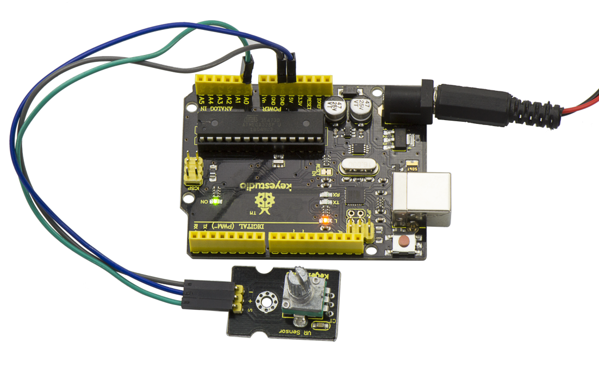

Done wiring and powered up, upload well the code, then open the serial monitor and set the baud rate as 9600, finally you will see the analog value. If rotate the knob on the rotation sensor, the value will be changed within 0-1023. Shown below.

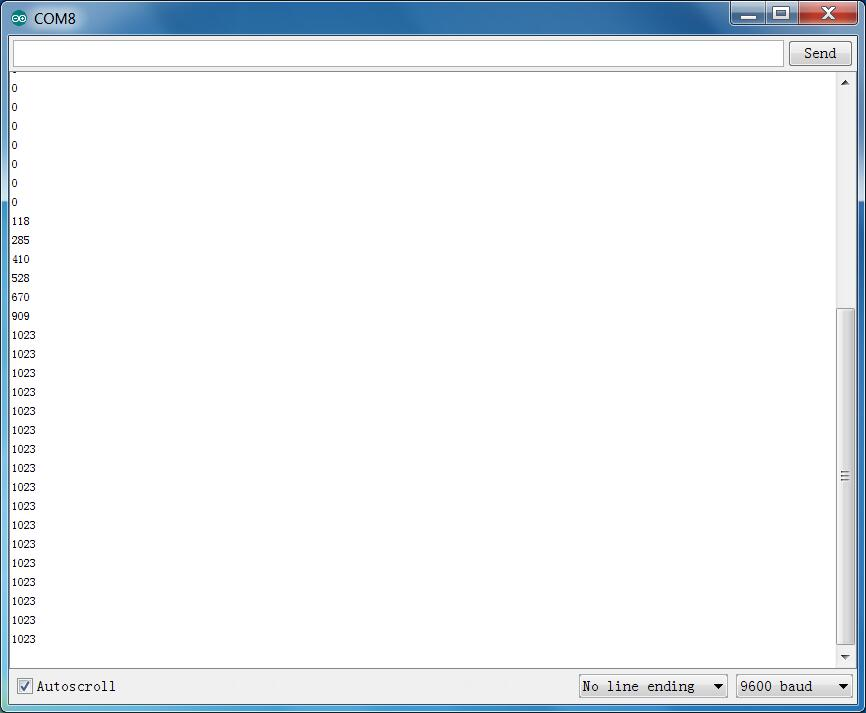

## Project 21: Photocell

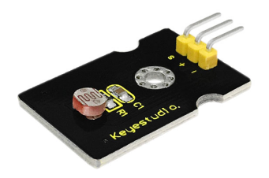

**Description**

Photocell is commonly seen in our daily life and is mainly used in intelligent
switch, also in common electronic design. To make it easier and more effective,
we supply the corresponding modules.

Photocell is a semiconductor. It has features of high sensitivity, quick
response, spectral characteristic and R-value consistence, maintaining high
stability and reliability in environment extremely such as high temperature and
high humidity.

It’s widely used in automatic control switch fields like cameras, garden solar
lights, lawn lamps, money detectors, quartz clocks, music cups, gift boxes, mini
night lights, sound and light control switches, etc.

**Specification**

-   Interface type: analog

-   Working voltage: 5V

-   Size: 30*20mm

-   Weight: 3g

**Connection Diagram**

Connect the S pin of module to Analog A0 of V4.0 board, connect the negative pin
to GND port, positive pin to 5V port.

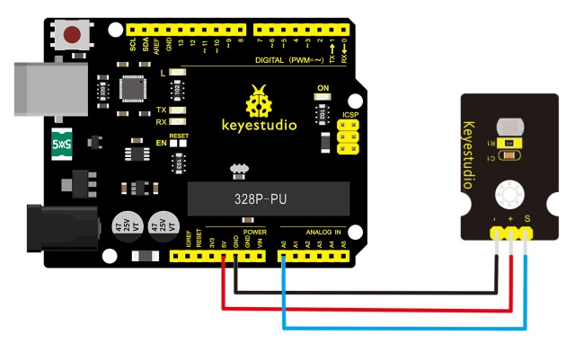

**Sample Code**

Copy and paste the below code to Arduino software.

```c
////////////////////////////////////////////////////////////////////
void setup()
{
  Serial.begin(9600); //Set serial baud rate to 9600 bps
}
void loop()
{
int val;
val=analogRead(0);//Read rotation sensor value from analog 0
Serial.println(val,DEC);//Print the value to serial port
delay(100);
}
////////////////////////////////////////////////////////////////////
```


**Example Result**

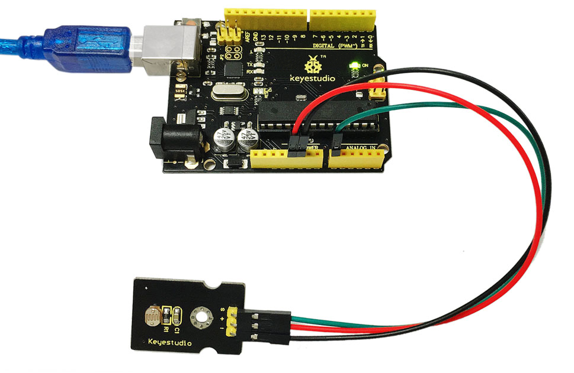

Done wiring and powered up, upload well the code, then open the serial monitor, if cover the photocell on the sensor with your hand, you will see the analog value decrease.

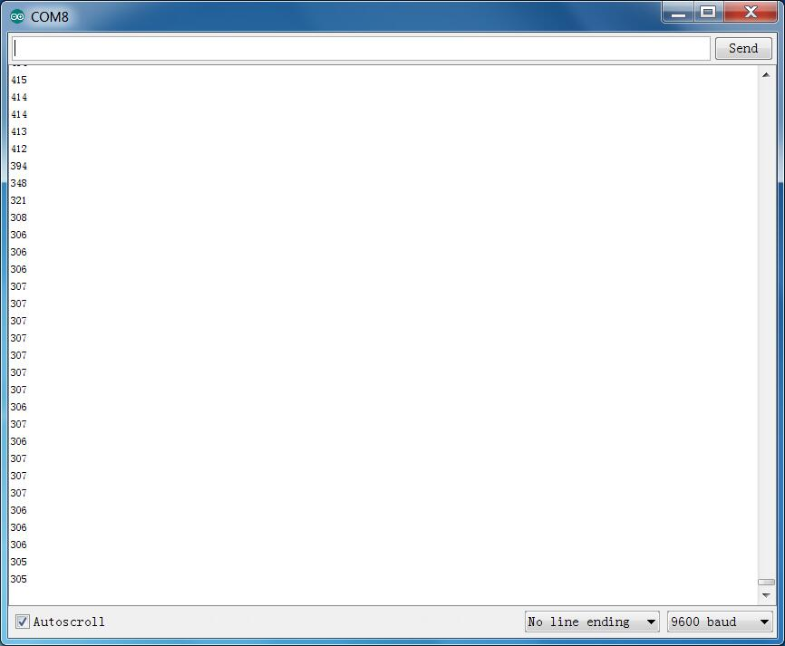

## Project 22: Analog Sound


**Description**

Analog sound sensor is typically used in detecting the volume of ambient sounds. The sensor comes with a potentiometer, so that you can turn it to adjust the signal gain.

You can use it to make some interesting and interactive works, such as a voice operated switch.

**Specification**

-   Supply Voltage: 3.3V to 5V

-   Interface: Analog

-   Size: 30*20mm

-   Weight: 4g

**Connection Diagram**

Connect the S pin of module to Analog A0 of V4.0 board, connect the negative pin to GND port, positive pin to 5V port.

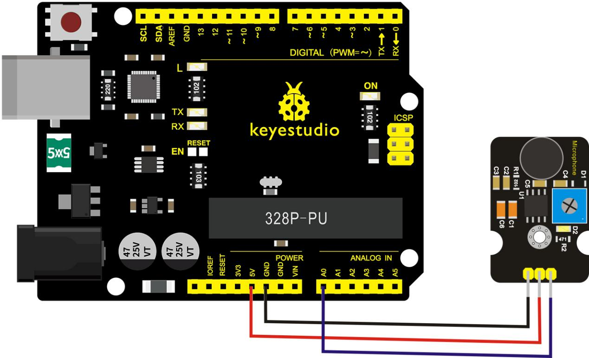

**Sample Code**

Copy and paste the below code to Arduino software.

```c
////////////////////////////////////////////////////////////////////
int sensorPin =A0 ; 
int value = 0; 
void setup() 
{
 Serial.begin(9600); } 
void loop() 
{
 value = analogRead(sensorPin); 
 
Serial.println(value, DEC); 
 
delay(50); 
}
////////////////////////////////////////////////////////////////////
```


**Example Result**

Done wiring and powered up, upload well the code, then open the serial monitor and set the baud rate as 9600, you will see the analog value. When talking toward the micro head, the value will increase. Shown below.

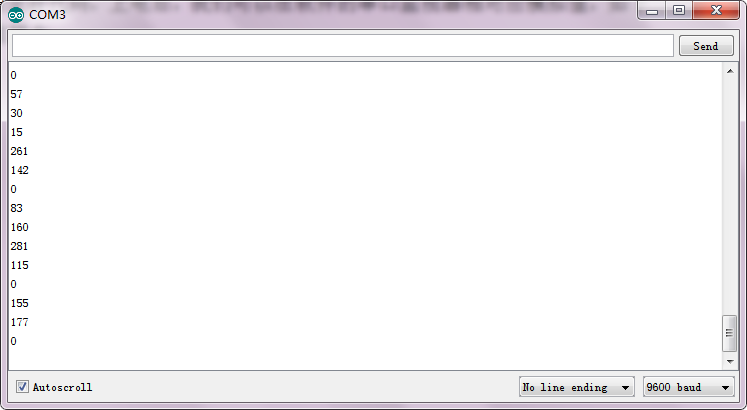

## Project 23: Water Level

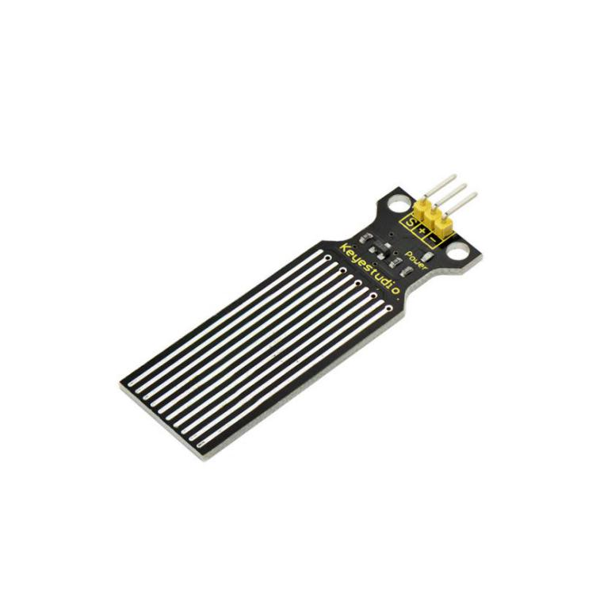

**Description**

Keyestudio water sensor is easy- to-use, portable and cost-effective, designed to identify and detect water level and water drop.

This small sensor can measure the volume of water drop or water quantity through an array of traces of exposed parallel wires.

**Features**

-   smooth conversion between water quantity and analog quantity;

-   strong flexibility, outputting basic analog value;

-   low power consumption and high sensitivity;

-   directly connect to microprocessor or other logic circuits, suitable for a variety of development boards and controllers such as Arduino controller, STC single-chip microcomputer, AVR single-chip microcomputer and more.

**Specifications**

- Operating voltage: DC5V

- Operating current: ﹤20mA

- Sensor type: Analog

- Detection area: 40mm x16mm

- Production process: FR4 double-side tinned

- Shape design: Anti-skid semi-lunar recess

- Working Temperature: 10℃-30℃

- Working Humidity: 10%-90% without condensation

- Weight: 3g

- Dimensions: 65mm x 20mm x 8mm

**Connection Diagram**

Connect the S pin of module to Analog A0 of V4.0 board, connect the negative pin to GND port, positive pin to 5V port.

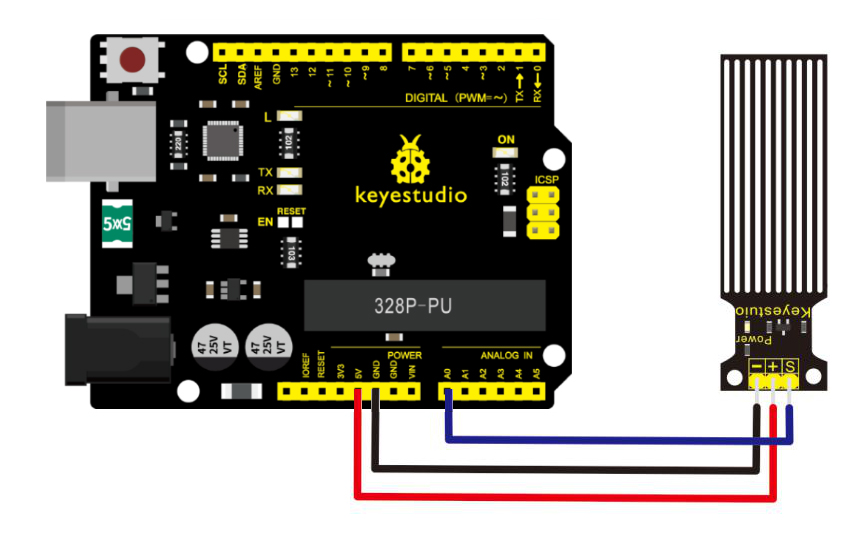

**Sample Code**

Copy and paste the below code to Arduino software.

```c
////////////////////////////////////////////////////////////////////
    int analogPin = 0; //connect water sensor to analog interface 0
int led = 13; //LED to digital interface 13 
int val = 0; //define the initial value of variable ‘val’ as 0
int data = 0; //define the initial value of variable ‘data’ as 0 
void setup()
{
pinMode(led, OUTPUT); //define led as output pin
Serial.begin(9600); //set baud rate at 9600
}
void loop()
{
val = analogRead(analogPin); //read and assign analog value to variable ’val’
if(val>700){ //decide whether variable ‘val’ is over 700 
digitalWrite(led,HIGH); //turn on LED when variable ‘val’ is over 700
}
else{
digitalWrite(led,LOW); //turn off LED when variable ‘val’ is under 700
}
data = val; //variable ’val’ assigns value to variable ‘data’
Serial.println(data); //print variable ‘data’ by Serial.print
delay(100);
}
////////////////////////////////////////////////////////////////////
```


**Example Result**

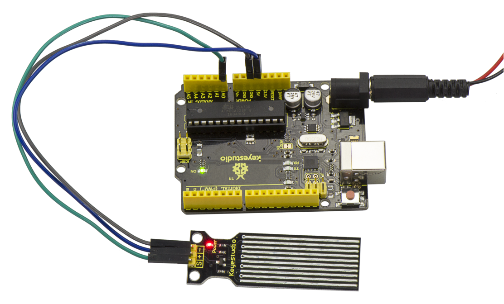

After the above steps are done, let’s do a test on lower water level and check what happens?

Upload well the code to V4.0 board, then open the serial monitor and set the baud rate as 9600.

When place the sensor into the water at different level, you will see the value change correspondingly.

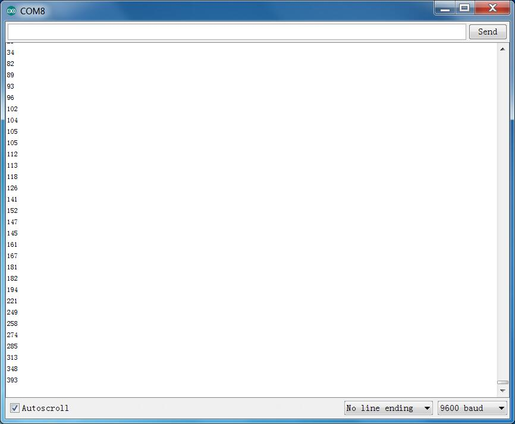

Furthermore, you can set an alarm value and connect a buzzer to make an alarm.

The LED can’t light up when water level haven’t reach alarm value. If water level reaches the alarm value, LED will be turned on and buzzer will sound to make an alarm.

## Project 24: Soil Moisture

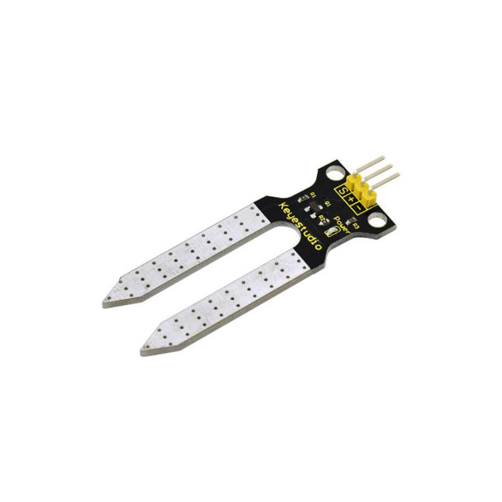

**Description**

This is a simple soil humidity sensor aimed to detect the soil humidity. If the soil is in lack of water, the analog value output by the sensor will decrease, otherwise, it will increase.

If you use this sensor to make an automatic watering device, it can detect whether your botany is thirsty to prevent it from withering when you go out.

Combine this sensor with Arduino controller can make your plant more comfortable and your garden more smarter.

The soil humidity sensor module is not as complicated as you might think, so if you need to detect the soil in your project, it will be your best choice.

The sensor is set with two probes which are inserted into the soil. If the current goes through the soil, the sensor will get resistance value by reading the current changes between the two probes, then convert the resistance value into moisture content.

The higher moisture (less resistance), the higher conductivity the soil has.

The surface of the sensor has undergone metallization process to prolong its service life. Insert it into the soil and then use the AD converter to read it. With the help of this sensor, the plant can remind of you: I need water.

**Specification**

- Power Supply Voltage: 3.3V or 5V

- Working Current: ≤ 20mA

- Output Voltage: 0-2.3V (When the sensor is totally immersed in water, the voltage will be 2.3V) 
  The higher humidity, the higher the output voltage.

- Sensor type: Analog output

- Interface: Pin1- signal, Pin2- GND, Pin3 - VCC

**Connection Diagram**

Connect the S pin of module to Analog A0 of V4.0 board, connect the negative pin to GND port, positive pin to 5V port.

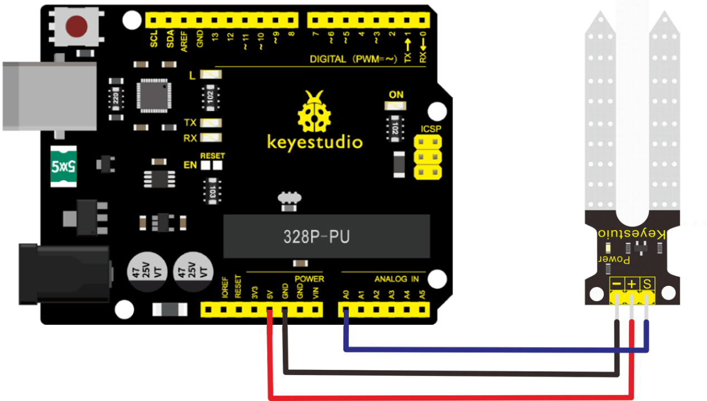

**Sample Code**

Copy and paste the below code to Arduino software.

```c
////////////////////////////////////////////////////////////////////
/*
  # Example code for the moisture sensor
  # Connect the sensor to the A0(Analog 0) pin on the Arduino board
  # the sensor value description
  # 0  ~300     dry soil
  # 300~700     humid soil
  # 700~950     in water
*/
void setup(){
  Serial.begin(57600);
}
void loop(){ 
  Serial.print("Moisture Sensor Value:");
  Serial.println(analogRead(0)); 
  delay(100);
}
////////////////////////////////////////////////////////////////////
```


**Example Result**

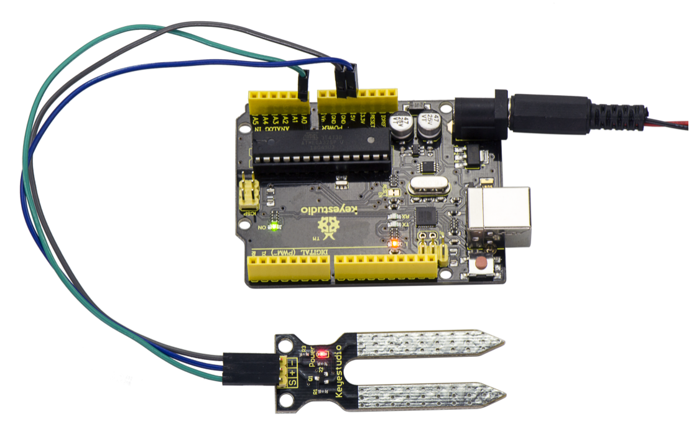

Done wiring and powered up, upload well the code, then open the serial monitor and set the baud rate as 57600, you will see the value. When the sensor detects the moisture, the value will make corresponding changes. Shown below.

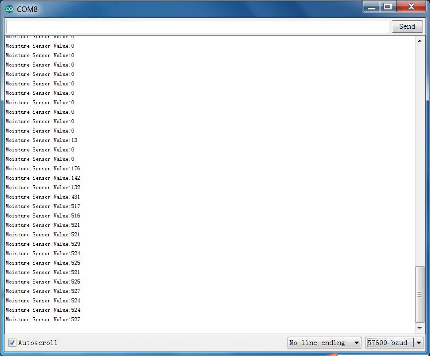

## Project 25: Analog Gas

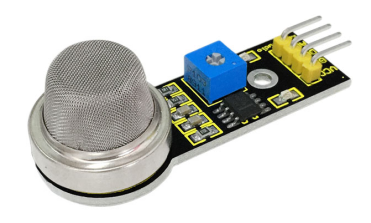

**Description**

This analog gas sensor MQ2 is used in gas leakage detecting equipment in both consumer electronics and industrial markets. This sensor is suitable for detecting LPG, I-butane, propane, methane, alcohol, Hydrogen and smoke.

The detecting scope of this sensor is very wide and it has high sensitivity and quick response.

In addition, the sensitivity can be adjusted by rotating the potentiometer on the sensor.

**Specification**

-   Power supply: 5V

-   Interface type: Analog

-   Simple drive circuit

-   Stable and long lifespan

**Connection Diagram**

Connect the A0 pin of module to Analog A0 of V4.0 board, connect the GND pin to GND port, VCC pin to 5V port.

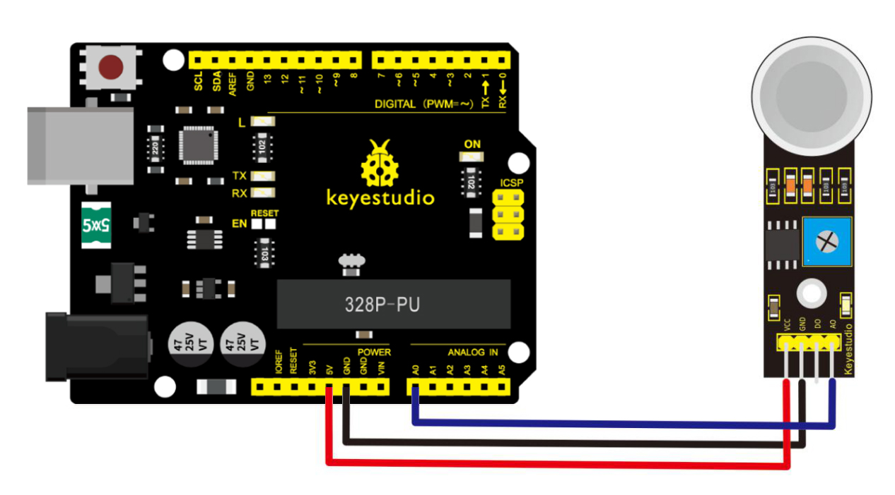

**Sample Code**

Copy and paste the below code to Arduino software.

```c
////////////////////////////////////////////////////////////////////
//Arduino Sample Code
void setup()
{
  Serial.begin(9600); //Set serial baud rate to 9600 bps
}
void loop()
{
int val;
val=analogRead(0);//Read Gas value from analog 0
Serial.println(val,DEC);//Print the value to serial port
delay(100);
}


////////////////////////////////////////////////////////////////////
```


**Example Result**

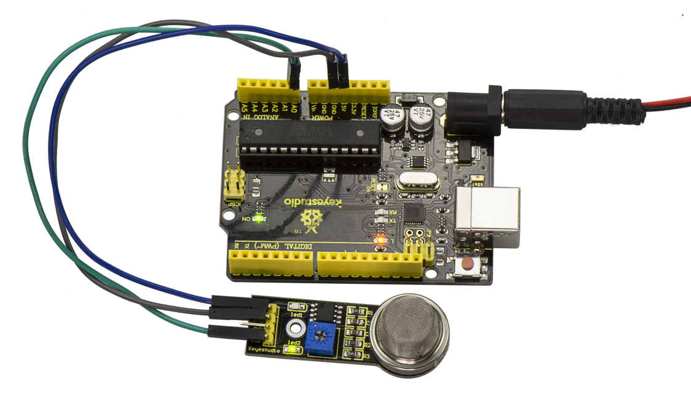

Done wiring and powered up, upload well the code, then open the serial monitor and set the baud rate as 9600, you will see the analog value. When detecting the gas, the value will make a change.

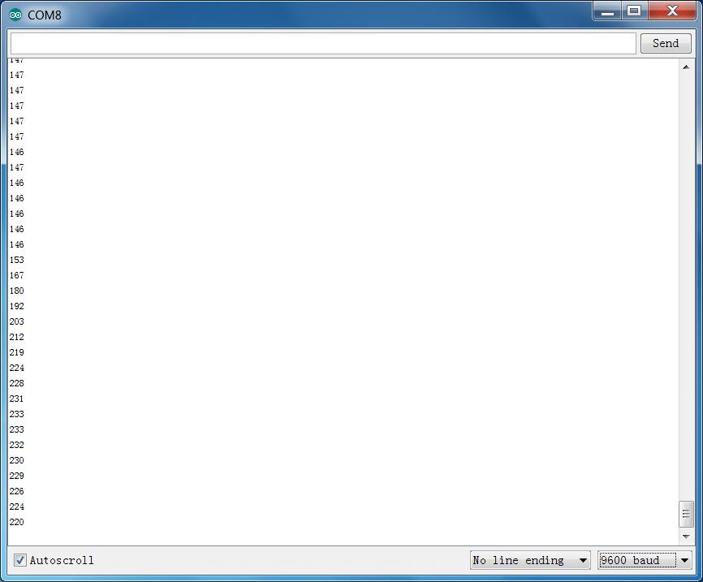

## Project 26: Analog Alcohol

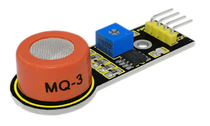

**Description**

This analog sensor-MQ3 is suitable for detecting the alcohol. It can be used in a breath [analyzer](file:///C:\Documents%2520and%2520Settings\Administrator\桌面\javascript:void(0);).

It has good selectivity because it has higher sensitivity to alcohol and lower sensitivity to Benzine.

The sensitivity can be adjusted by rotating the potentiometer on the sensor.

**Specification**

-   Power supply: 5V

-   Interface type: Analog

-   Simple drive circuit

-   Stable and long service life

-   Quick response and High sensitivity

**Connection Diagram**

Connect the A0 pin of module to Analog A0 of V4.0 board, connect the GND pin to GND port, VCC pin to 5V port.

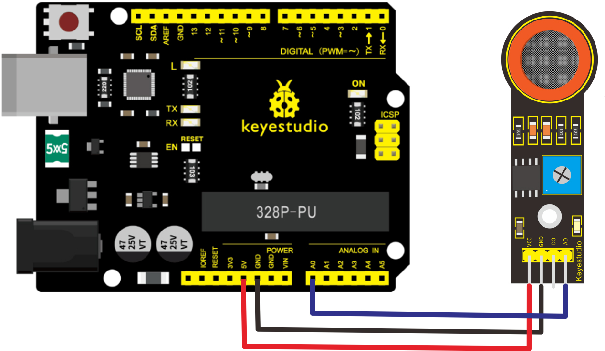

**Sample Code**

Copy and paste the below code to Arduino software.

```c
////////////////////////////////////////////////////////////////////
//Arduino Sample Code
void setup()
{
  Serial.begin(9600); //Set serial baud rate to 9600 bps
}
void loop()
{
int val;
val=analogRead(0);//Read Gas value from analog 0
Serial.println(val,DEC);//Print the value to serial port
delay(100);
}
////////////////////////////////////////////////////////////////////
```


**Example Result**

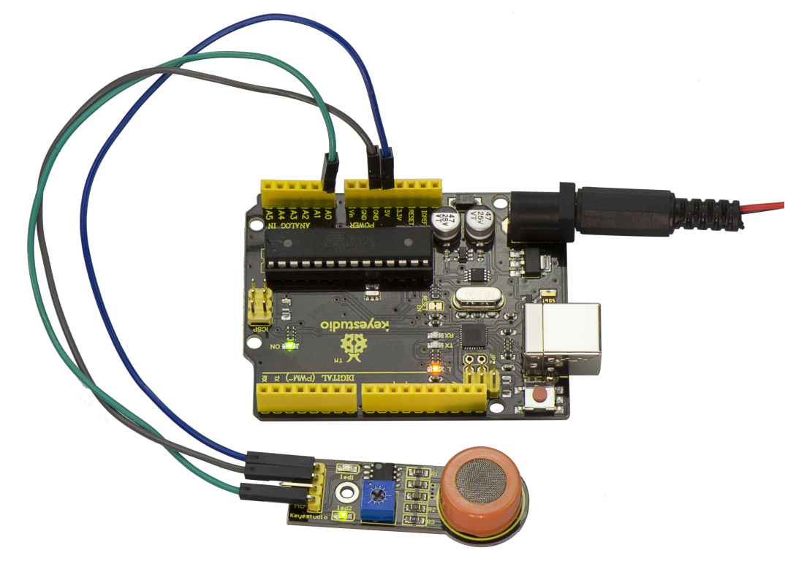

Done wiring and powered up, upload well the code, then open the serial monitor and set the baud rate as 9600, you will see the analog value. When detecting the alcohol gas, the value will make a change.

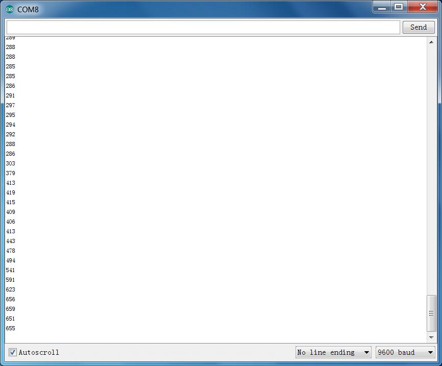

## Project 27: Steam Sensor

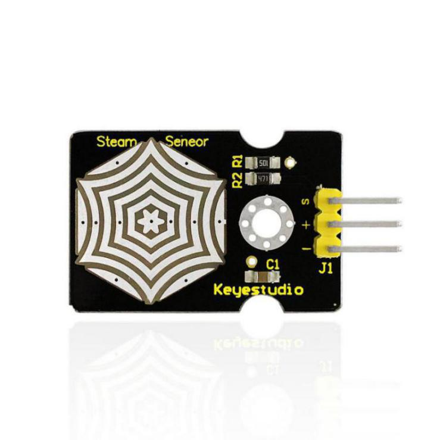

**Description**

Steam sensor is an analog sensor and can be made as a simple rainwater detector and liquid level switch. When humidity on the face of this sensor rises, output voltage will increase.

Caution: connection parts is non-waterproof, so please don’t put them into water.

**Parameters**

- Working Voltage: 3.3V or 5V

- Working Current: \<20mA

- Range of Working Temperature: －10℃～＋70℃

- Interface Type: Analog Signal Output

**Pin Definition**

-   S pin: for Signal Output

-   Positive pin (+): for Power Supply (VCC)

-   Negative pin (-): for Ground (GND)

**Connection Diagram**

First, you need to prepare the following parts before connection:

-   V4.0 board*1

-   Steam sensor*1

-   USB Cable*1

-   Jumper wire*3

Connect the S pin of module to Analog A0 of V4.0 board, connect the negative pin to GND port, positive pin to 5V port.

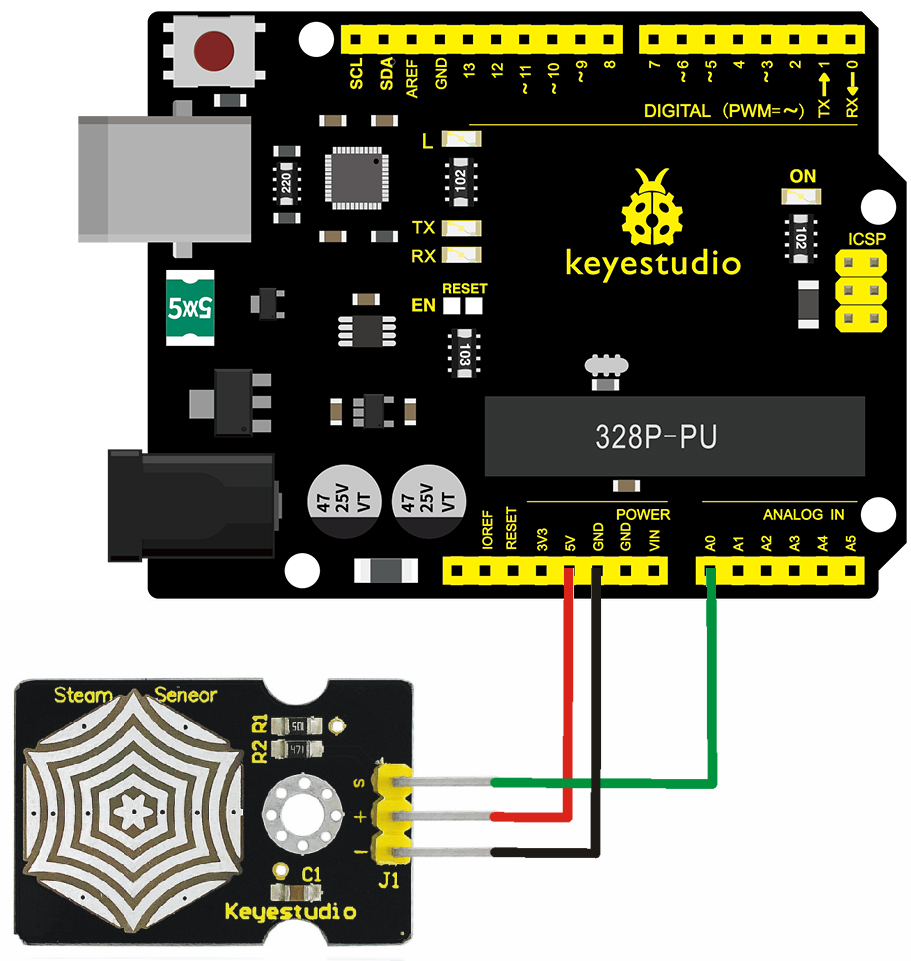

**Sample Code**

Copy and paste the below code to Arduino software.

```c
////////////////////////////////////////////////////////////////////
void setup()
{
Serial.begin(9600); //open serial port, and set baud rate at 9600bps
}
void loop()
{
int val;
val=analogRead(0); //plug vapor sensor into analog port 0
Serial.print("Moisture is ");
Serial.println(val,DEC); //read analog value through serial port printed
delay(100);
}
////////////////////////////////////////////////////////////////////
```


**Example Result**

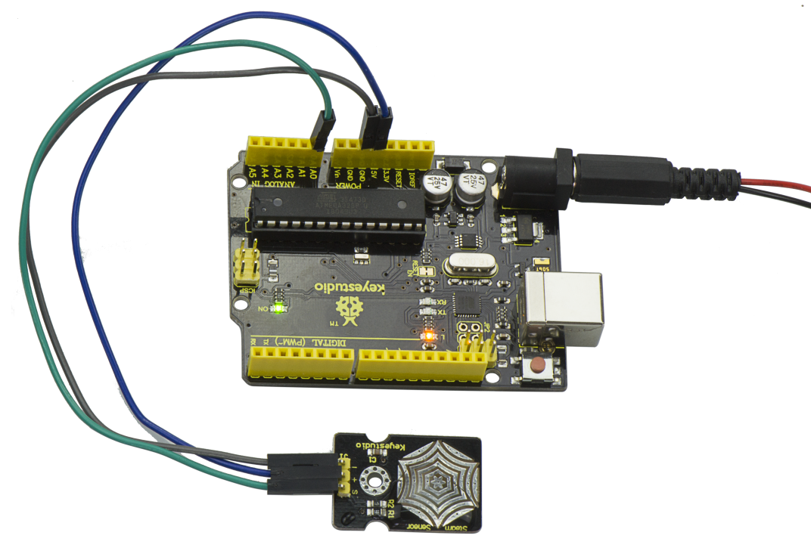

When detecting different degrees of humidity, the sensor will get the feedback of different current value. Shown as the following picture.

Due to the limited condition, you can put a drop of water on the sensor, the moisture value will be changed on serial monitor of Arduino software.

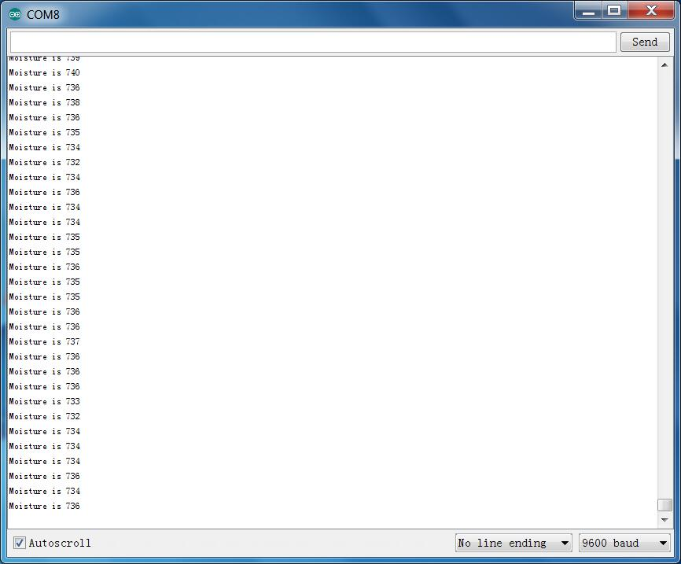

## Project 28: Analog Ceramic Vibration

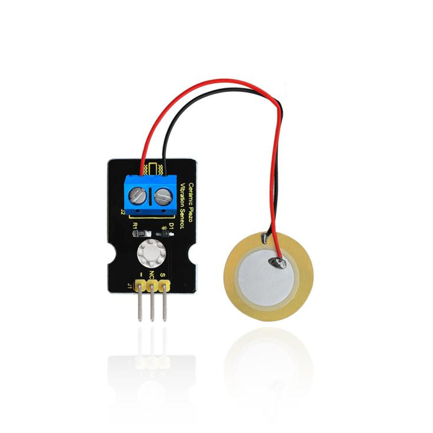

**Description**

This vibration sensor is based on piezoelectric ceramic chip analog vibration. It makes use of the anti-conversion process that piezoelectric ceramic vibration will generate the electric signals. When vibrating the piezoelectric ceramic chip, the sensor’s signal terminal will generate electrical signals.

The sensor can be used with Arduino dedicated sensor shield, and Arduino analog port can perceive weak vibration signals, so that it can make interactive works related to vibration, such as electronic drum.

Connect the vibration sensor to the analog port A0 of Arduino UNO. When vibrating the sensor in different degrees, you will see the different output value displayed on serial monitor of Arduino software.

**Specification**

-   Supply Voltage: 3.3V to 5V

-   Working Current：\<1mA

-   Working Temperature Range：－10℃～＋70℃

-   Output Signal：analog signal

**Connection Diagram**

First, you need to prepare the following parts before connection:

-   V4.0 board\*1

-   vibration sensor\*1

-   USB Cable\*1

-   Jumper wire\*3

Connect the S pin of module to Analog A0 of V4.0 board, connect the negative pin to GND port, NC pin to 5V port.

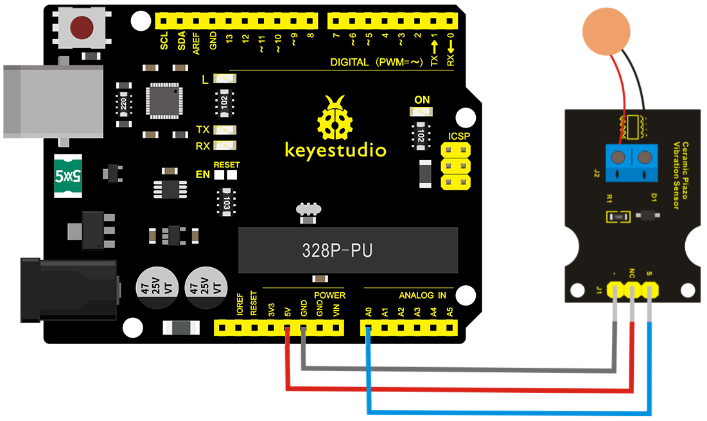

**Sample Code**

Copy and paste the below code to Arduino software.

```c
///////////////////////////////////////////////////////////
void setup()
{
Serial.begin(9600); //Open the serial to set the baud rate as 9600bps
}
void loop()
{
int val;
val=analogRead(0); //Connect the sensor to analog interface A0
Serial.print("Vibration is ");
Serial.println(val,DEC);//Print the analog value read on serial port
delay(100);
}
///////////////////////////////////////////////////////////

```


**Example Result**

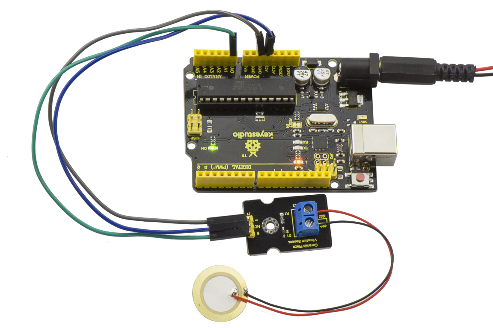

Wiring as the above diagram and upload well the code, then open the serial monitor and set the baud rate as 9600.

When vibrating the ceramic chip, you will see the data change as the figure shown below.

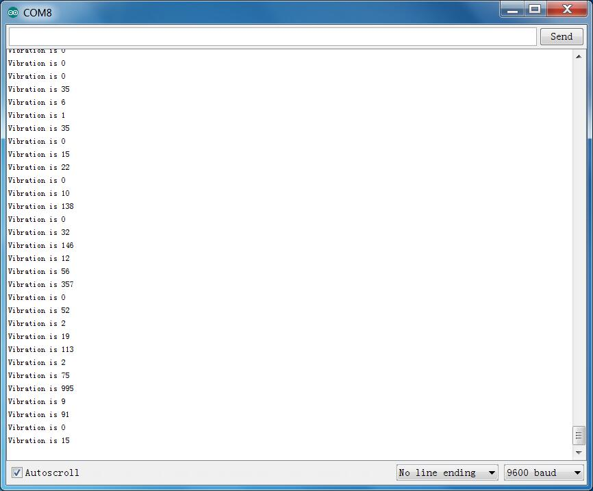

## Project 29: Voltage Detection

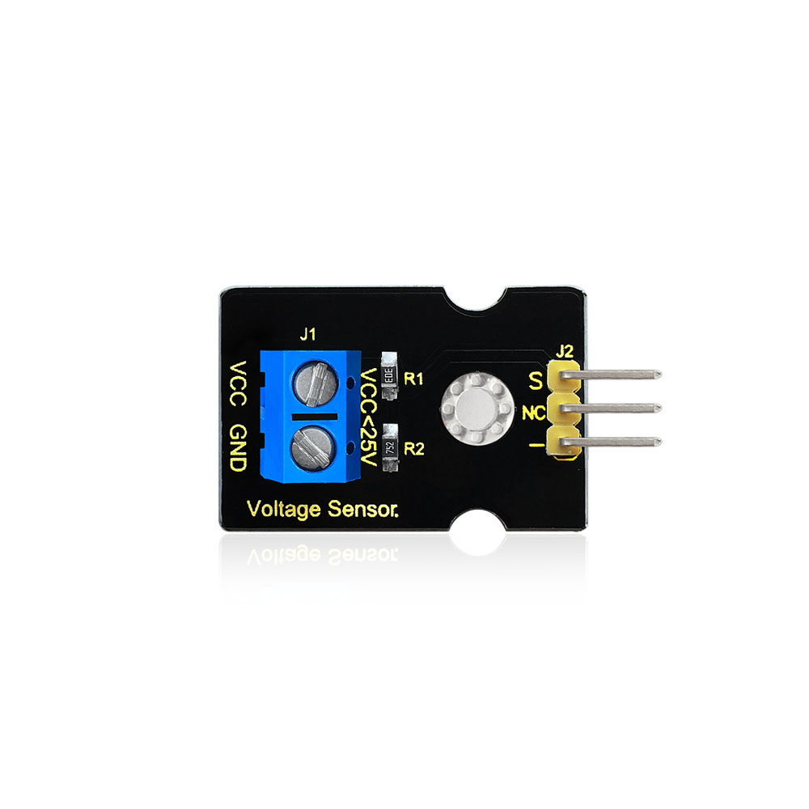

**Description**

Since the electronic products are various, the voltage of the power supply is also different. It is indeed necessary to detect it with a suitable voltage detection module or controller.

The maximum input voltage of the controller’s analog interface is 5V, which means that the voltage greater than 5V will not be detected.

However, this voltage detection module can achieve to detect the voltage greater than 5 V.

It is designed on the basis of resistive voltage divider principle, which can make the input voltage of bindingpost interface narrow 5 times, and the analog input voltage is up to 5 V, thus the input voltage of voltage detection module is not greater than 5V * 5 = 25 V (if using 3.3 V system, the input voltage is not greater than 3.3 V *5 = 16.5 V).

The AVR chip is 10-bit AD, so the analog resolution of this module is 0.00489 V (5V / 1023), and the minimum input voltage is 0.00489V * 5 = 0.02445 V.

When connect this sensor to expansion board using 3Pin wire, it can not only easily detect the magnitude of the voltage power and monitor the electric quantity of battery for interactive media works or robot, but also can combine with IIC LCD1602 LCD module to display the voltage or make a voltage monitor.

**Specification**

-   Working voltage: 0V-25V DC

-   Signal type: analog signal

**Connection Diagram**

First, you need to prepare the following parts before connection:

-   V4.0 board\*1

-   Voltage sensor\*1

-   USB Cable\*1

-   Jumper wire\*3

Connect the S pin of module to Analog A0 of V4.0 board, connect the negative pin to GND port, NC pin to 5V port.

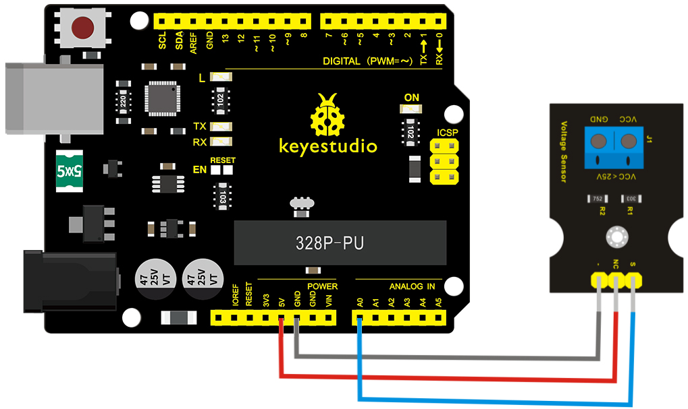

**Sample Code**

```c
////////////////////////////////////////////////////////////////////
int analogpin=0;     // Define analogpin as analog port 0               
int val,val5;       //Define variables val,val5
int val2=0;      //Define variables val2
int val3=0;     //Define variables val3
int val4=0;    //Define variables val4

void setup()
{
    Serial.begin(9600);     //Set baud rate of 9600
}
void loop()
{
    int val,val5;
    float val1;
    val=analogRead(analogpin);     //Read the value of the analog port and assign it to the variable val
    val1=val/3.9;
    val5=(int)val1;
    val3=val5/100;
    val2=(val5%100)/10;
    val4=val5%10;
    Serial.print("$CLEAR\r\n");      //clear the screen
    Serial.print("$GO 1 1\r\n");                 
    Serial.print("$PRINT Voltage:\r\n");         
    Serial.print("$GO 1 9\r\n"); 
    Serial.print("$PRINT ");         
Serial.print(val3);        //The serial port prints the value of the variable val3
Serial.print(val2);      //The serial port prints the value of the variable val2
    Serial.print(".");               //The serial port prints out a point"."
    Serial.print(val4);         //The serial port prints the value of the variable val4
    Serial.println("V");          //The serial port prints out capital “ V”
    delay(100);      //delay 0.1 second
}
////////////////////////////////////////////////////////////////////
```


**Example Result**

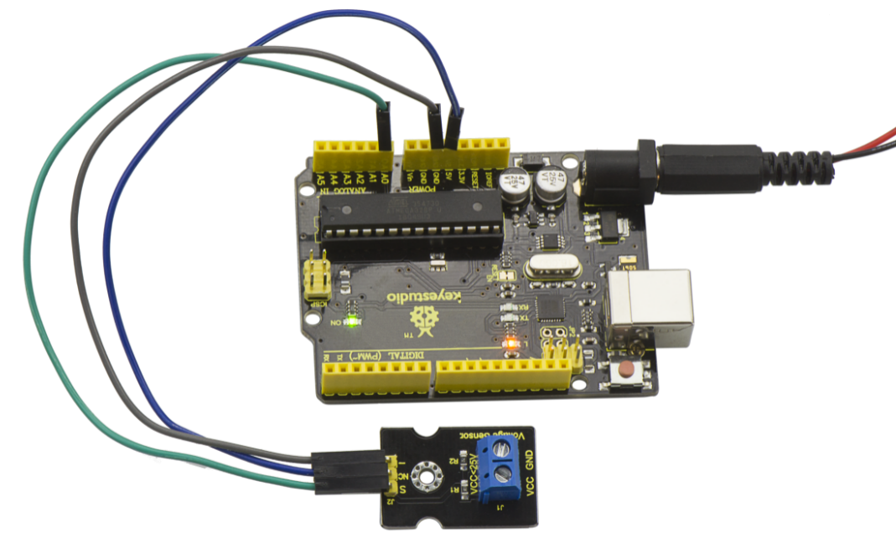

Done as the above wiring, compile and upload the code, powered-on, then open the serial port monitor, it will print out the detected voltage value shown below.

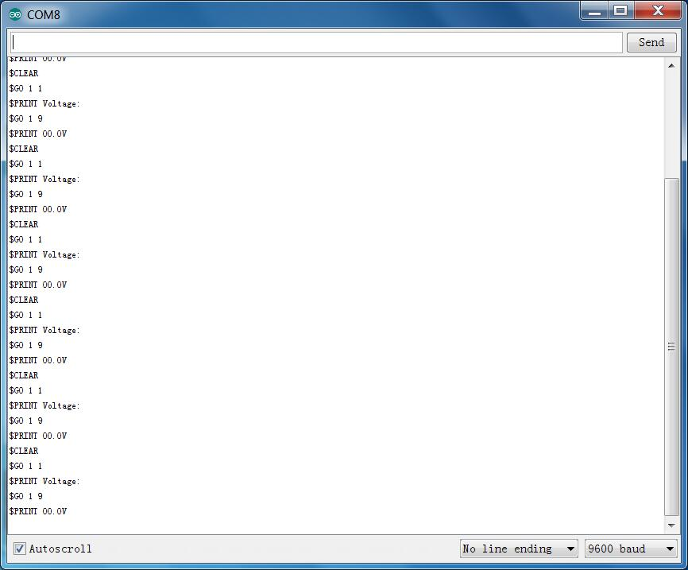

## Project 30: Pressure Detection

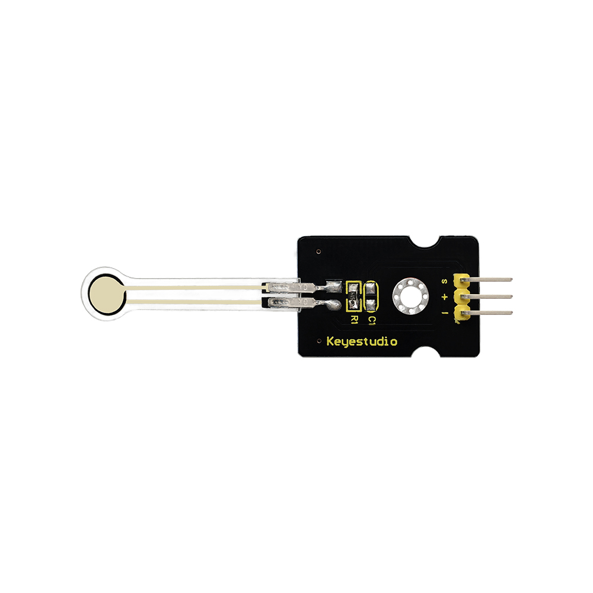

**Description**

This sensor adopts the new flexible nano pressure sensitive material with ultra thin film pad. It has the functions of water-proof and pressure detection.

When the sensor detects the outside pressure, the resistance of sensor will make a change.

So using the circuit, it can convert the pressure signal that senses pressure change into the corresponding electric signal output.

In this way, we can get the conditions of pressure changes by detecting the signal changes.

**Parameters**

- Working Voltage：DC 3.3V—5V

- Range：0-10KG

- Thickness：＜0.25mm

- Response Point：＜20g

- Repeatability：＜±5.8%（50% load）

- Accuracy：±2.5%（85% range interval）

- Durability：＞100 thousand times

- Initial Resistance：＞100MΩ(no load)

- Response Time：＜1ms

- Recovery Time：＜15ms

- Working Temperature：﹣20℃—60℃

**Connection Diagram**

Firstly you need to prepare the following parts before connection.

-   V4.0 Board\*1

-   Pressure sensor\*1

-   USB Cable\*1

-   Jumper Wire\*3

Connect the S pin of module to Analog A0 of V4.0 board, connect the negative pin to GND port, positive pin to 5V port.
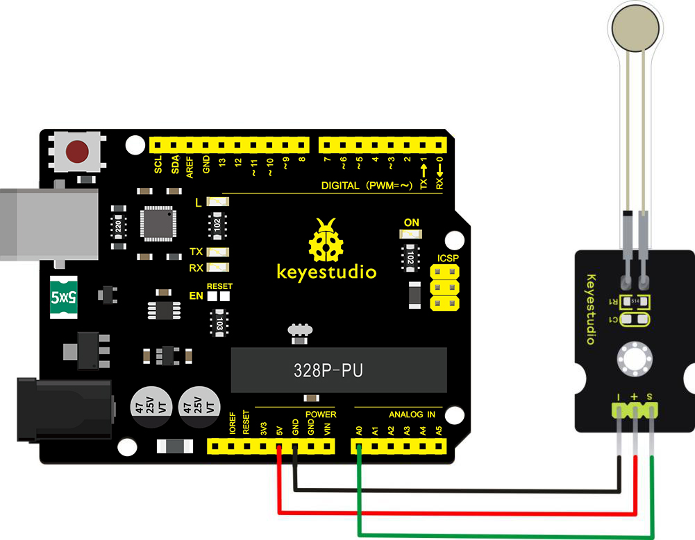

**Sample Code**

Copy and paste the code below to Arduino software.

```c
///////////////////////////////////////////////////////////////
int s_pin = A0;
void setup()
{
  Serial.begin(9600);
  pinMode(s_pin,INPUT);

}

void loop() 
{
  Serial.println(analogRead(s_pin));
  delay(500);
}
///////////////////////////////////////////////////////////////
```


**Example Result**

Wiring well and uploading the code, open the serial monitor on Arduino software.

Then, press the sensor with your hand tightly, the value shown on the monitor is increasing.

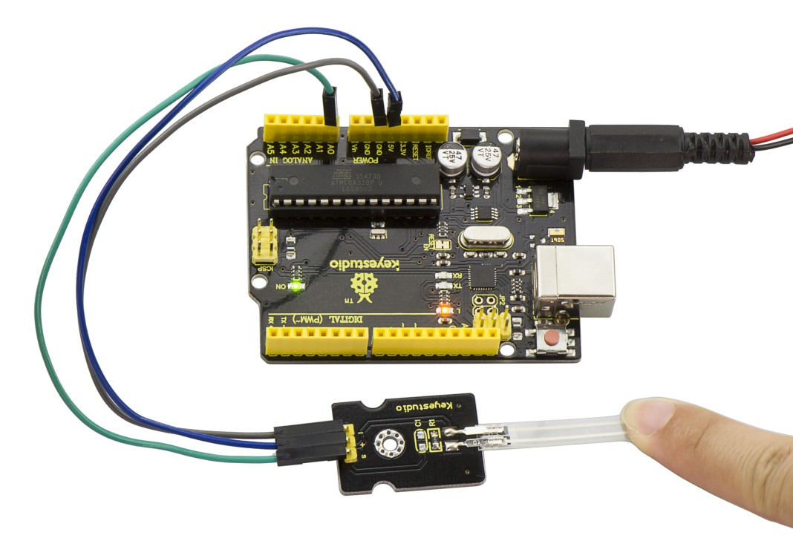

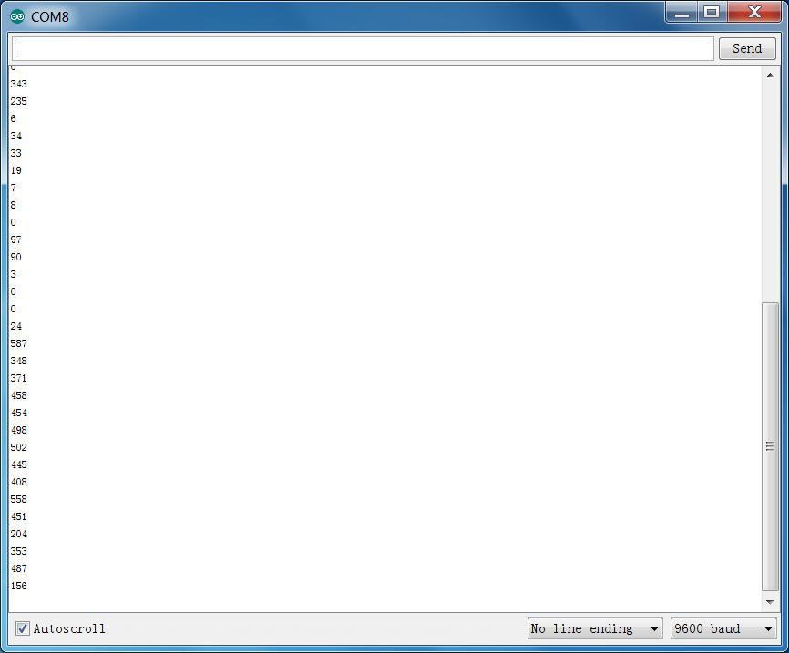

## Project 31: Ambient Light

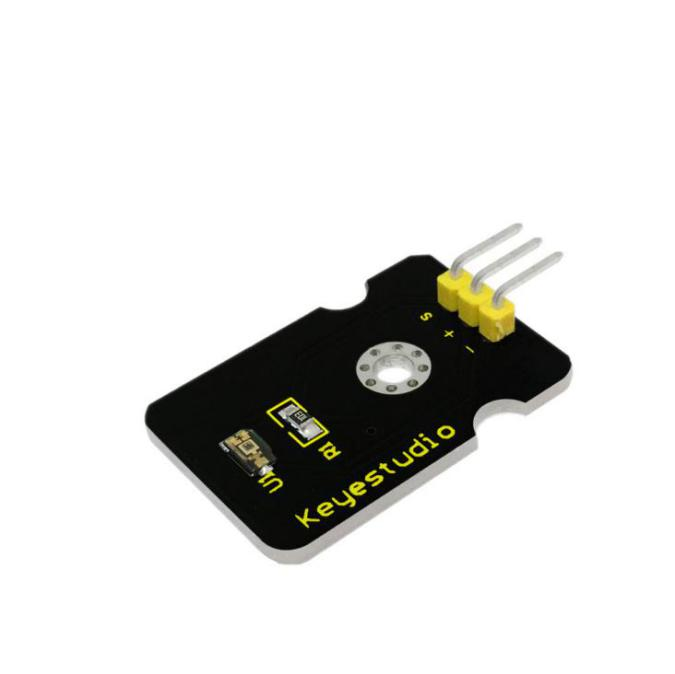

**Description**

At some point you are going to sense ambient brightness with better precision than your trusty photoresistor without adding complexity to your project. When that day comes, go get yourself a TEMT6000 ambient light sensor.

The TEMT6000 is supposed to be adapted to the sensitivity of the human eye, but found it preformed sub-par in low light conditions. It does however work very well reacting to very small changes in a large range of brightness. Because it is meant to mimic the human eye, it does not react well to IR or UV light, so just make sure to note that when using it in your project.

**Specification**

-   Supply Voltage: +5VDC 50mA

-   Size: 36.5\*16mm

-   Weight: 4g

**Connection Diagram**

Firstly you need to prepare the following parts before connection.

-   V4.0 Board\*1

-   TEMT6000 ambient light sensor\*1

-   USB Cable\*1

-   Jumper Wire\*3

This is an incredibly simple part, just connect power and ground, and the signal pin to analog input port, if done connecting, the sensor will output analog voltage, that ramps up when it gets brighter. You can power it with 3.3V as you like, the output value will just be much lower.

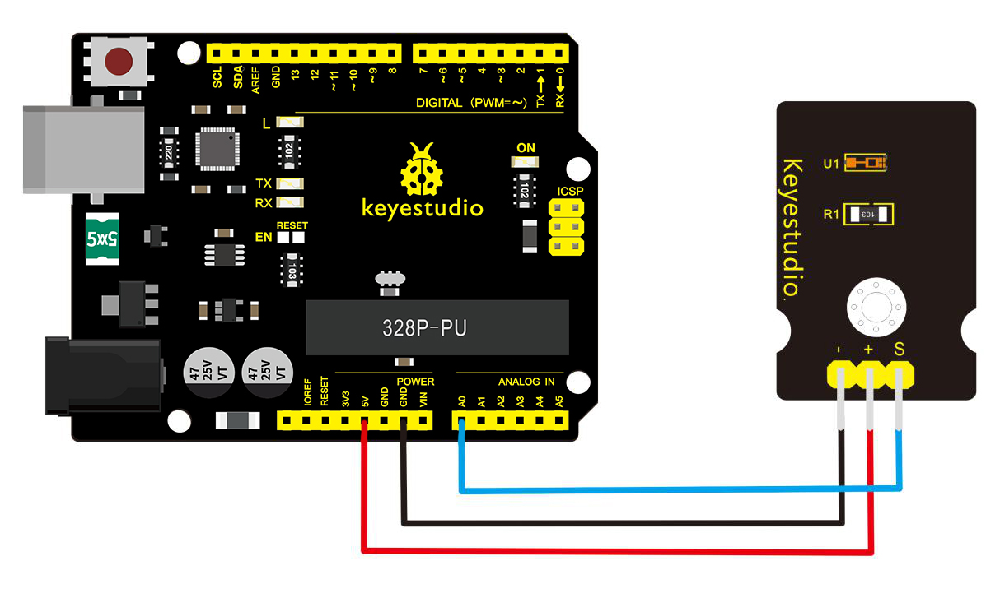

**Sample Code**

You can not get more simpler than this – This just reports the reading value from the sensor to the serial terminal: 0-1023 with 1023 being very bright, and 0 being very dark.

```c
///////////////////////////////////////////////////////////////
int temt6000Pin = 0;
void setup() {
 Serial.begin(9600);
}
void loop() {
 int value = analogRead(temt6000Pin);
 Serial.println(value);
 delay(100); //only here to slow down the output so it is easier to read
}
///////////////////////////////////////////////////////////////
```


**Example Result**

Wiring well and uploading the code above, open the serial monitor of Arduino software.

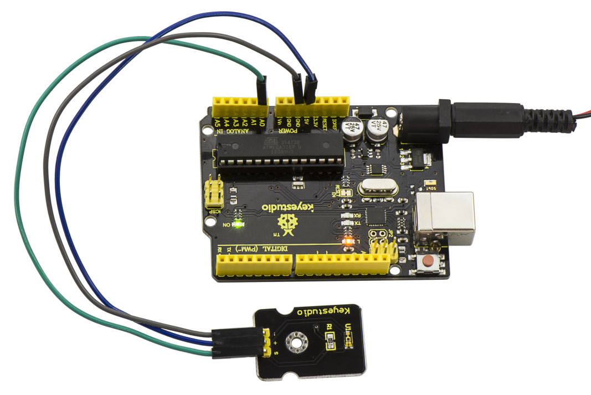

Then cover the sensor with your hand or a paper, the light becomes weak, finally you will see the value showed on monitor decreasing.

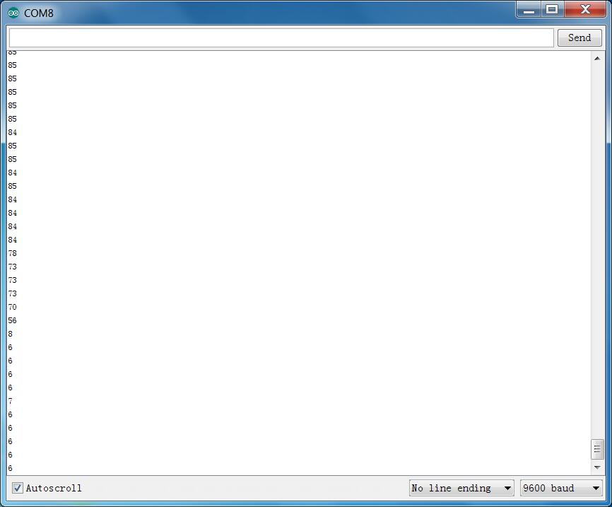

## Project 32: Ultraviolet Light

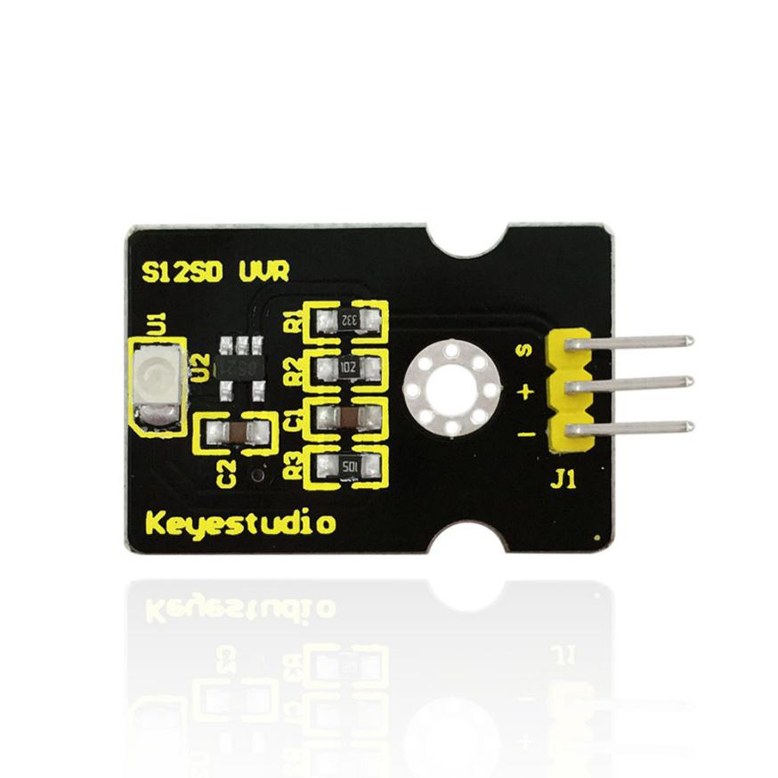

**Description**

Keyestudio GUVA-S12SD ultraviolet sensor is used to detect ultraviolet light. It includes GUVA-S12SD applied to measure ultraviolet index of intelligent wearable device, such as watches, smart phone and outdoor device with UV index detecting.

It can be also used to monitor the intensity of ultraviolet light or used as a
UV flame detector when disinfecting things by ultraviolet light.

**Parameters**

- Size: 15mm×30mm×0.7mm

- Supply Voltage: 2.5V～5V

- Output Signal: Analog Signal

- Detecting Range of Spectrum: 240-370nm

- Active Region: 0.076mm2

- Responsivity: 0.14A/W

- Dark Current: 1nA

- Light Current: 101\~125nA UVA Light, 1mW/cm2

**Connection Diagram**

Firstly you need to prepare the following parts before connection.

-   V4.0 Board\*1

-   GUVA-S12SD 3528 Ultraviolet Sensor \*1

-   USB Cable\*1

-   Jumper Wire\*3

Connect the S pin of module to Analog A0 of V4.0 board, connect the negative pin to GND port, positive pin to 3V3 port.

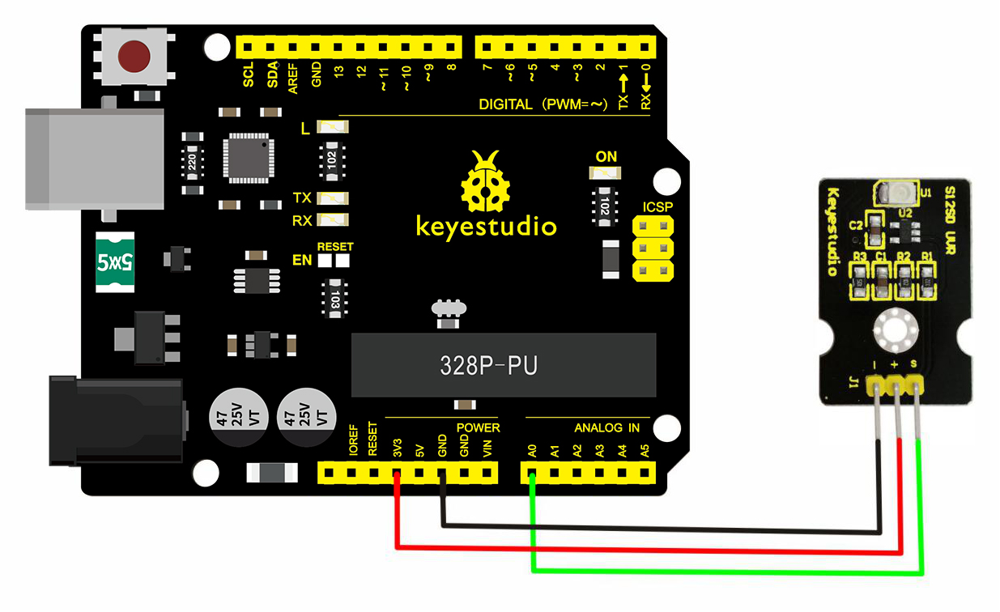

**Sample Code**

Copy and paste the code below to Arduino software.

```c
///////////////////////////////////////////////////////////////
/*
  AnalogReadSerial
  Reads an analog input on pin 0, prints the result to the serial monitor.
  Attach the center pin of a potentiometer to pin A0, and the outside pins to +5V and ground.

 This example code is in the public domain.
 */

// the setup routine runs once when you press reset:
void setup() {
  // initialize serial communication at 9600 bits per second:
  Serial.begin(9600);
}

// the loop routine runs over and over again forever:
void loop() {
  // read the input on analog pin 0:
  int sensorValue = analogRead(A0);
  // print out the value you read:
  Serial.println(sensorValue);
  delay(1);        // delay in between reads for stability
}
///////////////////////////////////////////////////////////////
```


**Example Result**

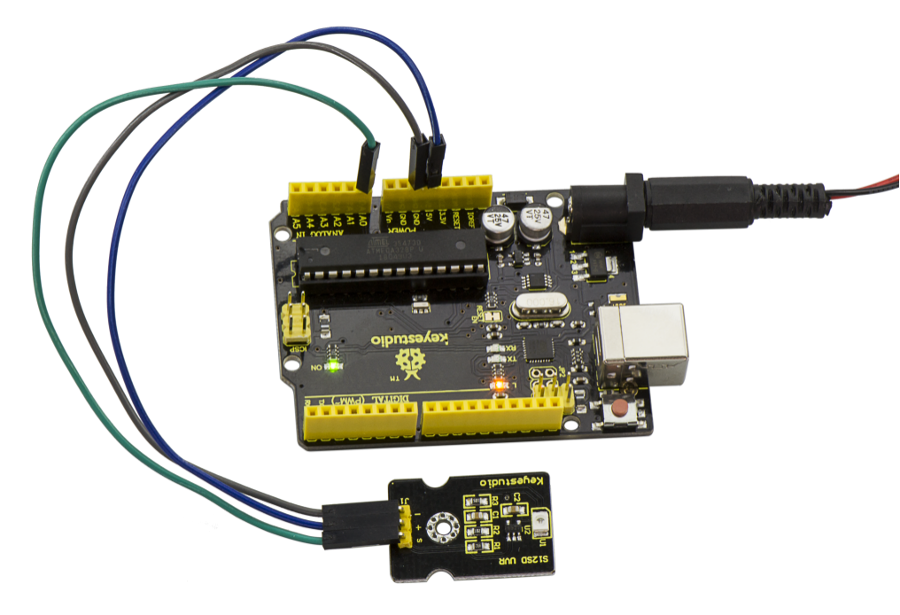

Wire it up well and upload the program code, then open serial monitor, it will display the data.

If shine UV light to the sensor, the data on serial monitor is changing shown as the following picture.

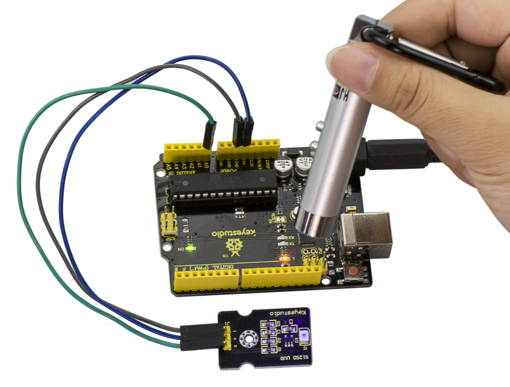

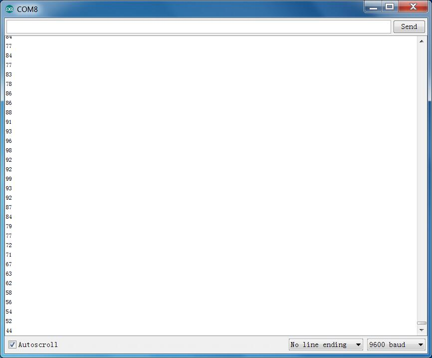

## Project 33: Digital IR Receiver

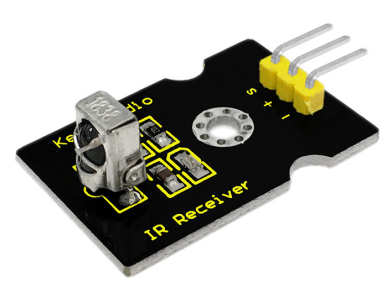

**Description**

IR is widely used in remote control. With this IR receiver, Arduino project is able to receive command from any IR remoter controllers if you have the right decoder. Well, it will be also easy to make your own IR controller using IR transmitter.

**Specification**

-   Power Supply: 5V

-   Interface: Digital

-   Modulation Frequency: 38Khz

-   Module Interface Socket: JST PH2.0

-   Size: 30*20mm

-   Weight: 4g

**Connection Diagram**

Firstly you need to prepare the following parts before connection.

-   V4.0 Board\*1

-   IR Receiver module\*1

-   USB Cable\*1

-   Jumper Wire\*3

Connect the S pin of module to Digital 11 of V4.0 board, connect the negative pin to GND port, positive pin to 5V port.

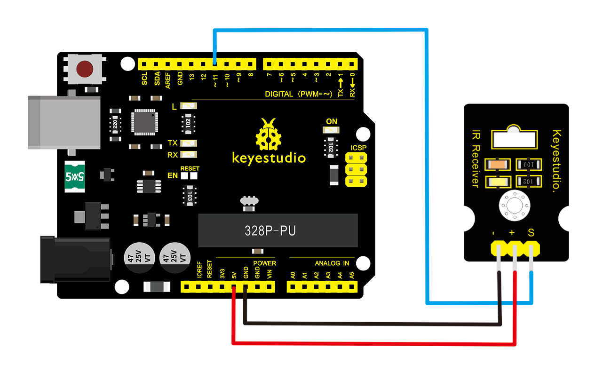

In the sample code below Digital pin 11 is in use, you may either change your wiring or change the sample code to match.

**Sample Code**

Copy and paste the code below to Arduino software.

```c
///////////////////////////////////////////////////////////////
#include <IRremote.h>
 int RECV_PIN = 11;
 IRrecv irrecv(RECV_PIN);
 decode_results results;
 void setup()
{
  Serial.begin(9600);
  irrecv.enableIRIn(); // Start the receiver
}
 void loop() {
  if (irrecv.decode(&results)) {
    Serial.println(results.value, HEX);
    irrecv.resume(); // Receive the next value
  }
}

///////////////////////////////////////////////////////////////
```


**Note:** before compiling the code, do remember to place the library into libraries directory of Arduino IDE. Otherwise, compiling will fail.

IR Remote Library Includes some sample codes for sending and receiving.

<https://github.com/shirriff/Arduino-IRremote>

**Example Result**

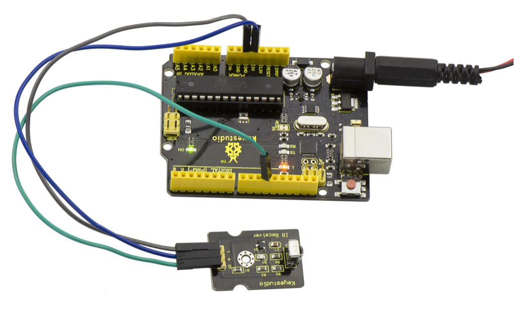

Done wiring and uploading the code, then control the IR receiver module by an infrared remote control, D1 led will flash.

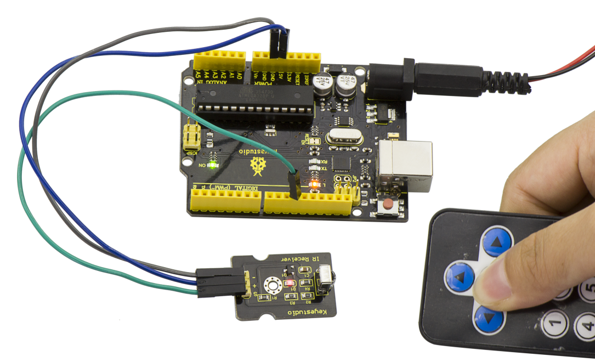

## Project 34: Digital IR Transmitter

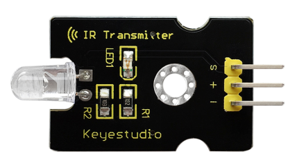

**Description**

IR transmitter module is designed for IR communication, which is widely used for operating the television device from a short line-of-sight distance.

Since infrared (IR) remote control uses light, it requires line of sight to operate the destination device. The signal can, however, be reflected by mirrors, just like any other light sources.

Infrared receivers also tend to have a more or less limited operating angle, which mainly depends on the optical characteristics of the phototransistor. 

However, it’s easy to increase the operating angle using a matte transparent object in front of the receiver.

**Specification**

- Power Supply: 3-5V

- Infrared center frequency: 850nm-940nm

- Infrared emission angle: about 20 degrees

- Infrared emission distance: about 1.3m (5V 38Khz)

- Interface socket: JST PH2.0

- Mounting hole: inner diameter is 3.2mm, spacing is 15mm

**Connection Diagram**

Firstly you need to prepare the following parts before connection.

-   V4.0 Board\*1

-   IR Transmitter module\*1

-   USB Cable\*1

-   Jumper Wire\*3

Connect the S pin of module to Digital 3 of V4.0 board, connect the negative pin to GND port, positive pin to 5V port.

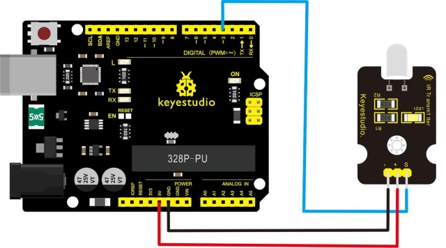

**Sample Code 1:**

```c
int led = 3;
void setup() {                
   pinMode(led, OUTPUT);     
}
void loop() {
  digitalWrite(led, HIGH);  
  delay(1000);               
  digitalWrite(led, LOW);   
  delay(1000); 
}
```


In the darkness of the environment, you are going to see blinking blue light on phone's screen when using camera to shoot the infrared LED.

Upload well the above code to the board, the led on the sensor will blink red light.

In the following, let’s move on to an interactive example between IR receiver and IR transmitter module.

**Infrared Remote/Communication:**

**Hardware Required**

-   Arduino R3 x2

-   Digital IR Receiver x1

-   IR Transmitter Module x1

Note: here if you have no two main boards, you can replace it with the breadboard for connection, may be more easier and convenient.

**Connection Diagram:**

**For IR Transmitter:**

Notice: Arduino-IR remote only supports D3 as transmitter.

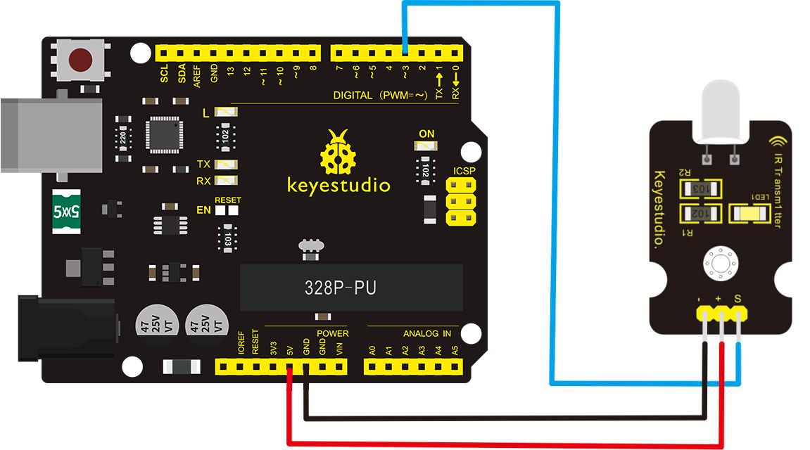

**For IR Receiver:**

Connect the signal pin to D11 port.


**Upload code 2 to the V4.0 connected with IR Transmitter:**

```c
 #include <IRremote.h>
  IRsend irsend;
 void setup()
 {}
 void loop() {
  irsend.sendRC5(0x0, 8); //send 0x0 code (8 bits)
     delay(200);
  irsend.sendRC5(0x1, 8); 
     delay(200); }
```


**Upload code 3 to the V4.0 connected with IR Receiver:**

```c
#include <IRremote.h>
 const int RECV_PIN = 11;
 const int LED_PIN = 13;
 IRrecv irrecv(RECV_PIN);
 decode_results results;
 void setup()
 {Serial.begin(9600);
   irrecv.enableIRIn(); // Start the receiver
 }
  void loop() 
 {if (irrecv.decode(&results)) 
   { if ( results.bits > 0 )
     {

       int state;
       if ( 0x1 == results.value )	
       {		
         state = HIGH;
       }
       else
       {
       	state = LOW;
       }
 		digitalWrite( LED_PIN, state );			
     }
  irrecv.resume();        // prepare to receive the next value
   }}
```


**Result:**

When IR Receiver module receives the infrared signal from IR Transmitter, D1 led on the IR Receiver module will blink.

When IR Receiver module receives the infrared signal from IR Transmitter, D1 led on the IR Receiver module will blink.

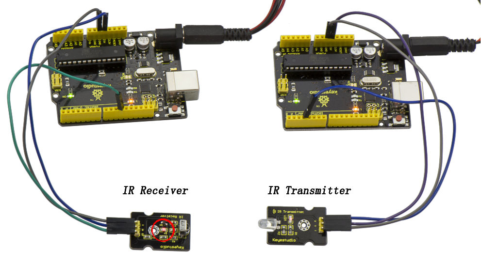

## Project 35: Pulse Rate Monitor

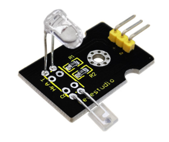

**Description**

This module makes use of a ultra-clear infrared LED and a phototransistor to detect the pulse in your finger. The red LED will flash in time with your pulse.

Working principle

Shine the bright LED onto one side of your finger while the phototransistor on the other side of your finger picks up the amount of transmitted light. The resistance of the phototransistor will vary slightly as the blood pulses through your finger.

**Connection Diagram**

Firstly you need to prepare the following parts before making a test.

-   V4.0 Board\*1

-   Pulse module\*1

-   USB Cable\*1

-   Jumper Wire\*3

Connect the Signal pin of module to Analog A0 of V4.0 board, the positive pin to 5V port, the negative pin to GND port.

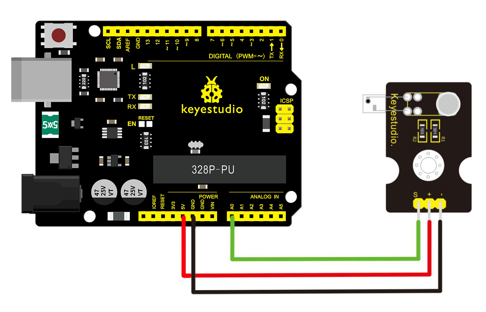

**Sample Code**

Copy and paste the code below to Arduino software.

```c
///////////////////////////////////////////////////////////////
int ledPin = 13;
int sensorPin = 0;
double alpha = 0.75;
int period = 20;
double change = 0.0;
void setup()
{
pinMode(ledPin, OUTPUT);
Serial.begin(115200);
}
void loop()
{
static double oldValue = 0;
static double oldChange = 0;
int rawValue = analogRead(sensorPin);
double value = alpha * oldValue + (1 - alpha) * rawValue;
Serial.print(rawValue);
Serial.print(",");
Serial.println(value);
oldValue = value;
delay(period);
}
///////////////////////////////////////////////////////////////
```


**Example Result**

Wire it up well as the above diagram, then upload well the code to the board and click the icon of serial monitor on the upper right corner of Arduino software. Set the baud rate as 115200, you will see the data is displayed on the monitor.

You can copy and paste the data to the excel, finally it will generate the corresponding picture shown below.

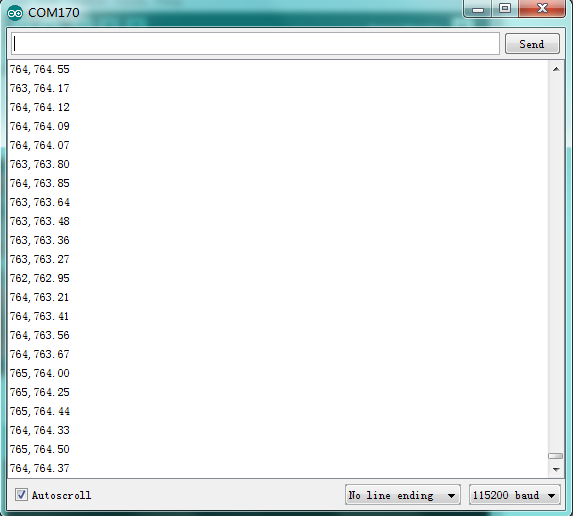

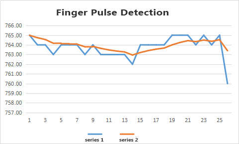

## Project 36: Joystick

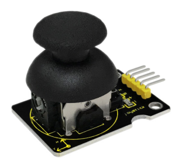

**Description**

Lots of robot projects need joystick. This module provides an affordable solution. By simply connecting to two analog inputs, the robot is at your commands with X, Y control. It also has a switch that is connected to a digital pin.

**Specification**

-   Supply Voltage: 3.3V to 5V

-   Interface: Analog x2, Digital x1

-   Size: 40*28mm

-   Weight: 12g

**Connection Diagram**

Firstly you need to prepare the following parts before connection.

-   V4.0 Board\*1

-   Joystick module\*1

-   USB Cable\*1

-   Jumper Wire\*5

Connect the Y pin of module to Analog A1 of V4.0 board, connect the X pin to Analog A0, B pin to Digital 3; Connect negative pin to GND port, positive pin to 5V port.

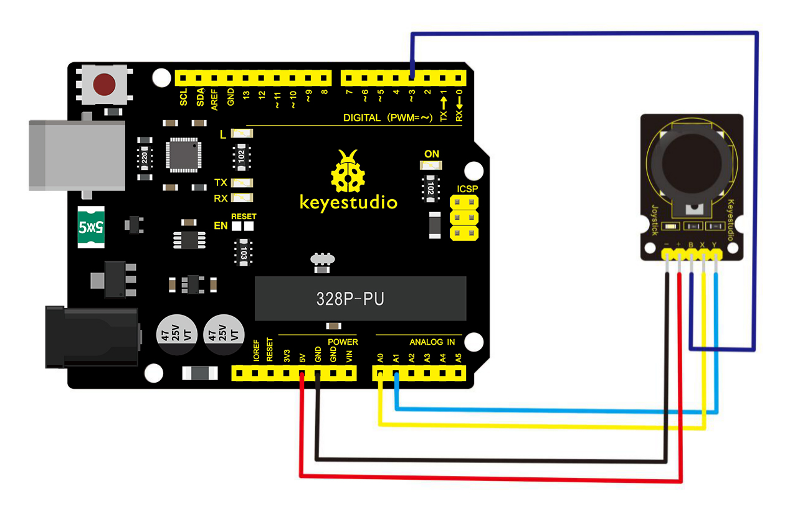

**Sample Code**

Copy and paste the code below to Arduino software.

```c
///////////////////////////////////////////////////////////////
int JoyStick_X = 0; //x
int JoyStick_Y = 1; //y
int JoyStick_Z = 3; //key
  void setup() 
{
  pinMode(JoyStick_Z, INPUT); 
  Serial.begin(9600); // 9600 bps
}
void loop() 
{
  int x,y,z;
  x=analogRead(JoyStick_X);
  y=analogRead(JoyStick_Y);
  z=digitalRead(JoyStick_Z);
  Serial.print(x ,DEC);
  Serial.print(",");
  Serial.print(y ,DEC);
  Serial.print(",");
  Serial.println(z ,DEC);
  delay(100);
}
///////////////////////////////////////////////////////////////
```


**Example Result**

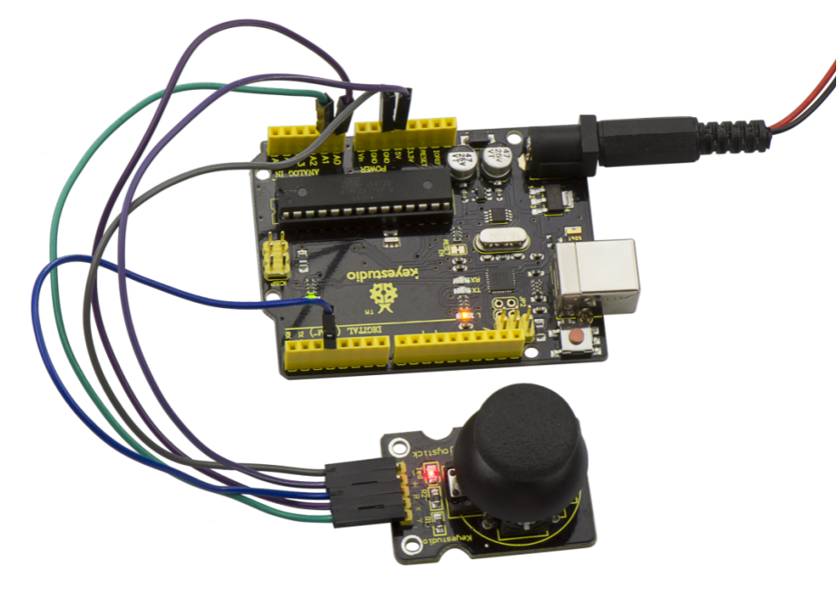

Wiring well and uploading the code, open the serial monitor on Arduino software, and set the baud rate as 9600, you will see the value shown below. If push the joystick downward /upward /leftward /rightward, the data will change.

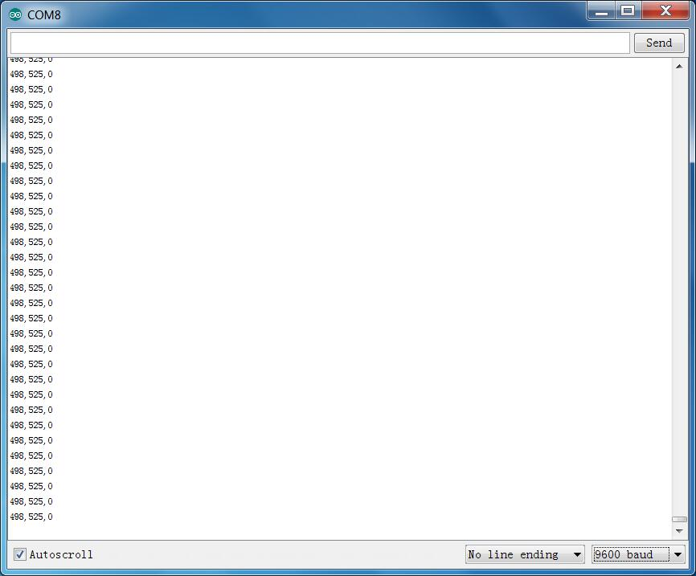

## Project 37: Rotary Encoder

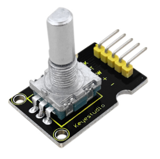

**Introduction**

The rotary encoder can count the pulse outputting times during the process of rotation in positive and reverse direction.

This rotating counting is unlimited, not like potential counting. It can be restored to initial state to count from 0.

**Specification**

-   Power Supply: 5V

-   Interface: Digital

-   Size: 30\*20mm

-   Weight: 7g

**Connection Diagram**

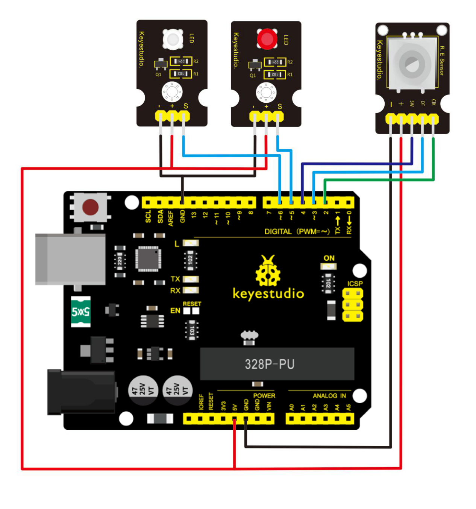

As seen in the diagram, we connect rotary encoder module and two LED modules to the breadboard and V4.0 board.

Use the rotary encoder module to control two LED modules on and off.

**Sample Code**

```c
///////////////////////////////////////////////////////////////
const int interruptA = 0;       
const int interruptB = 1;       
int CLK = 2;     // PIN2
int DAT = 3;     // PIN3
int BUTTON = 4;  // PIN4
int LED1 = 5;    // PIN5
int LED2 = 6;    // PIN6
int COUNT = 0;

void setup() 
 {
  attachInterrupt(interruptA, RoteStateChanged, FALLING);
 // attachInterrupt(interruptB, buttonState, FALLING);
  pinMode(CLK, INPUT); 
  digitalWrite(2, HIGH);  // Pull High Resistance  
  pinMode(DAT, INPUT); 
  digitalWrite(3, HIGH);  // Pull High Resistance 
 
pinMode(BUTTON, INPUT); 
  digitalWrite(4, HIGH);  // Pull High Resistance
  pinMode(LED1, OUTPUT); 
  pinMode(LED2, OUTPUT); 
   Serial.begin(9600);
 }

void loop() 
{
  if  (!(digitalRead(BUTTON))) 
    {
     COUNT = 0;  
     Serial.println("STOP COUNT = 0");
     digitalWrite(LED1, LOW);
     digitalWrite(LED2, LOW);
     delay (2000);
    }
     Serial.println(COUNT);  
}

//-------------------------------------------
void RoteStateChanged() //When CLK  FALLING READ DAT
{
 if  (digitalRead(DAT)) // When DAT = HIGH IS FORWARD
   {
    COUNT++;
    digitalWrite(LED1, HIGH);
    digitalWrite(LED2, LOW);
    delay(20);
   }
 else                   // When DAT = LOW IS BackRote
   {
    COUNT--;
    digitalWrite(LED2, HIGH);
    digitalWrite(LED1, LOW);
    delay(20);
   }
}
///////////////////////////////////////////////////////////////
```


**Example Result**

Wiring well and uploading the above code, you can rotate the encoder module to randomly control two LED modules on and off. When you rotate the encoder module, one LED module is turned on first but another one is off.

If you continue to rotate the encoder module, one LED module becomes off while another one is turned on, repeatedly.

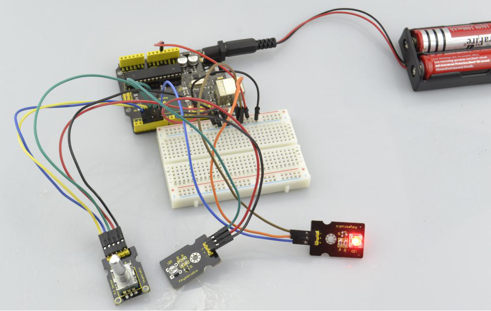

## Project 38: Single Relay

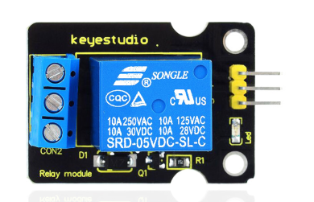

**Introduction**

This single relay module can be used in interactive projects. This module uses SONGLE 5v high-quality relay. It can also be used to control lighting, electrical and other equipment.

The modular design makes it easy to use with Arduino board. It can be controlled through digital IO port, such as solenoid valves, lamps, motors and other high current or high voltage devices.

**Specification**

- Type: Digital

- Rated current: 10A (NO) 5A (NC)

- Maximum switching voltage: 150VAC 24VDC

- Digital interface

- Control signal: TTL level

- Rated load: 8A 150VAC (NO), 10A 24VDC (NO), 5A 250VAC (NO/NC), 5A 24VDC (NO/NC)

- Maximum switching power: AC1200VA DC240W (NO), AC625VA DC120W (NC)

- Contact action time: 10ms

**Connection Diagram**

Firstly you need to prepare the following parts before connection.

-   V4.0 Board\*1

-   Relay module\*1

-   LED module \*1

-   Breadboard \*1

-   USB Cable\*1

-   Jumper Wire\*9

Here we use the single relay module to control an LED module on or off.

For relay module, connect the Signal pin to Digital port 8 of V4.0 board, then connect its positive pin to anode row of breadboard, lead off the row to 5V port of V4.0 board. Connect its negative pin to cathode row of breadboard, lead off the row to GND port of V4.0 board.

For LED module, connect its Signal pin to one terminal block of relay module, another terminal block on the relay is connected to Digital port 13 of V4.0 board. Connect its positive pin to anode row, negative pin to cathode row of breadboard.

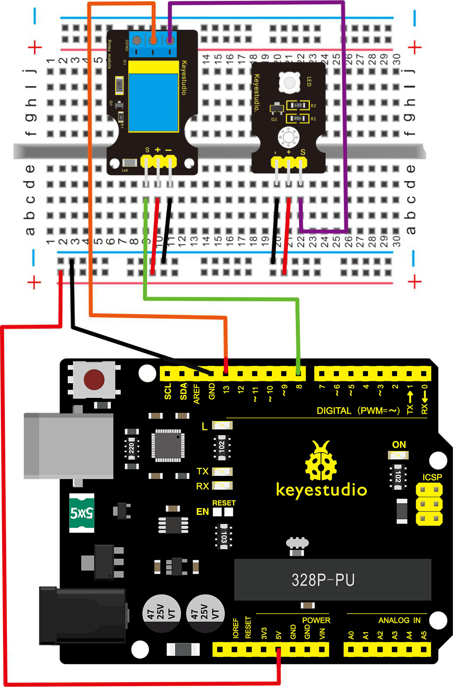

**Sample Code**

Copy and paste the code below to Arduino software.

```c
///////////////////////////////////////////////////////////////
 int Relay = 8;
  void setup()
{
  pinMode(13, OUTPUT);         //Set Pin13 as output
  digitalWrite(13, HIGH);     //Set Pin13 High
  pinMode(Relay, OUTPUT);     //Set Pin3 as output
}
void loop()
{
          digitalWrite(Relay, HIGH);   //Turn off relay
          delay(2000);
          digitalWrite(Relay, LOW);    //Turn on relay
          delay(2000);
}
///////////////////////////////////////////////////////////////
```


**Example Result**

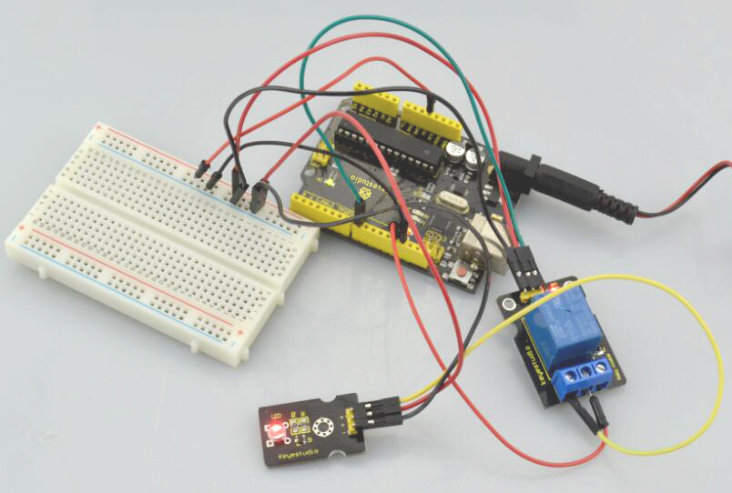

This relay module is active at HIGH level.

Wire it up well, powered up, then upload the above code to the board, you will see the relay is turned on（ON connected, NC disconnected）for two seconds, then turned off for two seconds（NC closed,ON disconnected）, repeatedly and circularly.

When the relay is turned on, external LED is on. If relay is turned off, external LED is off.

## Project 39: Linear Temperature

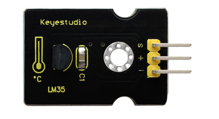

**Introduction**

LM35 Linear Temperature Sensor is based on semiconductor LM35 temperature sensor. It can be used to detect ambient air temperature.

This sensor offers a functional range among 0 degree Celsius to 100 degree Celsius. Sensitivity is 10mV per degree Celsius. The output voltage is proportional to the temperature.

This sensor is commonly used as a temperature measurement sensor. It includes thermocouples, platinum resistance, thermal resistance and temperature semiconductor chips.

The chip is commonly used in high temperature measurement thermocouples.

Platinum resistance temperature sensor is used in the measurement of 800 degrees Celsius, while the thermal resistance and semiconductor temperature sensor is suitable for measuring the temperature of 100-200 degrees or below, in which the application of a simple semiconductor temperature sensor is good in linearity and high in sensitivity.

The LM35 linear temperature sensor can be easily connected to Arduino shield.

**Specification**

-   Sensitivity: 10mV per degree Celsius

-   Functional range: 0 degree Celsius to 100 degree Celsius

-   Size: 30*20mm

-   Weight: 3g

**Connection Diagram**

Firstly you need to prepare the following parts before testing.

-   V4.0 Board\*1

-   LM35 temperature sensor\*1

-   USB Cable\*1

-   Jumper Wire\*3

Then follow the wiring diagram, connect the signal pin of sensor to A0 port of V4.0 board, negative pin to GND port, positive pin to 5V port.

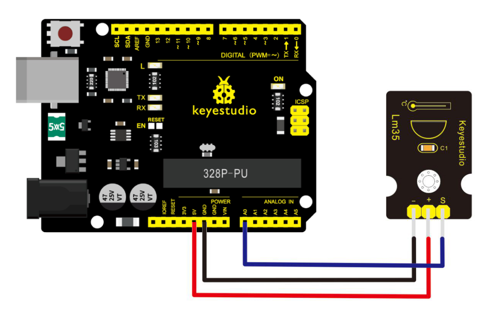

**Sample Code**

Copy and paste the code below to Arduino software.

```c
///////////////////////////////////////////////////////////////
void setup()
{
    Serial.begin(9600);//Set Baud Rate to 9600 bps
}
 void loop()
{  int val;
    int dat;
    val=analogRead(0);//Connect LM35 on Analog 0
    dat=(500 * val) /1024;;
    Serial.print("Temp:"); //Display the temperature on Serial monitor
    Serial.print(dat);
    Serial.println("C");
    delay(500);
}
///////////////////////////////////////////////////////////////
```


**Example Result**

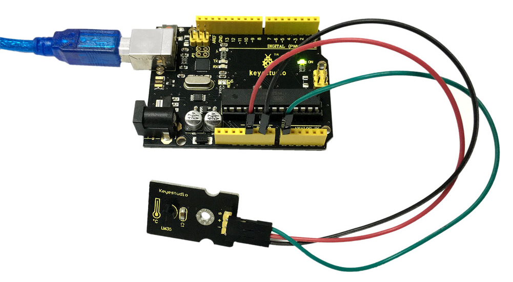

Wire it up as the above diagram and upload well the code to the board, then open the serial monitor and set the baud rate as 9600.

You will see the current temperature value shown below. The value may be slight difference due to different place and weather.

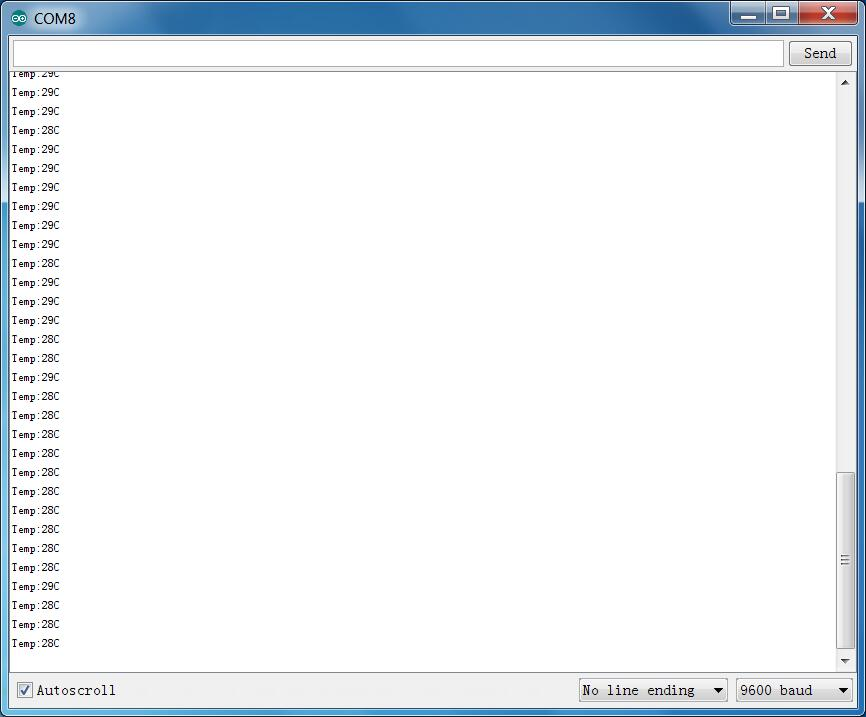

## Project 40: Temperature and Humidity Display

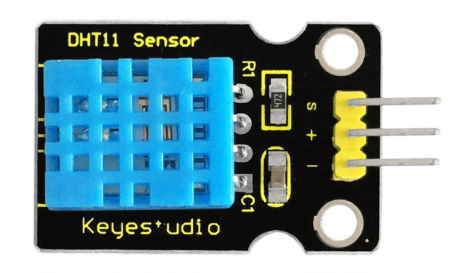

**Introduction**

This DHT11 sensor features calibrated digital signal output with the temperature and humidity sensor complex. Its technology ensures high reliability and excellent long-term stability.

A high-performance 8-bit microcontroller is connected on the sensor. This sensor includes a resistive element and a sense of wet NTC temperature measuring devices.

It has advantages of excellent quality, fast response, anti-interference ability and high cost performance.

Each DHT11 sensor features extremely accurate calibration data of humidity calibration chamber. The calibration coefficients stored in the OTP program memory, internal sensors detect signals in the process, and we should call these calibration coefficients.

The single-wire serial interface system is integrated to make it quick and easy. Qualities of small size, low power, and 20-meter signal transmission distance make it a wide applied application or even the most demanding one.

**Specification**

-   Supply Voltage: +5 V

-   Temperature range: 0-50 °C error of ± 2 °C

-   Humidity: 20-90% RH ± 5% RH error

-   Interface: Digital

**Connection Diagram**

Firstly you need to prepare the following parts before testing.

-   V4.0 Board\*1

-   DHT11 sensor\*1

-   USB Cable\*1

-   Jumper Wire\*3

Then follow the wiring diagram, connect the Signal pin of sensor to Digital 4 port of V4.0 board, negative pin to GND port, positive pin to 5V port.

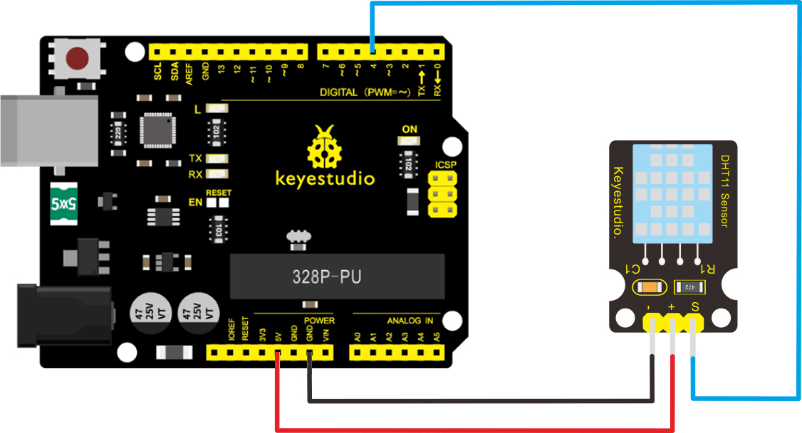

**Sample Code**

Please download the [DHT11Lib](https://github.com/RobTillaart/Arduino/tree/master/libraries/DHTlib) firstly. Or [visit the website](http://playground.arduino.cc/Main/DHTLib)

Copy and paste the code below to Arduino software.

```c
///////////////////////////////////////////////////////////////
#include <dht11.h>
dht11 DHT;
#define DHT11_PIN 4
  
void setup(){
  Serial.begin(9600);
  Serial.println("DHT TEST PROGRAM ");
  Serial.print("LIBRARY VERSION: ");
  Serial.println(DHT11LIB_VERSION);
  Serial.println();
  Serial.println("Type,\tstatus,\tHumidity (%),\tTemperature (C)");
}
  
void loop(){
  int chk;
  Serial.print("DHT11, \t");
  chk = DHT.read(DHT11_PIN);    // READ DATA
  switch (chk){
    case DHTLIB_OK:  
                Serial.print("OK,\t"); 
                break;

case DHTLIB_ERROR_CHECKSUM: 

                Serial.print("Checksum error,\t"); 
                break;
    case DHTLIB_ERROR_TIMEOUT: 
                Serial.print("Time out error,\t"); 
                break;
    default: 
                Serial.print("Unknown error,\t"); 
                break;
  }
 // DISPLAT DATA
  Serial.print(DHT.humidity,1);
  Serial.print(",\t");
  Serial.println(DHT.temperature,1);
  
  delay(1000);
}
///////////////////////////////////////////////////////////////
```


**Example Result**

Wire it up well and upload the above code to V4.0 board.

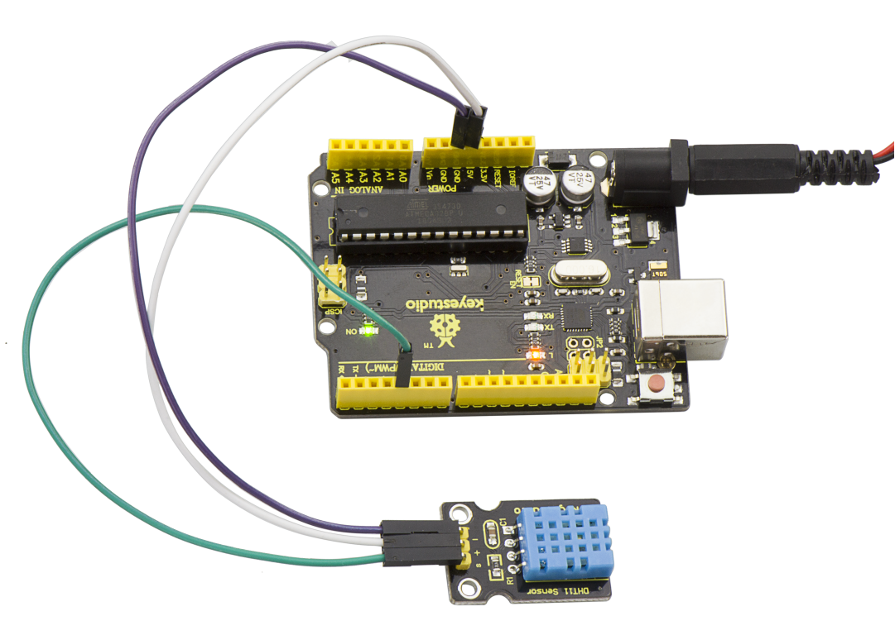

Then open the serial monitor and set the baud rate as 9600, finally you will see the current temperature and humidity value.

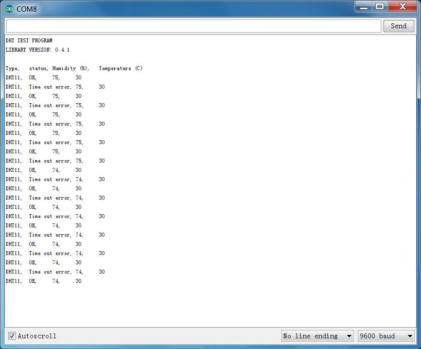

## Project 41: Magical Light Cup

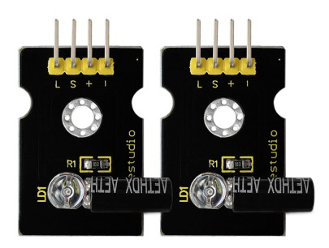

**Introduction**

Magic light cup module is able to interact with ARDUINO. The principle is based on PWM dimming.

The mercury switch on the module can provide a digital signal and trigger PWM regulation. The brightness of two modules will be changed together through the program design, finally you can see the changing effect that two set of cups are pouring the light.

**Specification**

-   Supply Voltage: 3.3V to 5V

-   Interface: Digital

**Connection Diagram**

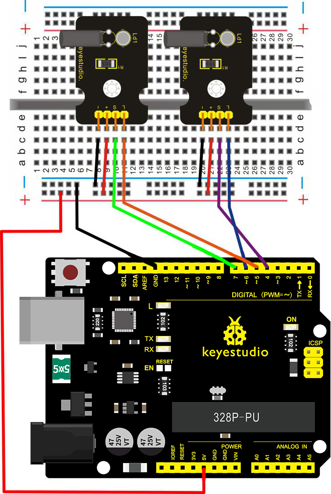

**Sample Code**

Copy and paste the code below to Arduino software.

```c
///////////////////////////////////////////////////////////////
int LedPinA = 5;
int LedPinB = 6;
int ButtonPinA = 7;
int ButtonPinB = 4;
int buttonStateA = 0;
int buttonStateB = 0;
int brightnessA = 0;
int brightnessB= 255;
void setup()
{
Serial.begin(9600);
pinMode(LedPinA, OUTPUT);
pinMode(LedPinB, OUTPUT);


pinMode(ButtonPinA, INPUT);
pinMode(ButtonPinB, INPUT);
}
void loop()
{
buttonStateA = digitalRead(ButtonPinA);
if (buttonStateA == HIGH && brightnessA != 255)
{
brightnessA ++;
}
if (buttonStateA == LOW && brightnessA != 0)
{
brightnessA --;
}
analogWrite(LedPinB, brightnessA);
Serial.print(brightnessA);

Serial.print("   ");
buttonStateB = digitalRead(ButtonPinB);
if (buttonStateB == HIGH && brightnessB != 0)
{
brightnessB --;
}
if (buttonStateB == LOW && brightnessB != 255)
{
brightnessB++;
}
analogWrite(LedPinA, brightnessB); 
Serial.println(brightnessB);
delay(5);
}
///////////////////////////////////////////////////////////////
```


**Example Result**

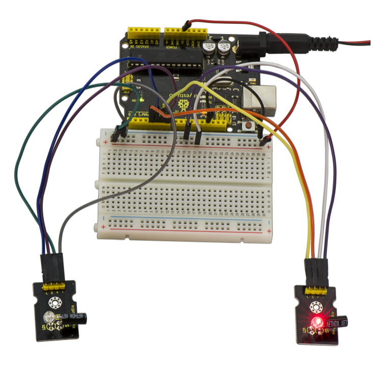

Wire it up as the above diagram and upload well the code to the board, then you can see one cap lights up while the other one is off. When tilt these two caps towards the same side, one cap is gradually become bright, another bright cap is gradually off.

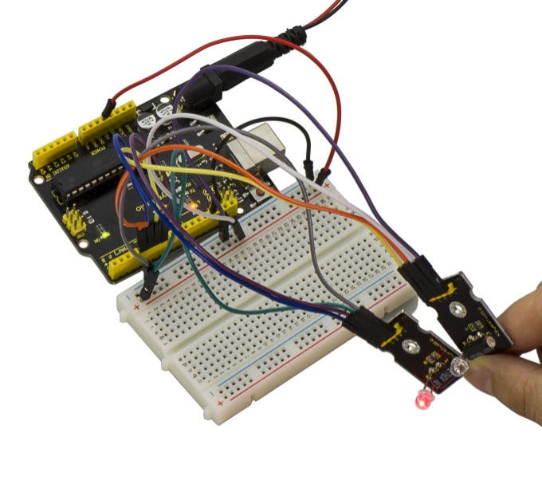

## Project 42: Attitude Sensor

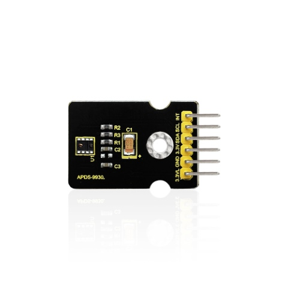

**Introduction**

Keyestudio attitude sensor module mainly uses APDS-9930 chip. APDS-9930 in a single 8 pin package can provide the ambient light sensor which is compatible with I2C interface and infrared LED proximity sensor.

The proximity sensor which is completely adjusted can detect 100mm object, and exempt the factory calibration requirements of terminal equipment as well as sub-components.

From the bright sunlight to the dark room, proximity sensor’s proximity detection function can operate well.

This module added micro optical lens can provide infrared energy efficient transmission and reception, which can reduce the overall power consumption.

In addition, its internal state machine can make the device into a low power mode, bringing a very low average power consumption.

**Parameters**

-   Working Voltage：DC 3.3-3.8V

-   Output Current：0-20mA

-   Temperature Range：-40℃—85℃

**Features**

1.  Optical module integrated with ALS, infrared LED and proximity detector;

2.  Up to 16-bit resolution;

3.  High sensitivity of operation in the back of dark glass;

4.  0.01lux low lumen performance;

5.  Proximity detection, fully calibrated to 100 mm detection;

6.  Integrate infrared LED and synchronous LED driver;

7.  Eliminate factory calibration for proximity sensors;

8.  Programmable waiting timer, waiting state’s power consumption- 90μA (typical value);
    
9.  Programmable range is from 2.7milliseconds to 8 seconds;

10. Compatible with I2C interface, up to 400kHz (I2C fast mode);

11. Dedicated interruption pin;

12. Sleep mode power - 2.2μA (typical value).

**Connection Diagram**

Firstly you need to prepare the following parts:

-   V4.0 Board\*1

-   Attitude sensor\*1

-   USB Cable\*1

-   Jumper Wire\*5

Connect the INT pin of sensor to Digital 2 port of V4.0 board, SCL pin to Analog A5 port, SDA pin to Analog A4 port; Connect 3V3 pin to 3V3 port, GND pin to GND port.

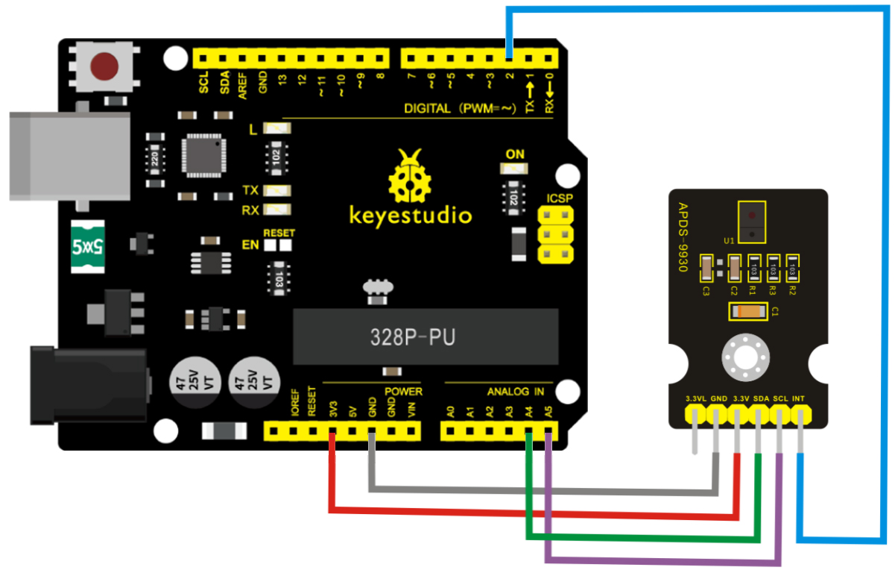

**Sample Code**

**IMPORTANT**: The APDS-9960 can only accept 3.3V!

**Hardware Connections:**

| Arduino Pin | APDS-9960 Board | Function  |
| :---------: | :-------------: | :-------: |
|    3.3V     |       VCC       |   Power   |
|     GND     |       GND       |  Ground   |
|     A4      |       SDA       | I2C Data  |
|     A5      |       SCL       | I2C Clock |
|     D2      |       INT       | Interrupt |
|     D13     |        -        |    LED    |

**Resources:** Include Wire.h and SparkFun_APDS-9960.h

**Development environment specifics**: Written in Arduino 1.0.5


Copy and paste the code below to Arduino software.

```c
#include <Wire.h>
#include <SparkFun_APDS9960.h>

// Pins
#define APDS9960_INT    2  // Needs to be an interrupt pin
#define LED_PIN         13 // LED for showing interrupt

// Constants
#define LIGHT_INT_HIGH  1000 // High light level for interrupt
#define LIGHT_INT_LOW   10   // Low light level for interrupt

// Global variables
SparkFun_APDS9960 apds = SparkFun_APDS9960();
uint16_t ambient_light = 0;
uint16_t red_light = 0;
uint16_t green_light = 0;
uint16_t blue_light = 0;
int isr_flag = 0;
uint16_t threshold = 0;

void setup() { 
  // Set LED as output
  pinMode(LED_PIN, OUTPUT);
  pinMode(APDS9960_INT, INPUT);
  // Initialize Serial port
  Serial.begin(9600);
  Serial.println();
  Serial.println(F("-------------------------------------"));
  Serial.println(F("SparkFun APDS-9960 - Light Interrupts"));
  Serial.println(F("-------------------------------------"));
  // Initialize interrupt service routine
  attachInterrupt(0, interruptRoutine, FALLING);
  // Initialize APDS-9960 (configure I2C and initial values)
  if ( apds.init() ) {
    Serial.println(F("APDS-9960 initialization complete"));
  } else {
    Serial.println(F("Something went wrong during APDS-9960 init!"));
  }
  // Set high and low interrupt thresholds
  if ( !apds.setLightIntLowThreshold(LIGHT_INT_LOW) ) {
    Serial.println(F("Error writing low threshold"));
  }
  if ( !apds.setLightIntHighThreshold(LIGHT_INT_HIGH) ) {
    Serial.println(F("Error writing high threshold"));
  }
  // Start running the APDS-9960 light sensor (no interrupts)
  if ( apds.enableLightSensor(false) ) {
    Serial.println(F("Light sensor is now running"));
  } else {
    Serial.println(F("Something went wrong during light sensor init!"));
  }
  // Read high and low interrupt thresholds
  if ( !apds.getLightIntLowThreshold(threshold) ) {
    Serial.println(F("Error reading low threshold"));
  } else {
    Serial.print(F("Low Threshold: "));
    Serial.println(threshold);
  }
  if ( !apds.getLightIntHighThreshold(threshold) ) {
    Serial.println(F("Error reading high threshold"));
  } else {
    Serial.print(F("High Threshold: "));
    Serial.println(threshold);
  }
  // Enable interrupts
  if ( !apds.setAmbientLightIntEnable(1) ) {
    Serial.println(F("Error enabling interrupts"));
  }
  // Wait for initialization and calibration to finish
  delay(500);
}
void loop() { 
  // If interrupt occurs, print out the light levels
  if ( isr_flag == 1 ) {
    
    // Read the light levels (ambient, red, green, blue) and print
    if (  !apds.readAmbientLight(ambient_light) ||
          !apds.readRedLight(red_light) ||
          !apds.readGreenLight(green_light) ||
          !apds.readBlueLight(blue_light) ) {
      Serial.println("Error reading light values");
    } else {
      Serial.print("Interrupt! Ambient: ");
      Serial.print(ambient_light);
      Serial.print(" R: ");
      Serial.print(red_light);
      Serial.print(" G: ");
      Serial.print(green_light);
      Serial.print(" B: ");
      Serial.println(blue_light);
    }  
    // Turn on LED for a half a second
    digitalWrite(LED_PIN, HIGH);
    delay(500);
    digitalWrite(LED_PIN, LOW);
    
    // Reset flag and clear APDS-9960 interrupt (IMPORTANT!)
    isr_flag = 0;
    if ( !apds.clearAmbientLightInt() ) {
      Serial.println("Error clearing interrupt");
    }  
  }
}
void interruptRoutine() {
  isr_flag = 1;
}

```


Note: before compiling the code, do remember to place the library into libraries directory of Arduino IDE. Otherwise, compiling will fail.

**Example Result**

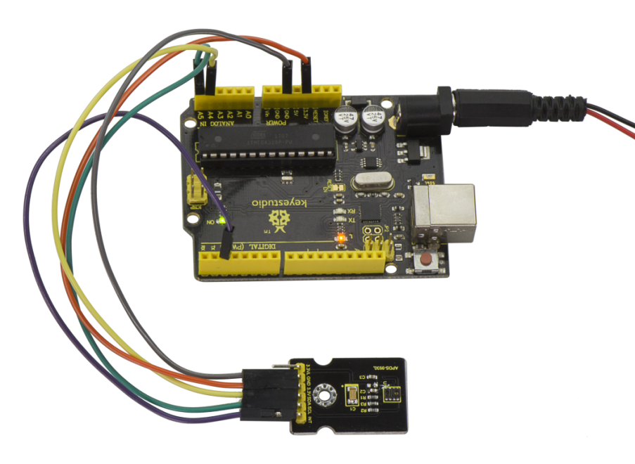

After uploading the code, open the serial monitor and set the baud rate to 9600.

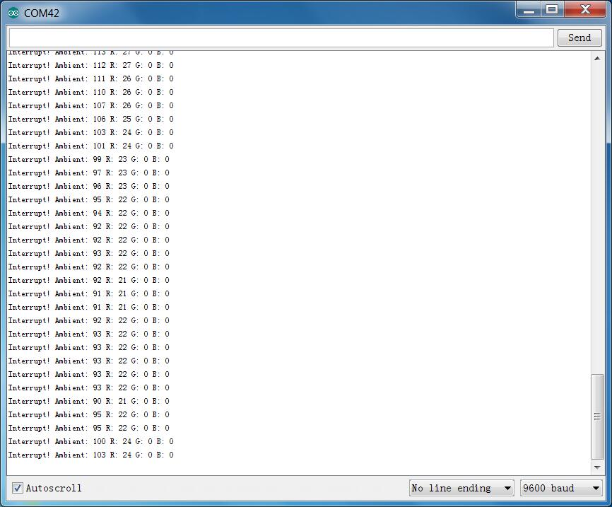

## Project 43: Optical Proximity Detection

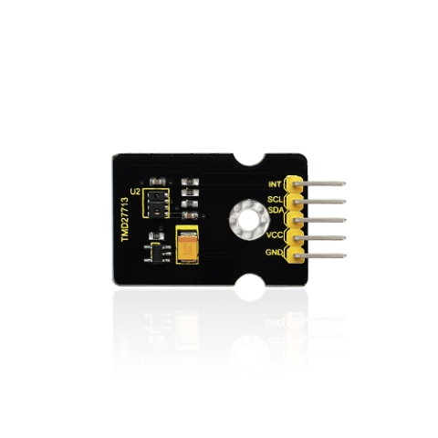

**Introduction**

It is a triple sensor integrated with ambient light, proximity sensor and infrared LED.

For one thing, it is used to detect the current ambient brightness (ALS). It can in accordance with the current ambient brightness automatically adjust the backlight brightness to conform to ambient light by the mean of software adjustment. This way can make backlight brightness soft to protect your vision and to achieve the effect of energy saving.

For another feature we are referred to as proximity sensor function (PROX). Sensor has been integrated transmitter/receiver and minimized the design, besides, design and installation have no more space restrictions, and for part of a structure is relatively simple.

**Parameters**

-   Working voltage：DC 3.3V

-   Detection distance：100mm

-   Communication way：IIC communication

-   Temperature range：-30℃ to 85℃

**Connection Diagram**

Firstly you need to prepare the following parts:

-   V4.0 Board\*1

-   TMD27713 sensor\*1

-   USB Cable\*1

-   Jumper Wire\*5

Connect the INT pin of sensor to Digital 2 port of V4.0 board, SCL pin to Analog A5 port, SDA pin to Analog A4 port; Connect VCC pin to 3V3 port, GND pin to GND port.

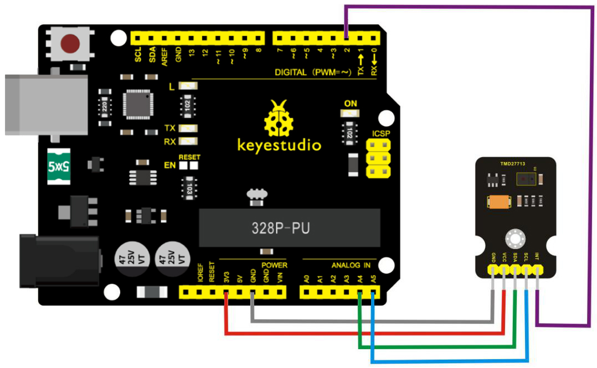

**Sample Code**

Tests the proximity interrupt abilities of the APDS-9930.

Configures the APDS-9930 over I2C and waits for an external interrupt based on high or low proximity conditions. Move your hand near the sensor and watch the LED on pin 13.

**Hardware Connections:**

**IMPORTANT**: The APDS-9930 can only accept 3.3V!

| Arduino Pin | APDS-9930 Board | Function  |
| :---------: | :-------------: | :-------: |
|    3.3V     |       VCC       |   Power   |
|     GND     |       GND       |  Ground   |
|     A4      |       SDA       | I2C Data  |
|     A5      |       SCL       | I2C Clock |
|      2      |       INT       | Interrupt |
|     13      |        -        |    LED    |

**Resources**: Include Wire.h and APDS9930.h

**Development environment specifics**: Written in Arduino 1.0.5


Copy and paste the code below to Arduino software.

```c
#include <Wire.h>
#include <APDS9930.h>

// Pins
#define APDS9930_INT    2  // Needs to be an interrupt pin
#define LED_PIN         13 // LED for showing interrupt

// Constants
#define PROX_INT_HIGH   600 // Proximity level for interrupt
#define PROX_INT_LOW    0  // No far interrupt

// Global variables
APDS9930 apds = APDS9930();
float ambient_light = 0; // can also be an unsigned long
uint16_t ch0 = 0;
uint16_t ch1 = 1;
uint16_t proximity_data = 0;
volatile bool isr_flag = false;

void setup() {

  // Set LED as output
  pinMode(LED_PIN, OUTPUT);
  pinMode(APDS9930_INT, INPUT);

  // Initialize Serial port
  Serial.begin(9600);
  Serial.println();
  Serial.println(F("------------------------------"));
  Serial.println(F("APDS-9930 - ProximityInterrupt"));
  Serial.println(F("------------------------------"));

  // Initialize interrupt service routine
  attachInterrupt(digitalPinToInterrupt(APDS9930_INT), interruptRoutine, FALLING);

  // Initialize APDS-9930 (configure I2C and initial values)
  if (apds.init()) {
    Serial.println(F("APDS-9930 initialization complete"));
  }
  else {
    Serial.println(F("Something went wrong during APDS-9930 init!"));
  }

  // Adjust the Proximity sensor gain
  if (!apds.setProximityGain(PGAIN_2X)) {
    Serial.println(F("Something went wrong trying to set PGAIN"));
  }

  // Set proximity interrupt thresholds
  if (!apds.setProximityIntLowThreshold(PROX_INT_LOW)) {
    Serial.println(F("Error writing low threshold"));
  }
  if (!apds.setProximityIntHighThreshold(PROX_INT_HIGH)) {
    Serial.println(F("Error writing high threshold"));
  }

  // Start running the APDS-9930 proximity sensor (interrupts)
  if (apds.enableProximitySensor(true)) {
    Serial.println(F("Proximity sensor is now running"));
  }
  else {
    Serial.println(F("Something went wrong during sensor init!"));
  }

  // Start running the APDS-9930 light sensor (no interrupts)
  if (apds.enableLightSensor(false)) {
    Serial.println(F("Light sensor is now running"));
  }
  else {
    Serial.println(F("Something went wrong during light sensor init!"));
  }

#ifdef DUMP_REGS
  /* Register dump */
  uint8_t reg;
  uint8_t val;

  for (reg = 0x00; reg <= 0x19; reg++) {
    if ((reg != 0x10) && \
      (reg != 0x11))
    {
      apds.wireReadDataByte(reg, val);
      Serial.print(reg, HEX);
      Serial.print(": 0x");
      Serial.println(val, HEX);
    }
  }
  apds.wireReadDataByte(0x1E, val);
  Serial.print(0x1E, HEX);
  Serial.print(": 0x");
  Serial.println(val, HEX);
#endif

}

void loop() {

  // If interrupt occurs, print out the proximity level
  if (isr_flag) {

    // Read proximity level and print it out
    if (!apds.readProximity(proximity_data)) {
      Serial.println("Error reading proximity value");
    }
    else {
      Serial.print("Proximity detected! Level: ");
      Serial.print(proximity_data);
      Serial.print("   ");
    }
    apds.readAmbientLightLux(ambient_light);
    // Read the light levels (ambient, red, green, blue)
    if (!apds.readAmbientLightLux(ambient_light) ||
      !apds.readCh0Light(ch0) ||
      !apds.readCh1Light(ch1)) {
      Serial.println(F("Error reading light values"));
    }
    else {
      Serial.print(F("Ambient: "));
      Serial.print(ambient_light);
      Serial.print(F("  Ch0: "));
      Serial.print(ch0);
      Serial.print(F("  Ch1: "));
      Serial.println(ch1);
    }

    // Turn on LED for a half a second
    digitalWrite(LED_PIN, HIGH);
    delay(300);
    digitalWrite(LED_PIN, LOW);

    // Reset flag and clear APDS-9930 interrupt (IMPORTANT!)
    isr_flag = false;
    if (!apds.clearProximityInt()) {
      Serial.println("Error clearing interrupt");
    }

  }
}

void interruptRoutine() {
  isr_flag = true;
}

```


Note: before compiling the code, do remember to place the library into libraries directory of Arduino IDE. Otherwise, compiling will fail.

**Example Result**

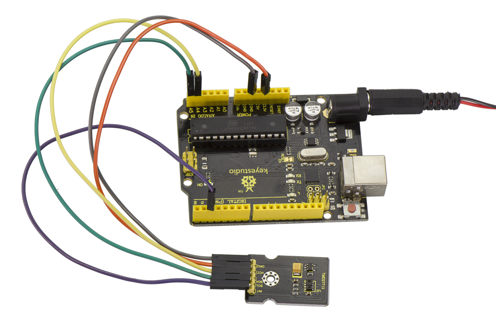

Tested by Arduino-1.8.2 version software, then open serial monitor, you can see the data as the figure shown below.

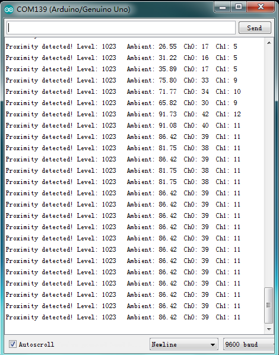

## Project 44: Triaxial Digital Acceleration Detection

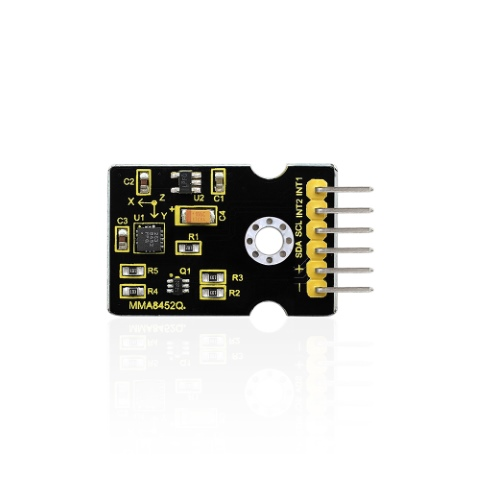

**Introduction**

MMA8452Q is a smart low-power, three-axis, capacitive micromachine acceleration sensor with 12-bit resolution.

This acceleration sensor has a rich embedded performance, featured with flexible user programmable options and two interruption pins configuration.

The embedded interruption function can save the overall power consumption and remove the burden of constantly polling the data in the main processor.

Besides, MMA8452Q has a user optional range of ±2g / ±4g/ ±8g, which can output high-pass filtering data and non-filtered data in real time.

This device can configure an embedded function to generate an inertial wake-up interrupt signal, which enables MMA8452Q to maintain a low-power mode in the static state while monitoring the event.

**Performance Parameters**

- Power Supply Voltage：1.95 V to 3.6 V

- Interface Voltage：1.6 V to 3.6 V

- ±2g/±4g/±8g Optional dynamic range

- Output data rate (ODR) range: 1.56Hz to 800Hz

- Noise：99μg/√Hz

- 12 bits and 8 bits digital outputs;

- I2C digital output interface (up to 2.25MHz when the pull-up resistor is 4.7kΩ);

- Two programmable interruption pins applied to six interruption sources;

- Three motion detection embedded channels: free fall detection, pulse detection, shaking detection;

- Direction (transverse/longitudinal) detection with setting lag compensation;

- Automatic arousal and auto-dormant ODR can be automatically altered;

- High-pass filtering data can be exported in real time;

- Power consumption: 6μA – 165μA

**Connection Diagram**

Firstly you need to prepare the following parts:

-   V4.0 Board*1

-   MMA8452Q sensor*1

-   USB Cable*1

-   Jumper Wire*4

Connect the SCL pin to Analog A5 port, SDA pin to Analog A4 port; Connect positive pin to 3V3 port, negative pin to GND port.

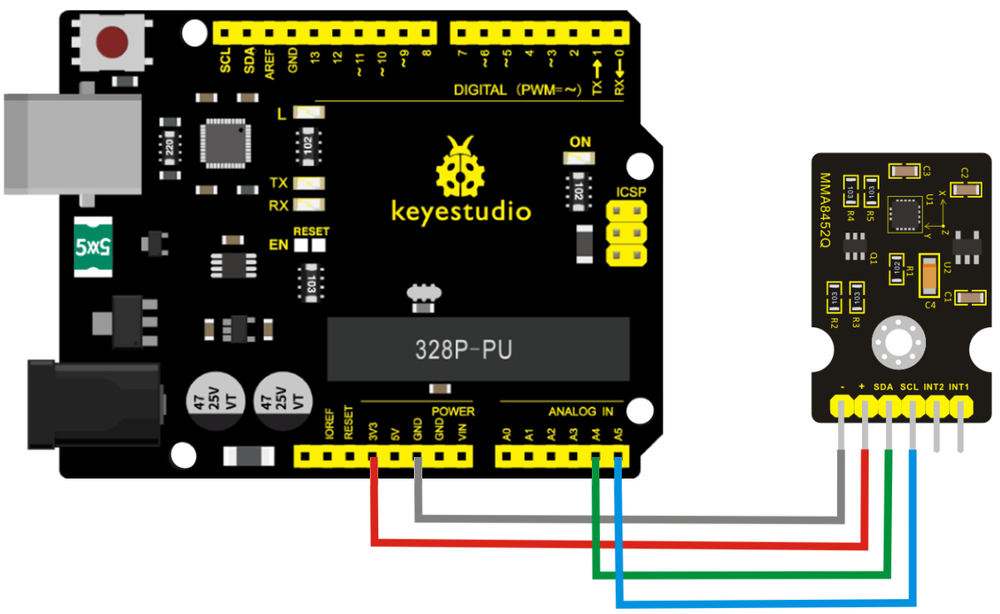

**Sample Code**

Copy and paste the code below to Arduino software.

```c
#include <Wire.h> // Must include Wire library for I2C
#include <SparkFun_MMA8452Q.h> // Includes the SFE_MMA8452Q library
// Begin using the library by creating an instance of the MMA8452Q
//  class. We'll call it "accel". That's what we'll reference from
//  here on out.
MMA8452Q accel;
// The setup function simply starts serial and initializes the
//  accelerometer.
void setup()
{
  Serial.begin(9600);
  Serial.println("MMA8452Q Test Code!");
  
  // Choose your adventure! There are a few options when it comes
  // to initializing the MMA8452Q:
  //  1. Default init. This will set the accelerometer up
  //     with a full-scale range of +/-2g, and an output data rate
  //     of 800 Hz (fastest).
  accel.init();
  //  2. Initialize with FULL-SCALE setting. You can set the scale
  //     using either SCALE_2G, SCALE_4G, or SCALE_8G as the value.
  //     That'll set the scale to +/-2g, 4g, or 8g respectively.
  //accel.init(SCALE_4G); // Uncomment this out if you'd like
  //  3. Initialize with FULL-SCALE and DATA RATE setting. If you
  //     want control over how fast your accelerometer produces
  //     data use one of the following options in the second param:
  //     ODR_800, ODR_400, ODR_200, ODR_100, ODR_50, ODR_12,
  //     ODR_6, or ODR_1. 
  //     Sets to 800, 400, 200, 100, 50, 12.5, 6.25, or 1.56 Hz.
  //accel.init(SCALE_8G, ODR_6);
}

// The loop function will simply check for new data from the
//  accelerometer and print it out if it's available.
void loop()
{
  // Use the accel.available() function to wait for new data
  //  from the accelerometer.
  if (accel.available())
  {
    // First, use accel.read() to read the new variables:
    accel.read();
    
    // accel.read() will update two sets of variables. 
    // * int's x, y, and z will store the signed 12-bit values 
    //   read out of the accelerometer.
    // * floats cx, cy, and cz will store the calculated 
    //   acceleration from those 12-bit values. These variables 
    //   are in units of g's.
    // Check the two function declarations below for an example
    // of how to use these variables.
    printCalculatedAccels();
    //printAccels(); // Uncomment to print digital readings
    
    // The library also supports the portrait/landscape detection
    //  of the MMA8452Q. Check out this function declaration for
    //  an example of how to use that.
    printOrientation();
    
    Serial.println(); // Print new line every time.
  }
}

// The function demonstrates how to use the accel.x, accel.y and
//  accel.z variables.
// Before using these variables you must call the accel.read()
//  function!
void printAccels()
{
  Serial.print(accel.x, 3);
  Serial.print("\t");
  Serial.print(accel.y, 3);
  Serial.print("\t");
  Serial.print(accel.z, 3);
  Serial.print("\t");
}

// This function demonstrates how to use the accel.cx, accel.cy,
//  and accel.cz variables.
// Before using these variables you must call the accel.read()
//  function!
void printCalculatedAccels()
{ 
  Serial.print(accel.cx, 3);
  Serial.print("\t");
  Serial.print(accel.cy, 3);
  Serial.print("\t");
  Serial.print(accel.cz, 3);
  Serial.print("\t");
}

// This function demonstrates how to use the accel.readPL()
// function, which reads the portrait/landscape status of the
// sensor.
void printOrientation()
{
  // accel.readPL() will return a byte containing information
  // about the orientation of the sensor. It will be either
  // PORTRAIT_U, PORTRAIT_D, LANDSCAPE_R, LANDSCAPE_L, or
  // LOCKOUT.
  byte pl = accel.readPL();
  switch (pl)
  {
  case PORTRAIT_U:
    Serial.print("Portrait Up");
    break;
  case PORTRAIT_D:
    Serial.print("Portrait Down");
    break;
  case LANDSCAPE_R:
    Serial.print("Landscape Right");
    break;
  case LANDSCAPE_L:
    Serial.print("Landscape Left");
    break;
  case LOCKOUT:
    Serial.print("Flat");
    break;
  }
}
```


Note: before compiling the code, do remember to place the library into libraries directory of Arduino IDE. Otherwise, compiling will fail.

**Example Result**

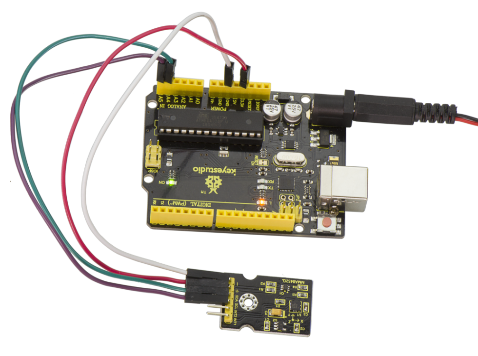

Done uploading the code and open the serial monitor, it will display the triaxial acceleration of sensor and its status shown below.

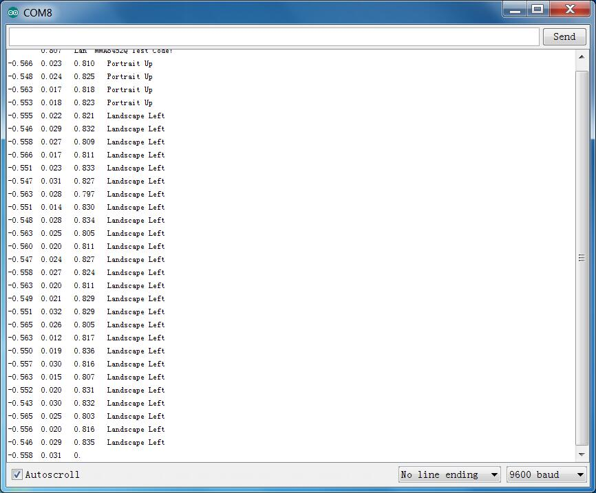

## Project 45: Micro Servo

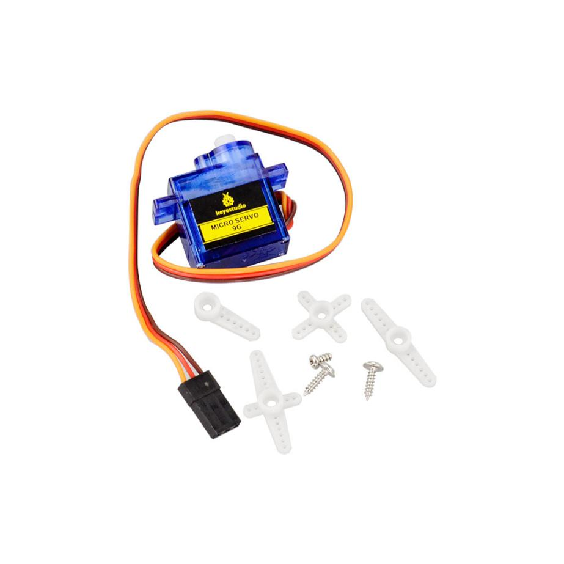

**Introduction**

Servomotor is a position control rotary actuator. It mainly consists of housing, circuit board, core-less motor, gear and position sensor.

Included with your servo motor you will find a variety of white motor mounts that connect to the shaft of your servo. You may choose to attach any mount you wish for the circuit. It will serve as a visual aid, making it easier to see the servo spin.

The servo has three interfaces,distinguished by brown, red and orange line (different brand may have different color). Brown line is for GND, red one for power 5V, orange one for signal terminal (PWM signal).

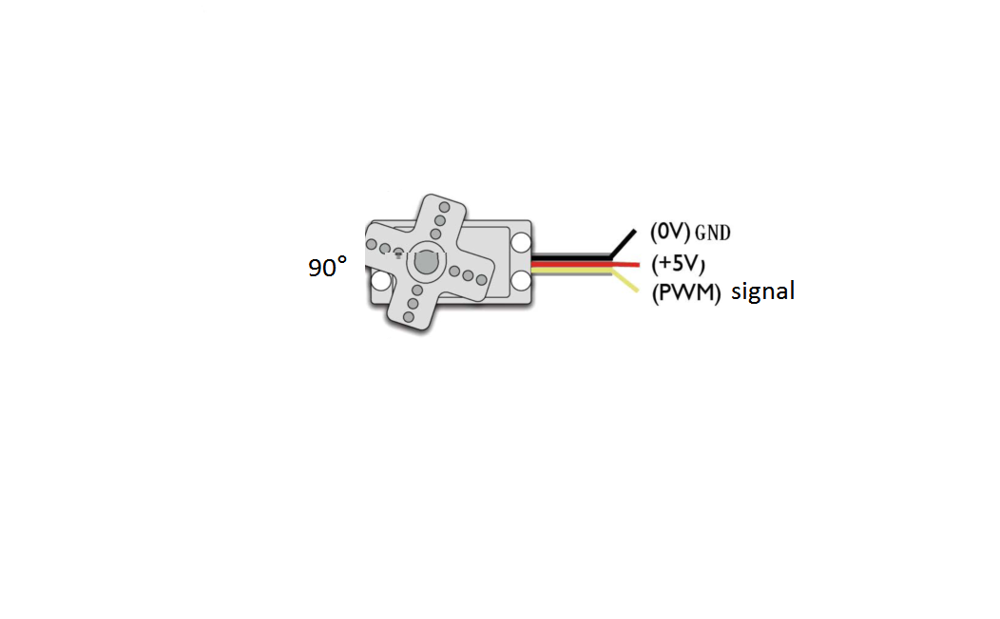

The rotation angle of servo is controlled by regulating the duty cycle of the PWM(Pulse-Width Modulation) signal. The standard cycle of the PWM signal is fixed at 20ms (50 Hz), and the pulse width is distributed between 1ms-2ms. The pulse width corresponds to the rotation angle ( 0°～90°) of servo.

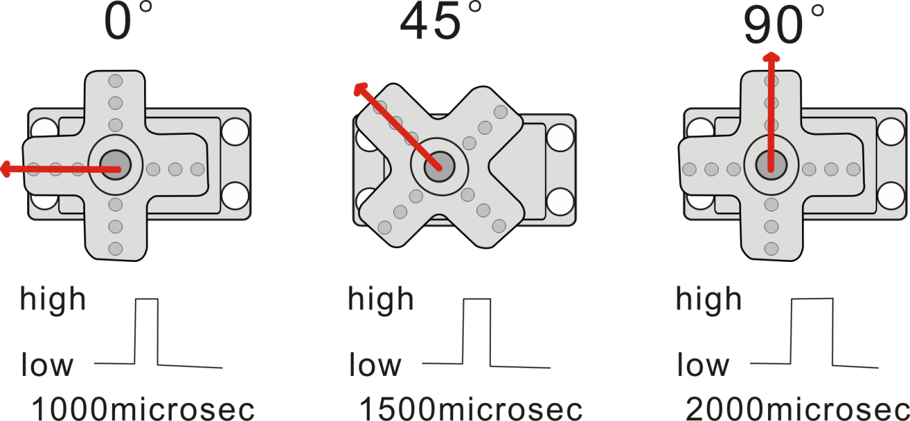

Next, let's learn how to control a servomotor.

In this experiment, you only need a servomotor and several jumper wires.

**Connection Diagram**

Connection for V4.0 :

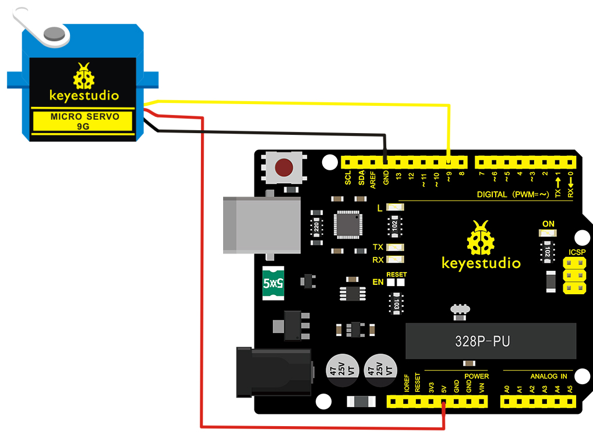

Connection for 2560 R3:

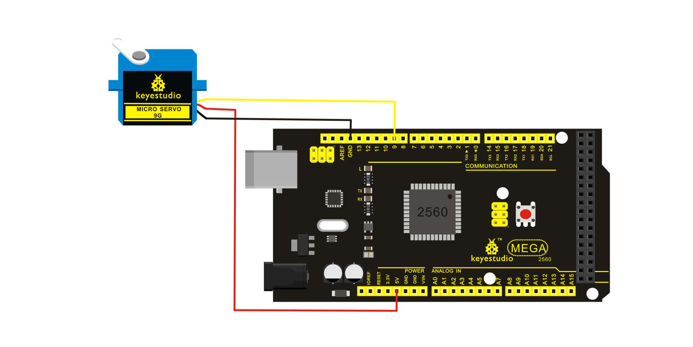

Connect the motor to digital pin 9.

Compile a program to control the motor rotate to the commanded angle, and display the angle on the screen.

**Sample Program**

There are two ways to control a servomotor with Arduino.

One is to use a common digital sensor port of Arduino to produce square wave with different duty cycle to simulate PWM signal and use that signal to control the positioning of the motor.

Another way is to directly use the Servo function of the Arduino to control the motor.

In this way, the program will be easier but it can only control two-contact motor for the servo function, only digital pin 9 and 10 can be used. The Arduino drive capacity is limited. So if you need to control more than one motor, you will need external power.

**Method 1:**

**Sample Program A**

```c
//////////////////////////////////////////////////////////
int servopin=9;// select digital pin 9 for servomotor signal line
int myangle;// initialize angle variable
int pulsewidth;// initialize width variable
int val;
void servopulse(int servopin,int myangle)// define a servo pulse function
{
pulsewidth=(myangle*11)+500;// convert angle to 500-2480 pulse width
digitalWrite(servopin,HIGH);// set the level of servo pin as “high”
delayMicroseconds(pulsewidth);// delay microsecond of pulse width
digitalWrite(servopin,LOW);// set the level of servo pin as “low”
delay(20-pulsewidth/1000);
}
void setup()
{
pinMode(servopin,OUTPUT);// set servo pin as “output”
Serial.begin(9600);// connect to serial port, set baud rate at “9600”
Serial.println("servo=o_seral_simple ready" ) ;
}
void loop()// convert number 0 to 9 to corresponding 0-180 degree angle, LED blinks corresponding number of time
{
val=Serial.read();// read serial port value
if(val>='0'&&val<='9')
{
val=val-'0';// convert characteristic quantity to numerical variable
val=val*(180/9);// convert number to angle
Serial.print("moving servo to ");
Serial.print(val,DEC);
Serial.println();
for(int i=0;i<=50;i++) // giving the servo time to rotate to commanded position
{
servopulse(servopin,val);// use the pulse function
}
}
}
//////////////////////////////////////////////////////////
```


**Method 2:**

Let's first take a look at the Arduino built-in servo function and some common statements.

1\. **attach（interface**）——select pin for servo, can only use pin 9 or 10.

2\. **write（angle）**——used to control the rotate angle of the servo, can set the angle among 0 degree to 180 degree.

3\. **read（）**——used to read the angle of the servo, consider it a function to read the value in the write() function.

4\. **attached（）**——determine whether the parameter of the servo is sent to the servo pin.

5\. **detach（）**—— disconnect the servo and the pin, and the pin(digital pin 9 or 10) can be used for PWM port.

**Note:** the written form of the above statements are " servo variable name. specific statement ()", e.g. myservo. Attach (9).

Still, connect the servo to pin 9.

**Sample Program B:**


**Example Result**

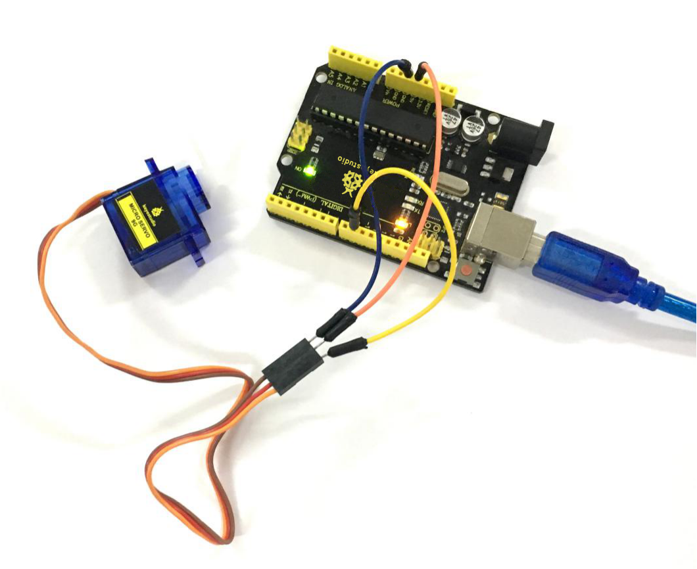

Wire it up well, upload the Program A to the board, then click to open the serial monitor of Arduino software, set the baud rate to 9600, and on the upper bar enter a number and click “Send”, you will see the servo rotate to the corresponding angle, and moving angle will be displayed on the monitor. Shown below.

Powered up, upload well the Program B to the board, first servo will turn to the angle of 90 degree.

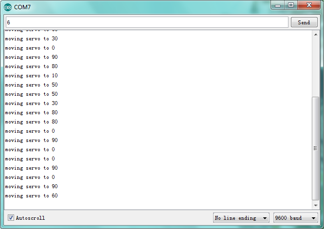

## Project 46: Ultrasonic Ranger

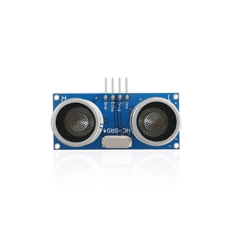

**Description**

As the ultrasonic has strong directivity, slow energy consumption and far spread distance in the media, so it is commonly used in the measurement of distance, such as range finder and position measuring instrument.

Ultrasonic detector module can provide 2cm-450cm non-contact sensing distance, and its ranging accuracy is up to 3mm, very good to meet the normal requirements.

The module includes an ultrasonic transmitter and receiver as well as the corresponding control circuit.

**Working Schematics**

Please refer to the working [sequence](D:/Dict/7.3.0.0807/resultui/dict/javascript:;) as below：

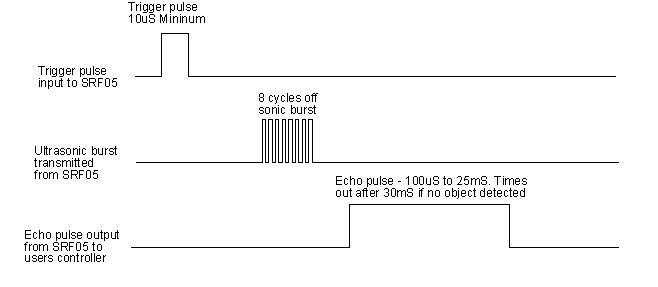

1\. First pull down the TRIG, and then trigger it with at least 10us high level signal;

2\. After triggering, the module will automatically transmit eight 40KHZ square waves, and automatically detect whether there is a signal to return.

3\. If there is a signal returned back, through the ECHO to output a high level, the duration time of high level is actually the time from emission to reception of ultrasonic.
$$
Test Distance = High Level Duration * 340m/s * 0.5
$$


**Parameters**

- Working voltage：0.5V(DC)

- Working current：15mA

- Detecting range：2-450cm

- Detecting angle：15 degrees

- Input trigger pulse：10us TTL Level

- Output echo signal： output TTL level signal(HIGH)，proportional to range.

**Pinout Diagram**

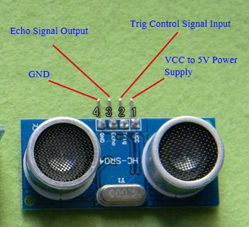

**Connection Diagram**

First, you need to prepare the following components:

-   V4.0 board\*1

-   Ultrasonic sensor\*1

-   USB Cable\*1

-   Jumper wire\*4

Next, please refer to the following connection table:

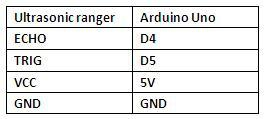

Note: D4、D5 are the digital pin 4 and pin 5.

You can refer to the connection diagram shown below:

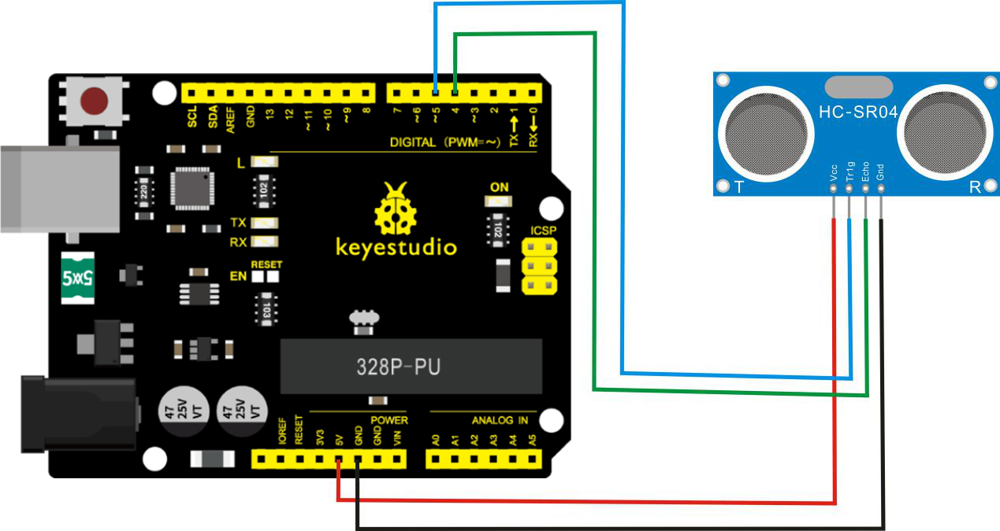

After connecting well, you can use it to measure the distance, displaying the distance value on the monitor.

**Test Code**

Copy and paste the test code below to Arduino software

```c
///////////////////////////////////////////////////////////////////////////////
int inputPin=4; // define ultrasonic signal receiver pin ECHO to D4 
int outputPin=5; // define ultrasonic signal transmitter pin TRIG to D5
 void setup()
{
Serial.begin(9600); 
pinMode(inputPin, INPUT); 
pinMode(outputPin, OUTPUT);

}
void loop()
{
digitalWrite(outputPin, LOW); delayMicroseconds(2);
digitalWrite(outputPin, HIGH); // Pulse for 10μ s to trigger ultrasonic detection
delayMicroseconds(10); 
digitalWrite(outputPin, LOW);
int distance = pulseIn(inputPin, HIGH); // Read receiver pulse time 
distance= distance/58; // Transform pulse time to distance 
Serial.println(distance); //Output distance
delay(50);
}
///////////////////////////////////////////////////////////////////////////////
```


**Example Result**

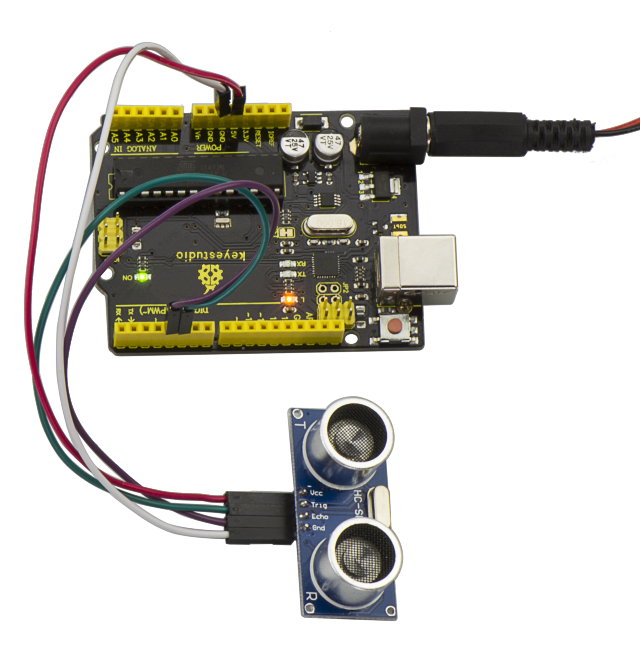

After upload well the code to V4.0 board, then open the serial monitor. When place an object in front of the ultrasonic sensor (from near and far), it will detect the distance of object. The value will be displayed on the monitor shown below.

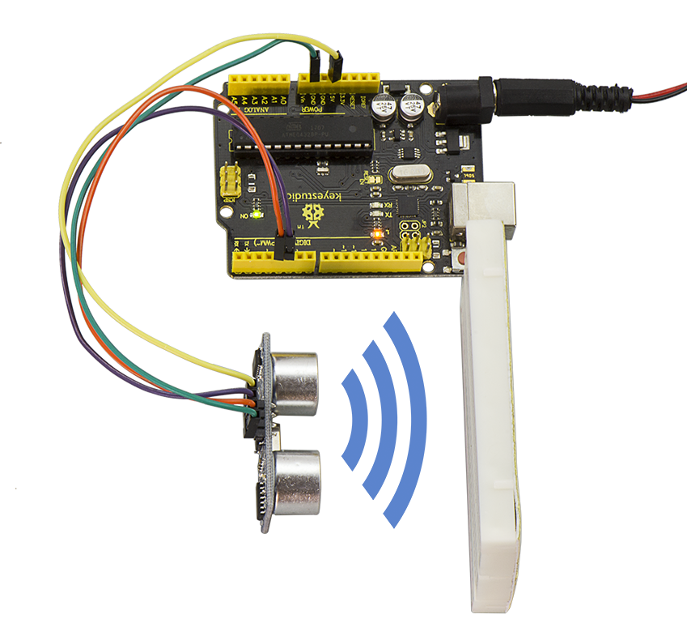

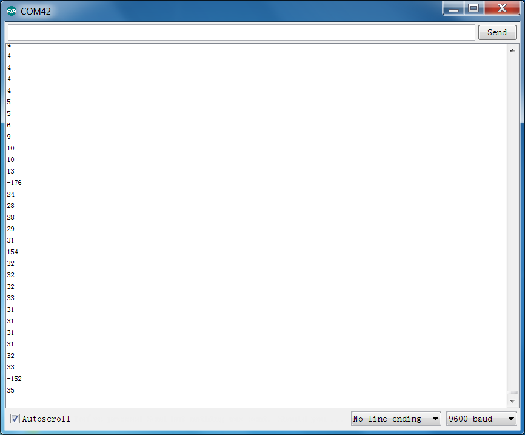

## Project 47: LCD Display


**Description**

This project we are going to drive this 0802 LCD display the text combined with V4.0 board.

The display capacity of LCD is 8x2 characters, and operating voltage of the chip is 4.5～5.5V.

There are two connection method for 0802 LCD displaying the text, respectively 4-bit and 8-bit connection.

You can refer to the related explanation below.

**Interfaces Explanation**


| **Interface** | **Pin** | **Explanation**                                              |
| :-----------: | :-----: | ------------------------------------------------------------ |
|       1       |   VSS   | Logic Power Ground                                           |
|       2       |   VDD   | Logic Power                                                  |
|       3       |   V0    | LCD adjustable voltage, connect to the middle pin of 10K potentiometer |
|       4       |   RS    | Data\\ Command option                                        |
|       5       |   RW    | read\\write option                                           |
|       6       |    E    | Enable read\\write, active at HIGH, falling edge lock the data |
|       7       |   DB0   | Data input/output pin                                        |
|       8       |   DB1   | Data input/output pin                                        |
|       9       |   DB2   | Data input/output pin                                        |
|      10       |   DB3   | Data input/output pin                                        |
|      11       |   DB4   | Data input/output pin                                        |
|      12       |   DB5   | Data input/output pin                                        |
|      13       |   DB6   | Data input/output pin                                        |
|      14       |   DB7   | Data input/output pin                                        |
|      15       |  LED-A  | backlight power positive end                                 |
|      16       |  LED-K  | backlight power negative end                                 |

**Hardware Required**

Firstly you need to prepare the following parts:

-   V4.0 Board\*1

    -   0802 LCD\*1

    -   Rotary potentiometer\*1

    -   Breadboard \*1

    -   USB Cable\*1

    -   Jumper wire\*several

    -   Dupont wire \*several

**Connection Diagram**

**4-bit Connection:**

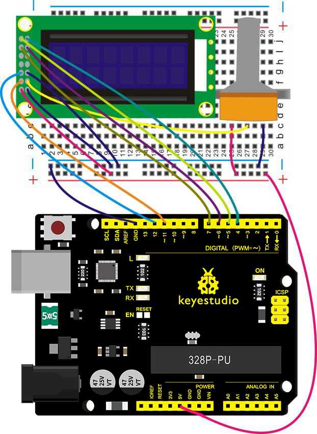

**8-bit Connection:**

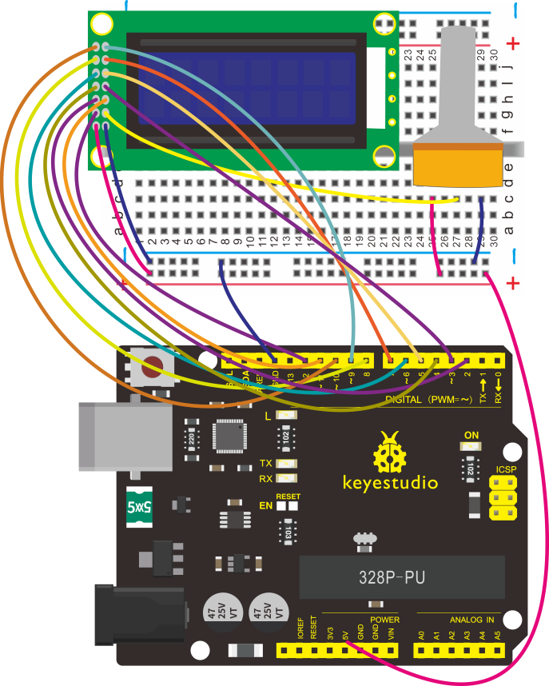

**Source Code**

**For 4-bit Connection:**

```C
//////////////////////////////////////////////////////////
#include <LiquidCrystal.h>
// initialize the library with the numbers of the interface pins
LiquidCrystal lcd(11, 12, 6, 7, 4, 5);

void setup() {
  // set up the LCD's number of columns and rows:
  lcd.begin(8, 2);
  // Print a message to the LCD.
  lcd.setCursor(0, 0);
  lcd.print(" Hello");
  lcd.setCursor(0, 1);
  lcd.print(" world!");
}

void loop() {
}
//////////////////////////////////////////////////////////
```


**For 8-bit Connection:**

```C
//////////////////////////////////////////////////////////
int DI = 12;
int RW = 11;
int DB[] ={3, 4, 5, 6, 7, 8, 9, 10};// use array to select pin for bus
int Enable = 2;

void LcdCommandWrite(int value) {
// define all pins
int i = 0;
for (i=DB[0]; i <= DI; i++) // assign value for bus
{
   digitalWrite(i,value & 01);// for 1602 LCD, it uses D7-D0( not D0-D7) for signal identification; here, it’s used for signal inversion. 
   value >>= 1;
}
digitalWrite(Enable,LOW);
delayMicroseconds(1);
digitalWrite(Enable,HIGH);
delayMicroseconds(1);  // wait for 1ms
digitalWrite(Enable,LOW);
delayMicroseconds(1);  // wait for 1ms
}

void LcdDataWrite(int value) {
// initialize all pins
int i = 0;
digitalWrite(DI, HIGH);
digitalWrite(RW, LOW);
for (i=DB[0]; i <= DB[7]; i++) {
   digitalWrite(i,value & 01);
   value >>= 1;
}
digitalWrite(Enable,LOW);
delayMicroseconds(1);
digitalWrite(Enable,HIGH);
delayMicroseconds(1);
digitalWrite(Enable,LOW);
delayMicroseconds(1);  // wait for 1ms
}

void setup (void) {
int i = 0;
for (i=Enable; i <= DI; i++) {
   pinMode(i,OUTPUT);
}
delay(100);
// initialize LCD after a brief pause
// for LCD control
LcdCommandWrite(0x38);  // select as 8-bit interface, 2-line display, 5x7 character size 
delay(64);                      
LcdCommandWrite(0x38);  // select as 8-bit interface, 2-line display, 5x7 character size 
delay(50);                      
LcdCommandWrite(0x38);  // select as 8-bit interface, 2-line display, 5x7 character size             
delay(20);                      
LcdCommandWrite(0x06);  // set input mode
                         // auto-increment, no display of shifting
delay(20);                      
LcdCommandWrite(0x0E);  // display setup
                         // turn on the monitor, cursor on, no flickering
delay(20);                      
LcdCommandWrite(0x01);  // clear the scree, cursor position returns to 0
delay(100);                      
LcdCommandWrite(0x80);  //  display setup
                         //  turn on the monitor, cursor on, no flickering

delay(20);                      
}

void loop (void) {
  LcdCommandWrite(0x01);  // clear the scree, cursor position returns to 0  
  delay(10); 
  LcdCommandWrite(0x80); 
  delay(10);                     
  // write in welcome message 
  LcdDataWrite('A');
  LcdDataWrite('B');
  LcdDataWrite('C');
  LcdDataWrite('D');
  LcdDataWrite('E');
  LcdDataWrite('F');
  LcdDataWrite('G');
  LcdDataWrite('H');
  delay(10);
  LcdCommandWrite(0xc0);  // set cursor position at second line, second position
  delay(10); 
  LcdDataWrite('1');
  LcdDataWrite('2');
  LcdDataWrite('3');
  LcdDataWrite('4');
  LcdDataWrite('5');
  LcdDataWrite('6');
  LcdDataWrite('7');
  LcdDataWrite('8');
  delay(3000);
  LcdCommandWrite(0x01);  // clear the screen, cursor returns to 0  
  delay(10);
  LcdDataWrite('T');
  LcdDataWrite('E');
  LcdDataWrite('S');
  LcdDataWrite('T');
  LcdDataWrite('-');
  LcdDataWrite('-');
  LcdDataWrite('-');
  LcdDataWrite('-');
  delay(3000);
  LcdCommandWrite(0x02); // set mode as new characters replay old ones, where there is no new ones remain the same
  delay(10);
  LcdCommandWrite(0x80+4); // set cursor position at first line, sixth position
  delay(10);  
  LcdDataWrite('1');
  LcdDataWrite('2');
  LcdDataWrite('3');
  LcdDataWrite('4');
  LcdCommandWrite(0xc0);  // set cursor position at second line, second position
  delay(10); 
  LcdDataWrite('T');
  LcdDataWrite('E');
  LcdDataWrite('S');
  LcdDataWrite('T');
  LcdDataWrite(' ');
  LcdDataWrite(' ');
  LcdDataWrite('O');
  LcdDataWrite('K');
  delay(3000);
}
//////////////////////////////////////////////////////////
```


**Example Result**

Wire it up well, powered up, upload the above code to the board, adjust the backlight of LCD through rotating the potentiometer, finally you can see the character is displayed on the LCD screen.

If you use the 4-bit connection, you should see the LCD display the character "Hello" on the first line, and the second line display the character "world!" shown as below.

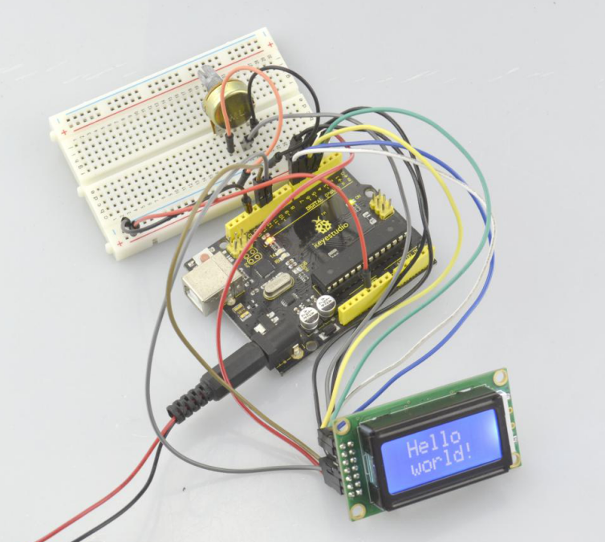

If using the 8-bit connection, you will see other characters are displayed on the LCD. Shown below.

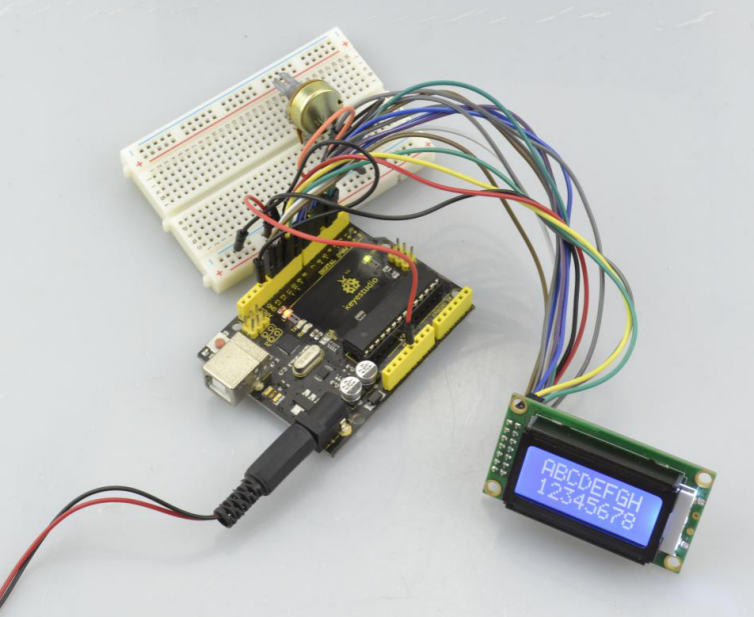

## Project 48: Dot Matrix


**Introduction**

What's better than a single LED? Lots of LEDs! A fun way to make a small display is to use an 8x8 matrix.  This module uses HT16K33 chip to drive an 8x8 dot matrix.

Just need to use the I2C communication port of microcontroller to control the dot matrix, which can save more port resources of microcontroller.  The matrix module comes with a 4Pin header of 2.54mm pin pitch.

You can connect the module to control board for communication using jumper wires.

Besides, it comes with three DIP switches. You can randomly toggle the switch to select the I2C communication address. 

**The address settings are as shown below:**

|   OX70   |          |          |      |   OX71   |          |          |      |   OX72   |          |          |
| :------: | :------: | :------: | ---- | :------: | :------: | :------: | ---- | :------: | :------: | :------: |
| A0（1）  | A1（2）  | A2（3）  |      | A0（1）  | A1（2）  | A2（3）  |      | A0（1）  | A1（2）  | A2（3）  |
| 0（OFF） | 0（OFF） | 0（OFF） |      | 1（ON）  | 0（OFF） | 0（OFF） |      | 0（OFF） | 1（ON）  | 0（OFF） |
|          |          |          |      |          |          |          |      |          |          |          |
| **OX73** |          |          |      | **OX74** |          |          |      | **OX75** |          |          |
| A0（1）  | A1（2）  | A2（3）  |      | A0（1）  | A1（2）  | A2（3）  |      | A0（1）  | A1（2）  | A2（3）  |
| 1（ON）  | 1（ON）  | 0（OFF） |      | 0（OFF） | 0（OFF） | 1（ON）  |      | 1（ON）  | 0（OFF） | 1（ON）  |
|          |          |          |      |          |          |          |      |          |          |          |
| **OX76** |          |          |      | **OX77** |          |          |      |          |          |          |
| A0（1）  | A1（2）  | A2（3）  |      | A0（1）  | A1（2）  | A2（3）  |      |          |          |          |
| 0（OFF） | 1（ON）  | 1（ON）  |      | 1（ON）  | 1（ON）  | 1（ON）  |      |          |          |          |

**Technical Details**

-   Interface: 4Pin header

-   Operating voltage: DC 4.5V-5.5V

-   Comes with three DIP switches for address selection

-   Dimensions：52mm\*34mm\*11mm

-   Weight：13.2g

**Hookup Guide**

Connect the SCL pin to Analog A5 port, SDA pin to Analog A4 port; Connect VCC pin to 5V port, GND pin to GND port.

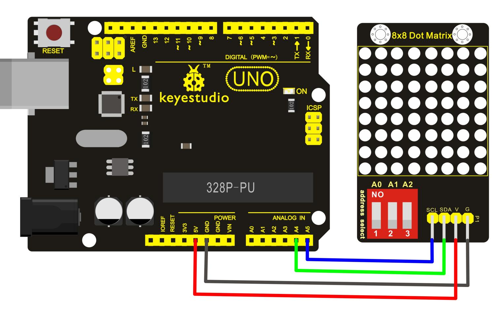

**Test Code**

Download the library:

```C
#include <Wire.h>
#include "Adafruit_LEDBackpack.h"
#include "Adafruit_GFX.h"
#ifndef _BV
#define _BV(bit) (1<<(bit))
#endif
Adafruit_LEDBackpack matrix = Adafruit_LEDBackpack();
uint8_t counter = 0;
void setup() {
  Serial.begin(9600);
  Serial.println("HT16K33 test");
  matrix.begin(0x70);  // pass in the address
}
void loop() {
  // paint one LED per row. The HT16K33 internal memory looks like
  // a 8x16 bit matrix (8 rows, 16 columns)
  for (uint8_t i=0; i<8; i++) {
// draw a diagonal row of pixels

    matrix.displaybuffer[i] = _BV((counter+i) % 16) | _BV((counter+i+8) % 16)  ;
  }
  // write the changes we just made to the display
  matrix.writeDisplay();
  delay(100);
 counter++;
  if (counter >= 16) counter = 0;  
}

```


**Note:** before compiling the code, do remember to place the Matrix library folder into directory \\Arduino\\libraries. Otherwise, fail to compile the code.

For example: **C:\\Program Files\\Arduino\\libraries**

**Test Result**

Done uploading the code to the board, power on, you should see the 8\*8 matrix displaying a heart image. Shown below.

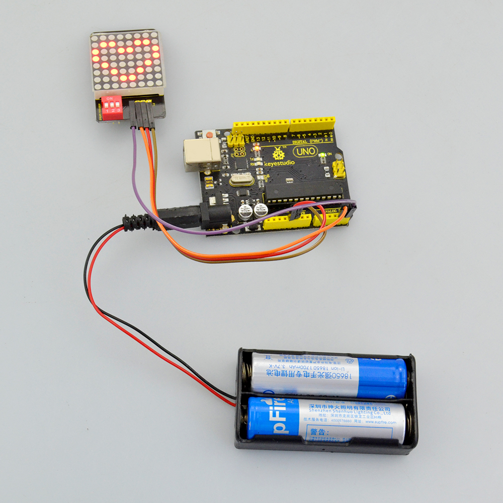

**Settings Method**

1.  Set the communication address. Refer to the address chart.

The code is set as below.

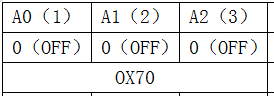


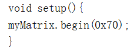


2.  Set the display image

You can set the display image in the code shown below.


Place the matrix module as follows:


Then convert 0x00,0x18,0x24,0x42,0x81,0x99,0x66,0x00 into Binary number:

**0x00 should be 0 0 0 0 0 0 0 0**

**0x18 should be 0 0 0 1 1 0 0 0**

**0x24 should be 0 0 1 0 0 1 0 0**

**0x42 should be 0 1 0 0 0 0 1 0**

**0x81 should be 1 0 0 0 0 0 0 1**

**0x99 should be 1 0 0 1 1 0 0 1**

**0x66 should be 0 1 1 0 0 1 1 0**

**0x00 should be 0 0 0 0 0 0 0 0**

The first hexadecimal number represents the control of the first column of LEDs.

The second data represents the control of the second column of LEDs. And so on.

The settings is converting Hexadecimal data into binary data 8-bit.

The number 0 means LED off, and number 1 means LED on.

The first converted number is controlling the first row of LED on and off, and so on.

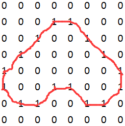


# 6.Download

Download all the code and libraries for projects from the link：

[https://fs.keyestudio.com/KS0522](https://fs.keyestudio.com/KS0522)
